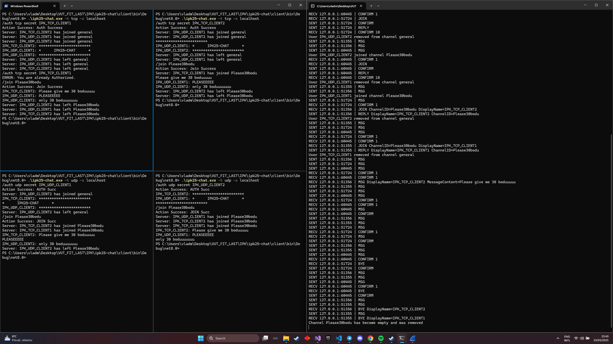

# Project 2 - IPK25-CHAT
### Autor: Malashchuk Vladyslav (xmalas04)

In this documentation, the basic theory needed to understand how the project works will be described first, then I will write the basic rules of how the project and protocol IPK25-CHAT work. There will also be various tests in which I tested all possible cases, and in different ways, such as on a reference server, my server, and on different Python tests in isolation. The documentation contains UML diagrams, pictures, and in the testing section there will be screenshots of applications such as discord and wireshark to show how the program works, in the application files you can find all the photos and files with packet capture, all the program outputs, etc.

Initially the application was written in .NET 8 with the switch **--self-contained false** in MakeFile to not include the .NET 8 runtime in the binary file, thereby not increasing its size. I made the last commit, changed the **csproj to net9.0** and tested it on a virtual machine, a virtual environment, I went through all the tests again in this environment.

`git clone https://git.fit.vutbr.cz/NESFIT/dev-envs.git`
`nix develop ./dev-envs/ipk#c`
`nix develop "git+https://git.fit.vutbr.cz/NESFIT/dev-envs.git?dir=ipk#csharp"`

I used these commands to run the environment, I am writing this because initially the environment has .NET 8, but after the last commit it overwrites the original environment with .NET 9. I am adding this because I do not know what version you will be testing this on. But 4 days before the deadline, the condition and task changed and .NET 8+ was changed to .NET 9+, so I assume that the tests will be run on 9. I reserve the right to change the .NET version at any time after the project is submitted, without deducting additional points, in case of non-compilation, non-launch of the application due to problems with .NET. Before the last commit, the application worked only on .NET 8, after the last one it will be on 9 due to the task update. This is an addition to the previous one, I tested it on a virtual machine with an environment from ipk and from root and I can unpack the zip, run make, the application is launched without "sudo", and using "sudo", also the tests were re-run through ipk and root again. The application is compiled in .NET 9 SDK and Runtime is embedded in it after which the use of .NET is not required and the application can be launched on any device without installing .NET Runtime on it, it can be launched on any system where Linux is installed. Environment and how testing was made in [Testing](#testing).

The table of contents may look large (I made it shorter from last commits), but it makes it easier to jump to the part that interests you.
The theory was taken from RFS and open sources, Project overview was taken from the Giteo Repo [[6]](https://git.fit.vutbr.cz/NESFIT/IPK-Projects/src/branch/master/Project_2) itself and almost completely copied. I wrote the tests myself.

Last year I got points deducted because of screenshots in the documentation, but I think it is necessary to show that the project is fully functional and this is the best example, because you can extend files, text, but it is unlikely that someone will photoshop dozens of clippings from Discord, because it is faster to implement this functionality.

I wrote documentation throughout the entire project and it turned out to be, to put it mildly, large. To save your time, I would advise you to familiarize yourself with such parts as [Implementation](#implementation), [Testing](#testing). I advise you not to read too much into parts(they are big and have basic info that you read like 300x times before) like Project overview, this part is due to the fact that it is completely taken from our documentation and only non-internet parts are removed, the Theory mainly contains paraphrased text from RFC or open sources, of course, with their notation. The theory also contains possibly unnecessary things like examples and areas of use of protocols or clients and servers. You can also skip these parts. But I attached the links where they were taken from and whoever wants can read them. I know that this stretches the already not small documentation, but since I have added it, I do not consider it necessary to delete it, whoever wants to read it will, whoever does not will not. A translator was also used, so it is possible that some statements may not sound natural.

# Table of Contents

- [IPK25-CHAT Theory](#ipk25-chat-theory)
  - [TCP (Transmission Control Protocol)](#tcp-transmission-control-protocol)
  - [UDP (User Datagram Protocol)](#udp-user-datagram-protocol)
  - [Client](#client)
  - [Server](#server)
  - [Socket](#network-socket)
- [Introduction](#introduction)
- [Project Overview (IPK25-CHAT Documentation Shorted)](#project-overview)
  - [Message Types (UDP)](#message-types)
  - [TCP Variant of Messages](#tcp-variant)
  - [CLI Arguments and Client Behavior](#cli-arguments-and-client-behavior)
  - [Client Error Handling](#client-error-handling)
- [Implementation](#implementation)
  - [Main Components of Program](#main-components-of-client)
  - [Main Program Flow](#main-program-flow)
  - [TCP Implementation](#tcp-client-implementation-tcpuser)
  - [UDP Implementation](#main-program-flow)
- [Testing](#testing)
  - [Testing with Reference Server](#testing-with-reference-server)
  - [Testing with Custom Server](#testing-with-custom-server)
  - [Not-Basic Tests](#not-basic-tests)
  - [Integration Tests](#integration-tests)
  - [Additional Tests](#closed-python-tests-simulated-server)
  - [Tests Results](#tests-results)
- [Bibliography](#bibliography)


# IPK25-CHAT Theory

The section will describe the basic theory needed to understand the work of the project, such as TCP, UDP, as well as what a client and server are, the difference between TCP and UDP.

The theory was taken not only from RFC, but also from basic sources such as articles, Wikipedia, and studying materials. I will quote RFC where I see that it is possible, I will leave quotes on the theory from open sources where i thing it needs to be.

## **TCP (Transmission Control Protocol)**

This section will talk about the theory of TCP connections, perhaps even too deeply and knowledge of these things is not necessary, but still desirable for understanding, information for the section was taken from RFC and various open sources. 

TCP is a core Internet protocol that works with IP, forming TCP/IP. It delivers data reliably, in order, and error-free between apps over an IP network. Used by things like websites, email, and file transfers, it’s part of the transport layer. SSL/TLS often runs on TCP.

TCP needs a connection, set up with a three-way handshake. The server waits for client requests, and the handshake ensures both agree on settings. This, plus retransmission and error checks, makes TCP reliable but slower. [[1]](https://datatracker.ietf.org/doc/html/rfc9293)


### **Three-Way Handshake**

The algorithm used by TCP to establish and terminate a connection is called a three-way handshake. We first describe the basic algorithm and then show how it is used by TCP. The three-way handshake involves the exchange of three messages between the client and the server.

Two parties want to agree on parameters, like starting sequence numbers for a TCP connection. The client sends a segment to the server with its initial sequence number (Flags = SYN, SequenceNum = x). The server replies with a segment that acknowledges the client’s number (Flags = ACK, Ack = x + 1) and includes its own sequence number (Flags = SYN, SequenceNum = y). The client then sends a final segment to acknowledge the server’s number (Flags = ACK, Ack = y + 1). Acknowledgments use the next expected sequence number, confirming all prior ones. Timers are set for the first two segments, and they’re retransmitted if no response is received  [[1]](https://datatracker.ietf.org/doc/html/rfc9293).


## **UDP (User Datagram Protocol)**  
This section will describe UDP, this is the second important part in the implementation of the project.

UDP (User Datagram Protocol) is a connectionless transport-layer protocol defined in [[2]](https://datatracker.ietf.org/doc/html/rfc768). It provides a lightweight mechanism for transmitting data with minimal overhead, making it suitable for time-sensitive applications where low latency is prioritized over reliability. 

The User Datagram Protocol, or UDP, is a communication protocol used across the Internet for especially time-sensitive transmissions such as video playback or DNS lookups. It speeds up communications by not formally establishing a connection before data is transferred.


### **Comparison: UDP vs. TCP**  

| Feature          | UDP [[2]](https://datatracker.ietf.org/doc/html/rfc768) | TCP [[1]](https://datatracker.ietf.org/doc/html/rfc793) |
|-----------------|-----------------|-----------------|
| **Connection Type** | Connectionless | Connection-oriented |
| **Reliability** | Unreliable | Reliable |
| **Ordering** | No guaranteed order | Ensures ordered delivery |
| **Error Handling** | Checksum only | Checksum, retransmissions |
| **Speed** | Faster (low overhead) | Slower (due to handshaking & acknowledgments) |
| **Use Cases** | Streaming, gaming, DNS, VoIP | Web browsing, file transfers, emails |

## **Client**

The following parts of the text will not have citations this is my interpretation of server-client which i made from styding. There are a lot of RFC for HTTP,SMTP,DNS servers and clients. But they have some differences and next 2 sections will desribe just basis for all of them.
There are many articles on this topic and the explanations in them are correct, so you can take from any resources.

The client-server model is a way of organizing tasks in a distributed system, splitting work between servers, which provide resources or services, and clients, which request those services. Typically, clients and servers communicate over a network on separate devices, but they can also be on the same device. A server runs programs that share its resources with clients, while a client usually doesn’t share its own computing power—it just asks for content or services from the server, sometimes including its own data in the request. Clients start communication by sending requests to servers, which wait for these requests. Examples of this model include email, network printing, and the World Wide Web.


A **client** is a device or program that sends requests to a server to access services or resources. It typically initiates communication with the server and waits for a response. Clients can be a variety of devices or software applications, such as web browsers, email clients, or mobile apps. The client relies on the server to provide the required data, services, or functionality.


**Client** is an one of two main component in the client-server model, responsible for requesting services and displaying results to users. It depends on the server for resources but also handles many critical aspects of user interaction, processing, and presentation.


## **Server**

A **server** is a system or program that waits for and responds to requests from clients. It processes these requests and sends back the appropriate responses. Servers are usually always-on systems that provide services like hosting web pages, managing emails, handling databases, or running applications.

**Server-side software** refers to applications, like web servers, that run on remote server hardware and can be accessed from a user’s device, such as a computer or smartphone. These operations happen on the server because they need access to data or functions not available on the client, or because doing them on the client would be slow, unreliable, or insecure.

Clients and servers often use common programs, like free or commercial web browsers and web servers, communicating through standard protocols. Alternatively, developers can create custom server, client, and communication protocols designed to work only with each other.

Server-side operations include handling client requests and performing background tasks, like maintenance, that aren’t directly tied to client interactions.


As a result, the server is a very important part in IT and we can say that the entire Internet works thanks to servers. In our project, this is a very important part since our client communicates with a remote server. In IPK25 project we use standart approach when client is .NET application in my situation or C,C++ that is running on client side and server is application that runs far from client (We dont know in what language, it is not important we comunicate using packets) and they communicate using Sockets. Next esction about sockets and it will be more that enough to understnand background of project.

## Network socket

In computer science, a network socket is an endpoint connected through a computer network. With the rise of the Internet, most communication between computers is done using the TCP/IP protocol family. The actual data transfer is done over IP, so the term "Internet socket" is also used. A user socket is a handle (an abstract reference) that a program can use when calling a network application programming interface (API), such as "send this data to this socket."

For more information use open-sources. Also will be good to read Microsoft **System.Net.Sockets Namespace** [[3]](https://learn.microsoft.com/en-us/dotnet/api/system.net.sockets?view=net-9.0) for better understanding how to use it in .NET applications.

In my project i use abstractions above sockets, so you will not see how i use it. But classes **TcpClient** [[4]](https://learn.microsoft.com/en-us/dotnet/api/system.net.sockets.tcpclient?view=net-9.0) and **UdpClient** [[5]](https://learn.microsoft.com/en-us/dotnet/api/system.net.sockets.udpclient?view=net-9.0) uses it. **They are part of Sockets namespace.**

# Introduction

This project involves the development of a client application that communicates with a remote server using the **IPK25-CHAT** protocol like it was desribed in Theory section. The protocol offers two transport protocol variants **UDP** and **TCP**. The task/project was to implement both variants, focusing on the networking aspects of the communication between the client and the server.

The **IPK25-CHAT** protocol defines several message types such as **AUTH**, **JOIN**, **MSG**, **BYE**, **PING**, **ERR**, **CONFIRM**, **REPLY** each with specific parameters and behaviors. The client must handle these message types appropriately, sending the required data and processing responses from the server based on the protocol/project's specifications.

The primary focus of this implementation was the correct handling of the networking layer, message processing, error handling, correct outputs, correct termination atd. This includes managing connections like UDP or stream-based communication of TCP. The client must perform actions such as authentication, joining chat channels, sending and receiving messages, and gracefully handling errors or connection terminations as described before.

Throughout the development, attention was given to the correct formatting of messages, correct using of transport protocols, FSM machine states. The client implements **IPK25-CHAT** protocol specification, enabling interaction with the server using both UDP and TCP variants. 

Next, the project will be described, its structure, how it should work, its state, what packets look like, error handling, client output, and so on it was taken from documentaion to project. 

***You can skip it to Implementation...**


# Project Overview

The **IPK25-CHAT** protocol uses client-server communication, with the option to use the **UDP** or **TCP** transport protocols. This project focuses on the implementation of both protocol variants, allowing for flexible communication and handling of different message types. The following sections outline the key message types in the protocol, the message header structure, and the content of each message type and so on...

All tables and theory were taken from the task, some parts were removed, some were shortened. Who is not interested in reading the task a second time, please go to the next chapter with my implementation. [Implementation](#implementation)
Source of Project Overview Section: [[6]](https://git.fit.vutbr.cz/NESFIT/IPK-Projects/src/branch/master/Project_2)

#### **Client FSM**:


## Message Types

The **IPK25-CHAT** protocol defines several message types, each with specific functionality and structure. The client application must support and properly handle the following message types:

- **CONFIRM**
- **REPLY**
- **AUTH**
- **JOIN**
- **MSG**
- **ERR**
- **BYE**
- **PING**

Each message type has its own unique purpose in the communication flow, such as authentication, sending messages, confirming receipt, or indicating an error. More information about packets in next sections. They are refer to UDP variant, Tcp will be desribed after it from TCP Variant section.

### **CONFIRM**
The **CONFIRM** message is used exclusively in the UDP protocol variant to confirm the successful delivery of a message. This message contains the **Ref_MessageID**, which is the identifier of the message being confirmed.

```
1 byte       2 bytes      
+--------+--------+--------+
|  0x00  |  Ref_MessageID  |
+--------+--------+--------+
Ref_MessageID | uint16  | The MessageID value of the message being confirmed
```

### **REPLY**
The **REPLY** message is used to reply to a previously sent message. It contains the **Result** field (0 for failure, 1 for success), the **Ref_MessageID** (identifier of the message being replied to), and the **MessageContents** (the content of the reply message).

```
1 byte       2 bytes       1 byte       2 bytes      
+--------+--------+--------+--------+--------+--------+--------~~---------+---+
|  0x01  |    MessageID    | Result |  Ref_MessageID  |  MessageContents  | 0 |
+--------+--------+--------+--------+--------+--------+--------~~---------+---+
Result            | uint8    | 0 indicates failure, 1 indicates success
Ref_MessageID     | uint16   | The MessageID value of the message being replied to
MessageContents   | string   | Contains the reply content, always terminated with a zero byte
```

### **AUTH**
The **AUTH** message is used for client authentication. It contains the **Username**, **DisplayName**, and **Secret** fields, all of which are strings terminated by a zero byte.

```
1 byte       2 bytes      
+--------+--------+--------+-----~~-----+---+-------~~------+---+----~~----+---+
|  0x02  |    MessageID    |  Username  | 0 |  DisplayName  | 0 |  Secret  | 0 |
+--------+--------+--------+-----~~-----+---+-------~~------+---+----~~----+---+
Username      | string   | User's username, terminated with a zero byte
DisplayName   | string   | User's display name, terminated with a zero byte
Secret        | string   | User's secret (password), terminated with a zero byte
```

### **JOIN**
The **JOIN** message is used to request the client’s participation in a specific chat channel. It includes the **ChannelID** and the **DisplayName** of the client.

```
1 byte       2 bytes      
+--------+--------+--------+-----~~-----+---+-------~~------+---+
|  0x03  |    MessageID    |  ChannelID | 0 |  DisplayName  | 0 |
+--------+--------+--------+-----~~-----+---+-------~~------+---+
ChannelID     | string   | The channel to join, terminated with a zero byte
DisplayName   | string   | The client's display name, terminated with a zero byte
```

### **MSG**
The **MSG** message is used to send a message to the chat channel. It includes the **DisplayName** of the sender and the **MessageContents** of the message.

```
1 byte       2 bytes      
+--------+--------+--------+-------~~------+---+--------~~---------+---+
|  0x04  |    MessageID    |  DisplayName  | 0 |  MessageContents  | 0 |
+--------+--------+--------+-------~~------+---+--------~~---------+---+
DisplayName     | string   | Sender's display name, terminated with a zero byte
MessageContents | string   | The content of the message, terminated with a zero byte
```

### **ERR**
The **ERR** message is sent when an error occurs during communication. It includes the **DisplayName** of the sender and an error **MessageContents**.

```
1 byte       2 bytes
+--------+--------+--------+-------~~------+---+--------~~---------+---+
|  0xFE  |    MessageID    |  DisplayName  | 0 |  MessageContents  | 0 |
+--------+--------+--------+-------~~------+---+--------~~---------+---+
DisplayName     | string   | Sender's display name, terminated with a zero byte
MessageContents | string   | The error message content, terminated with a zero byte
```

### **BYE**
The **BYE** message indicates the termination of the conversation. It includes the **DisplayName** of the sender.

```
1 byte       2 bytes
+--------+--------+--------+-------~~------+---+
|  0xFF  |    MessageID    |  DisplayName  | 0 |
+--------+--------+--------+-------~~------+---+
DisplayName     | string   | Sender's display name, terminated with a zero byte
```

### **PING**
The **PING** message is used in the UDP variant to check the aliveness of the connection. It only contains the **MessageID** field.

```
1 byte       2 bytes
+--------+--------+--------+
|  0xFD  |    MessageID    |
+--------+--------+--------+
MessageID    | uint16   | A unique message ID for the ping message
```

## TCP Variant

The **TCP variant** of the **IPK25-CHAT** protocol ensures communication between the client and server by utilizing the inherent features of the **Transmission Control Protocol (TCP)** (like connection between server and client). TCP provides connection-oriented communication, ensuring that messages are delivered in the correct order and without loss. (When UDP dont connect and just send packets in any order) Unlike the **UDP variant**, the **CONFIRM** and **PING** message types are not required in the **TCP variant** because TCP guarantees the delivery and reliability of messages. 

### Message Content Parameter Mapping for TCP

In the **TCP variant**, each message type is mapped to specific content templates, which define how the data is formatted when exchanged between the client and server. The following table outlines the mapping of message types to their corresponding content templates:

| Message Type | Message Parameter Template                               |
|--------------|----------------------------------------------------------|
| **ERR**      | `ERR FROM {DisplayName} IS {MessageContent}\r\n`         |
| **REPLY**    | `REPLY {"OK \| "NOK"} IS {MessageContent}\r\n`           |
| **AUTH**     | `AUTH {Username} AS {DisplayName} USING {Secret}\r\n`    |
| **JOIN**     | `JOIN {ChannelID} AS {DisplayName}\r\n`                  |
| **MSG**      | `MSG FROM {DisplayName} IS {MessageContent}\r\n`         |
| **BYE**      | `BYE FROM {DisplayName}\r\n`                             |
| **CONFIRM**  | **Unused in TCP**                                        |
| **PING**     | **Unused in TCP**                                        |

These message parameter templates specify how the data should be structured for each type of message. For example:

- **ERR**: An error message is formatted as `ERR FROM {DisplayName} IS {MessageContent}\r\n`, where `{DisplayName}` is the name of the user sending the error message and `{MessageContent}` contains the description of the error.
  
- **REPLY**: A reply message is formatted as `REPLY {"OK" | "NOK"} IS {MessageContent}\r\n`, where `{"OK" | "NOK"}` indicates the success or failure of the operation, and `{MessageContent}` holds any additional information.

- **AUTH**: For authentication, the message is formatted as `AUTH {Username} AS {DisplayName} USING {Secret}\r\n`, where `{Username}` is the client’s username (in our situatuion, like xlogin00), `{DisplayName}` is the display name, and `{Secret}` is the password or authentication token (we used API-TOKEN when testing application).

- **JOIN**: When a client requests to join a chat channel, the message is structured as `JOIN {ChannelID} AS {DisplayName}\r\n`, where `{ChannelID}` is the unique identifier for the channel and `{DisplayName}` is the name of the client.

- **MSG**: A message from a user is sent as `MSG FROM {DisplayName} IS {MessageContent}\r\n`, where `{DisplayName}` is the user's name and `{MessageContent}` is the content of the message.

- **BYE**: To terminate the connection, the **BYE** message is formatted as `BYE FROM {DisplayName}\r\n`, where `{DisplayName}` indicates the user who is ending the conversation.

In the **TCP variant**, **CONFIRM** and **PING** messages are not used because TCP inherently ensures the reliability and delivery of messages. As a result, there is no need to confirm message delivery or periodically check the status of the connection.

By using TCP, this protocol variant focuses on message reliability, eliminating the need for extra mechanisms like **CONFIRM** and **PING**, which are crucial in the UDP variant where reliability is not inherently guaranteed by the transport layer. This makes the TCP variant simpler and more efficient for scenarios where message delivery assurance is required.

I also want to point out that packets have limitations, such as the length of messages, the characters that can be used in them, there are also many states and options when and how packets are sent, received, errors are processed, all this can be seen with the [FSM](#client-fsm) that I added to the project, and you can also read in more detail in the documentation for the **IPK25-CHAT** protocol.

## CLI Arguments and Client Behavior

This section have the behavior of the **client application** with respect to **command-line arguments (CLI)** and the **standard input (stdin)**. The client will handle the provided arguments to establish a connection with the server and support different client commands and chat messages.

### CLI Arguments

The client application must accept specific **command-line arguments** to configure its connection to the server. These arguments will control how the client communicates over TCP or UDP, how the server is identified, and certain timeout or retransmission settings for UDP. The table below outlines the mandatory and optional arguments:

| Argument | Value | Possible Values | Meaning or Expected Program Behavior |
|----------|-------|-----------------|--------------------------------------|
| `-t`     | User provided | `tcp` or `udp` | Specifies the transport protocol used for the connection (either TCP or UDP). |
| `-s`     | User provided | IP address or hostname | Specifies the server's IP address or hostname. This argument is mandatory for connecting to the server. |
| `-p`     | 4567  | `uint16` | Specifies the server port. Default value is 4567, but it can be adjusted if needed. |
| `-d`     | 250   | `uint16` | Specifies the UDP confirmation timeout in milliseconds. It is used only in the UDP protocol variant. |
| `-r`     | 3     | `uint8` | Specifies the maximum number of UDP retransmissions. This argument is only used with the UDP protocol. |
| `-h`     |       |                 | Prints the program help output and exits. |

**Note**: Arguments marked as "User provided" are mandatory, and the user must always specify these arguments when running the program. Other arguments, such as the timeout or retransmission limit, are optional and have default values. The behavior of the program is undefined if arguments are provided incorrectly or in an unsupported manner.

### Client Input and Commands

The client will read **user input** from the **standard input stream (stdin)**. Each input will either be a **local command** or a **chat message** to send to the server. The following defines the client behavior regarding input handling:

### **Command Format**:
All valid commands must be **prefixed** with a forward slash `/` and followed by a non-zero number of characters (a-z, 0-9, `_`, `-`) to uniquely identify the command. The client supports the following local commands:

| Command  | Parameters                                   | Client Behavior |
|----------|----------------------------------------------|-----------------|
| `/auth`  | `{Username} {Secret} {DisplayName}`          | Sends an AUTH message with the provided data to the server. The server's reply is processed, and the `DisplayName` is set for future use (same as the `/rename` command). |
| `/join`  | `{ChannelID}`                                | Sends a JOIN message with the specified channel name to the server. The server's reply is processed. |
| `/rename`| `{DisplayName}`                              | Locally changes the user's display name. This display name is used in messages and commands. |
| `/help`  |                                              | Displays all supported local commands with their descriptions. |

### **Message Input**:
- If the user input does not match a recognized command (i.e., no forward slash `/`), the input is interpreted as a **chat message**.
- If the chat message is not acceptable based on the current state (e.g., trying to send a message before authentication or joining a channel), the program will output an error message without terminating.
  
**Note**: All chat messages must be terminated with a newline character (`\n`).

The client must handle **user input sequentially**, only one action (command or message) can be processed at a time. Once the action is complete (i.e., the message has been delivered to the server, or the command has been processed), the program is ready to handle the next input.

### Client Error Handling

If the user attempts to perform an invalid operation (e.g., sending a message in an invalid state), the client will print an appropriate error message and will **not terminate**. Below are a few examples of what may trigger error messages:

- **Sending a message in a non-open state**: If the client hasn't authenticated, or if the channel hasn't been joined yet, sending a message should display an error.
- **Malformed command**: If the user provides a command with incorrect syntax, an error message will be printed.
- **Trying to join a channel in a non-open state**: If the client hasn't successfully authenticated or isn't connected to a server, attempting to join a channel will result in an error.
- **...**

### Connection Termination

The client must respond to termination signals (like `Ctrl + C`) by gracefully exiting and closing the connection with the server. The **BYE** message should be sent to the server to signal the termination of the connection.

- For **TCP connections**, ensure that the connection is properly finalized.
- For **UDP connections**, the client must right process packet and if need send CONFIRM several times to be sure.

If the client receives an **ERR** or **BYE** message from the server, the client should process these appropriately and terminate the connection gracefully.

### Client Output Formatting

The client must format its output correctly for different types of messages. Each type of message received from the server should trigger the corresponding output on the **standard output stream (stdout)**:

- **MSG (Chat Message)**: `"{DisplayName}: {MessageContent}\n"`
- **ERR (Error Message)**: `"ERROR FROM {DisplayName}: {MessageContent}\n"`
- **REPLY (Action Response)**: 
  - If successful: `"Action Success: {MessageContent}\n"`
  - If failure: `"Action Failure: {MessageContent}\n"`
- **Internal Client Errors**: `"ERROR: {MessageContent}\n"`
## Implementation

In this chapter, we discuss the implementation of a chat client that can communicate with a server over TCP or UDP. The client can be configured to use either transport protocol via command-line arguments, and the application leverages multithreading to handle network communication and user input concurrently.

### Overview of the Code Structure

The program implements a **client application** that can operate over both **TCP** and **UDP** protocols. It is designed to read command-line arguments, set up server connection settings, and enable chat functionality based on the chosen transport protocol.

### Main Components of Client

The main components in the program are:

1. **Server Settings**: The `ServerSetings` class parses the command-line arguments to configure server settings, including transport protocol, server address, and server port.
   
2. **TCP Client** [[4]](https://learn.microsoft.com/en-us/dotnet/api/system.net.sockets.tcpclient?view=net-9.0): The `TcpUser` class is used to manage the connection and communication with the server over TCP. It establishes a network stream for sending and receiving data.

3. **UDP Client** [[5]](https://learn.microsoft.com/en-us/dotnet/api/system.net.sockets.udpclient?view=net-9.0): The `UdpUser` class handles the UDP communication, including starting the client, sending messages, and receiving responses from the server.

4. **User:** ``TcpUser and UdpUser`` inherit common methods and fields, such as username, secret, display name,_isAuthorized checking messages,fields,commands for characters, length, etc. 

5. **Multithreading**: The program utilizes multithreading to manage the simultaneous execution of client-side operations, such as handling user input and maintaining the connection with the server. Actually can be changed to Async, working with Thread a little harder but gives more controll, this is for old programmers on C# old-school.

I want to note that TcpClient, UdpClient is not the same as TcpUser,UdpUser. The first pair goes to **System.Net.Sockets Namespace** [[3]](https://learn.microsoft.com/en-us/dotnet/api/system.net.sockets?view=net-9.0) it just deals with sockets, connections, packages, essentially an abstraction over sockets. In its turn, a couple with the User endings, these are my classes that are responsible for logic.

### Main Program Flow

The `Main` method is responsible for initializing the client application. The text can be confusing, **Tcp Client** and **Udp Client** in text do not belong to classes such as **TcpClient and UdpClient**, it only means that these are clients for TCP and UDP applications. That is, these words in my text and code are different things, one is a class, the other is a client that works with this protocols:

1. **Parse Command-Line Arguments**:
   The program begins by parsing the command-line arguments through the `ServerSetings` class. This class processes arguments related to transport protocol (`tcp` or `udp`), server address, and port number. If an error occurs during this process, the program displays an error message and terminates.

   ```csharp
   ServerSetings serverSetings = new ServerSetings(args);
   ```

2. **TCP Client Setup**:
   - If the `tcp` transport protocol is selected, a `TcpClient` object is created, which establishes a connection to the server using the specified IP address and port.
   - A `NetworkStream` is obtained from the `TcpClient` for sending and receiving data.
   - The `TcpUser` object, which handles the communication protocol for TCP, is instantiated and the `EnableChatTcp` method is called to enable chat functionality.

   ```csharp
       using (TcpClient tcpClient = new TcpClient(AddressFamily.InterNetwork))
       {
           tcpClient.Connect(serverSetings.serverAddress, serverSetings.serverPort);
           using (NetworkStream networkStream = tcpClient.GetStream())
           {
               TcpUser tcpUser = new TcpUser(networkStream);
               tcpUser.EnableChatTcp();
           }
           tcpClient.Close();
       }
   ```

   The `TcpClient` object is disposed of automatically after the connection is closed, ensuring that resources are freed properly.

3. **UDP Client Setup**:
   - If the `udp` transport protocol is selected, a `UdpUser` object is created using the `ServerSetings` configuration.
   - The `EnableChatUdp` method of the `UdpUser` class is invoked to begin the communication process. This method is responsible for sending and receiving messages over UDP and is implemented to handle network communication concurrently using **multithreading**, one thread to send,one to recieve.

   ```csharp
       UdpUser udpUser = new UdpUser(serverSetings);
       udpUser.EnableChatUdp();
   ```

4. **Error Handling**:
   - If an exception occurs at any point during the execution of the program, an error message is printed to the console. The program then exits with an error code.

   ```csharp
   catch (Exception e)
   {
       Console.WriteLine($"ERROR: {e.Message}");
       Environment.Exit(1);
   }
   ```
#### Short Description

In short, the application is the main thread, which at the beginning is divided into 2 options, either tcp or udp. After one of of them starts, starts 2 processes(Threads), one for processing the console and sending packets to the server, and the other for receiving. This is done so that the application does not hang at the moment of writing a message and stops receiving packets from the server or outputting them to the console, and when receiving packets, it does not allow writing in the chat. This approach allows you to asynchronously process both outgoing and incoming packets without waiting.
But it is Threads, so i had problems when Sending Thread close socket, and Revieve Thread throws SocketExeption, it was fixed in last commits. So was added bool checker if reciving must be closed and added before every closing socket function.

1) Program Entry Point:

-   The program starts in Program.cs in Main().
-  Based on the command-line arguments(ServerSetings object), the program determines what to use TCP or UDP.
-   Calls RunTcpClient() or RunUdpClient() from ProgramAdditional class.
2) Client Initialization:
- TCP Client:
   - RunTcpClient() creates a TcpClient object to make connection (Stream).
   - A TcpUser object is created with the NetworkStream from the TcpClient object.
   - The EnableChatTcp() method is called to start the TCP chat loop.
- UDP Client:
  - RunUdpClient() creates a UdpUser object with server settings.
  - The EnableChatUDP() method is called to start the UDP chat loop.
3) User Authentication:
   - The user enters the /auth command with their username, secret, and display name.
   - The Authenticate method sends an AUTH message to the server.
   - The server responds with a REPLY message indicating success or failure.
   - If successful, the _isAuthorized flag is set to true.
4) Main Chat Loop:
   	- The main loop (EnableChatTcp or EnableChatUDP) handles user input:
         - Commands:
            /auth: Authenticates the user.
            /join: Joins a chat channel.
            /rename: Changes the display name.
            /help: Displays available commands.
            Messages: If the input is not a command, it is treated as a message and sent to the server.
            The SendMessage() method is used to send messages.
            Input validation is performed using methods like IsMessageValid() from User class.
5) Termination:
   - The program can terminate in several ways:
     - The user presses Ctrl+C, triggering the Console_CancelKeyPress event handler.
     - A BYE or ERR message is received from the server.
     - The user manually exits the program.
     - And specific situation described in IPK25-Protocol.
#### Small illustration in text
```
                                           Main()
                                             |
                                             v
                           Parse Command-Line Arguments (ServerSetings class)
                                             |       
                       (TcpUser) +---------------------------+ (UdpUser)
                                 |                           |
                                 v                           v
                            RunTcpClient()           RunUdpClient()   <- ProgramAdditional.cs 
                                 |                           |
                                 v                           v
                           Create TcpUser            Create UdpUser   <- new()
                                 |                           |
                                 v                           v
                           EnableChatTcp()          EnableChatUDP()  <- Main loop
                                 |                           |
                                 v                           v
                           Authenticate User        Authenticate User   <- Auth
                                 |                           |
                                 v                           v
                           Main Chat Loop           Main Chat Loop      <- After reply success can use another command and send messages
                                 |                           |
                                 v                           v
                           Send/Receive Messages    Send/Receive Messages <- 2 Threads
                                 |                           |
                                 v                           v
                           Terminate Program        Terminate Program <- After BYE,ERR,Ctrl+C,EOF atd. EXIT(1)<->EXIT(0)
```
### TCP Client Implementation (TcpUser)

The `TcpUser` class is designed to handle communication between a client and a server using the **TCP** protocol. It supports various actions such as authenticating with the server, joining channels, sending and receiving messages, and processing different types of server responses. Additionally, it uses multithreading to manage simultaneous user input and message reception from the server like it was desribed earlier.

If I describe it briefly, it works like this: a connection is established between the client and the server, this connection (reference to the object) is transferred to my object and from there it is managed. There are basically 2 threads working in parallel: one receives input in the console and sends packets, in case of an error it displays it in the console, the second thread receives packets and also displays them in the console or an error. In case of receiving an error or BYE or closing the connection, the client correctly closes the connection and closes the application with or without the error code. Also implemented is the support of several messages recieved in one packet and also one message divided into several packets,this works using StringBuilder, it recieves stream and when recieves "\r\n", part of string before it will be parsed to Handle mathod with processing logic for this type of packet. I will not describe the work line by line, only its basics, for more detailed things like processing each packet, look in the source code, but it works so that the packets are read, then they are divided by \r\n and these packets are processed separately, for each packet there is a separate HandlePacket method that handles it.


From UML you can see that the program receives and sends packets of different types. [Project Overview Packet Types](#message-content-parameter-mapping-for-tcp)
#### Functions:

1. **Authentication**: The client can authenticate itself by providing a username, secret, and display name. The server will respond with either a success or failure message, allowing the client to proceed with further actions if successful.

2. **Channel Joining**: After authentication, the client can join a specific channel. The server replies with the success or failure of this operation.

3. **Message Sending and Receiving**: The client can send messages to the server, which in turn will send back responses. These messages can include communication from other users, errors, or general replies.

4. **Multithreading**: A dedicated thread is responsible for receiving messages from the server while the main thread handles the client’s user input.

5. **Error Handling**: The client processes various server responses, including success (`REPLY`), error (`ERR`), and message (`MSG`) types. If any unexpected messages are received, the client handles them accordingly.
6. **More in source files** rename...
#### Implementation Details:
**Only main details, it wond describe code line by line!**
1. **Constructor**:
   - The constructor initializes the network stream and sets up a thread to handle incoming messages from the server.
   - It also register **CancelKeyPress** event for interruption signals, such as when the user presses `Ctrl+C`.

2. **Enable Chat**:
   - The `EnableChatTcp` method listens for user input continuously. If the input matches a predefined command (e.g., authentication, channel joining), the client processes it accordingly.
   - If the user is not authenticated, sending messages is prohibited.
   - The method also validates the input to ensure that only valid messages (i.e., containing ASCII printable characters) are sent.

3. **Authentication**:
   - The client sends an authentication request to the server, including the username, display name, and secret. 
   - It then processes the server’s response, handling both success and failure cases.

4. **Join Channel**:
   - The client sends a `JOIN` request to the server to join a specific channel. The channel name is validated for length and character composition (only alphanumeric characters and hyphens are allowed).

5. **Message Reception**:
   - A dedicated thread listens for incoming server messages, processes them, and calls appropriate methods based on the type of message (e.g., message from another user, error, server reply).
   - The method splits incoming data into individual messages and processes them sequentially. (Splits by \r\n).
   - It calls HandleReceived methods for every packet they already processed from stream. 

6. **Sending Messages**:
   - Messages are converted into byte arrays and sent over the network stream to the server.

7. **Receiving Messages**:
   - Methods that have HandleReceived in names(HandleReceivedAUTH,HandleReceivedMSG..), they are called from main thread for reciving tcp stream. They impements logic for packet processing.

8. **Error Handling**:
   - The client has built-in error handling that processes error messages and gracefully terminates the connection if needed. For example, if an `ERR` message is received, the client displays the error correctly terminates. (Without BYE message)

### UDP Client Implementation (UdpUser)

The `UdpUser` class operates as a UDP-based communication client, enabling the user to send and receive messages to and from a server over the **UDP** protocol. It handles authentication, message sending, receiving server responses, and managing retransmissions when necessary.

The **UML diagram** follows the same structure as in the TCP variant but includes additional logic specific to UDP communication:  
- After sending a message (`SEND`), the client waits for a **CONFIRM** from the server.  
- Upon receiving a message (`RECEIVE`), the client sends back a **CONFIRM** to acknowledge it.  
- Handling Dublicates.
- Resending packets if not getting CONFIRM before timeout. 

To manage UDP-specific behaviors, the client uses the `-d` and `-r` command-line arguments:
- `-d` sets the **UDP confirmation timeout** (in milliseconds), defining how long the client waits for a **CONFIRM** before retrying.  
- `-r` specifies the **maximum number of UDP retransmissions**, ensuring the client does not retry indefinitely if no confirmation is received.  


The main difference from tcp is that a connection is not established, packets are in bit form and not in text, and it is also necessary to confirm incoming packets and resolve undelivered projects and duplicates. Basically the same code as before, just with additional logic and a different format. You can check this [Implementation Details](#implementation-details) UDP implemenation have same functions as TCP, but another packets format and additional logic as desrived before.

This concludes the implementation section. My goal was to describe more how it works and what it uses. For more information on the implementation, I recommend looking at the source code, I added quite large comments to each function and explained in detail what it is for, what it does, and what its result is. The entire code is divided into such small methods and each of them has its own extensive comment. The next section will be testing.

## Testing

The application was tested in different conditions, I tested all types of packets and all possible situations with the reference server, then you will see pictures from discord, wireshark, also in the directory with tests you can find all this in text form, and captured wireshark packets, do not reduce the points for screenshots, this is to confirm the tests. The application was also tested on my server, which I wrote last year, I tested all situations, and also simultaneously connected several clients to my server, both tcp and udp, and from them it is clear that all clients correctly process packets. It was also additionally tested on python tests in isolation, there are more than 40 tests aimed at checking all possible situations.

The tests were made on **VirtualBox with IPK25_Ubuntu24.ova** installed on it, i used and used **NIX development environment** [[7]](https://git.fit.vutbr.cz/NESFIT/dev-envs#starting-development-environment) with root privileges. 

During the tests it was found out that root does not have .NET Runtime so Makefile was changed and now includes Runtime. Now during testing it is considered that Makefile will be launched without privileges and compiled using .NET 9 SDK and .NET 9 Runtime will be placed in the binary file. In turn, root will use Runtime which will already be in the binary file, since it does not have its own.

### Testing with Reference Server

The client was tested using a **Reference Server**, which we get for this year. This allowed us to validate the core functionality and integration with the server-side processes. The tests performed in this environment ensured that the system handles real-time packet transmission and reception correctly, and meets performance and reliability standards.

#### Tested Protocols and Operations:
- **TCP**: AUTH, BYE, JOIN, MSG, RENAME
- **UDP**: AUTH, BYE, JOIN, MSG, RENAME , CONFIRM

The tests were conducted using an **automated Python test** that runs the program and feeds input into the standard input (stdin) with a timeout of **0.5s** to simulate human behavior. This test environment helped verify the system's ability to process packets with realistic timing, closely mimicking user actions. 

Additionally, the **Reference Server** does not support sending multiple TCP packets within a single packet, which was considered when designing the tests.

#### Test Setup and Results:
Each of the following tests includes predefined stdin inputs, along with results captured from the program, Reference Server, and network traffic analysis tools.
You can find all results in directory `tests\IntegrationReferenceServerTests`, additional you can find there all captured packets in files that ends  **.pcapng**. You can open it in Wireshark.

In the tests it was expected that the packets sent by the client would be correctly processed by the server. As a result, all possible cases were tested and the results can be seen below.

It will not describe over and over again what happens in the tests, it is clearly visible from the name of the test, input, output, discord snapshot, wireshark snapshot and all additional files saved in the directory with the tests.

In Tcp you can check right packets order via text in Wireshark Flow, there you will be seen wireshark packets in ASCII symbols,also you can check it yourself via .pcapng file. In UDP section i will not write all bytes in text, that takes place and show nothing. In evety Udp test you can see discord screenshot to see that packets correctly processed and wireshark to control count of send pakets, count of recieved/send CONFIRM. I checked count, so i Will not write that we have 10 packets send and 10 CONFIRMS recieved. More specific test like error handling from server,dublicates,resending packets to server atd will be test it next tests section.

Every test have structure like **Protocol-PacketType, stdin, stdout, image from Reference Discord Server, Wireshark Screenshot(with pcapng file in directory), for TCP I added FLOW in text**. Stdin and Stdout is links to txt files in directory, they are mostly same and was used during auto testing, dont see reasons to copy-paste it 10 times. All results in text/captured packets/images and so on can be finded in directory **tests**.

Based on the comments on the forum about using images, they will be used only in tests with the REFERENCE server to show the correct processing of packets by it. In further tests, all examples and results will be in text.

**If you see an unloaded icon/text/image** atd, it is most likely a markdown viewer error, in these places there is always a link to a file that is in the directory, mainly it has a problem with the input and output since they are stored in text form in the directory with tests, because they were used in automatic testing and I added links to them. In this case, please find them in the project files or use another viewer.

Before test, i said that i will not write bytes in UDP testing section, I will do it 1 time here and than will not. Because of the packet size in bits, the tests will stretch out tens of times and repeat, and saying that a 000000 packet with CONFIRM arrived at each test does not make sense.

So this is UDP test:

**Input and Output**:
From Input we can see Auth,Reply,recieved messages. After "Hello" you can see that i was writting message and it that time come a message from server. It writes it immideantly, but when i finished writing "is Vlad", to server was send "My name is Vlad". This test was done on my machine, since the virtual machine has problems with communication via UDP with the reference server, separate Integration tests were performed for UDP and the virtual machine to make sure they work, UDP tests and the Reference server were tested on my device with WSL and ENV NIX installed, in further tests the virtual machine will be used, the results of testing on it will be in the section with integration testing.
```
(nix:nix-shell-env) vlad@Vlad:~/IPKCHAT_BUILD7$ ./ipk25chat-client -t udp -s anton5.fit.vutbr.cz
/auth xmalas04 5a798b1c-9425-492f-aca1-439513fb7440 VVV
Action Success: Authentication successful.
Server: VVV has joined `discord.general` via UDP.
Hello
My name TotoSomJa: Moj Pokus cislo 2
is Vlad
This is test
Bye
```
Here i will shorlty describe bits.. For first byte in packet (0x02,0x00,0x01..) check [Table](#message-type-mapping). This is Wireshark Capture with C arrays encoding. This is an example of how arrays are formed in the application and sent, below you will see another encoding, which is more compact and there I will describe what each package does.
```
char peer0_0[] = { /* Packet 17 */
0x02, 0x00, 0x00, 0x78, 0x6d, 0x61, 0x6c, 0x61, 
0x73, 0x30, 0x34, 0x00, 0x56, 0x56, 0x56, 0x00, 
0x35, 0x61, 0x37, 0x39, 0x38, 0x62, 0x31, 0x63, 
0x2d, 0x39, 0x34, 0x32, 0x35, 0x2d, 0x34, 0x39, 
0x32, 0x66, 0x2d, 0x61, 0x63, 0x61, 0x31, 0x2d, 
0x34, 0x33, 0x39, 0x35, 0x31, 0x33, 0x66, 0x62, 
0x37, 0x34, 0x34, 0x30, 0x00 };
char peer1_0[] = { /* Packet 18 */
0x00, 0x00, 0x00 };
char peer0_0[] = { /* Packet 19 */
0x01, 0x00, 0x00, 0x01, 0x00, 0x00, 0x41, 0x75, 
0x74, 0x68, 0x65, 0x6e, 0x74, 0x69, 0x63, 0x61, 
0x74, 0x69, 0x6f, 0x6e, 0x20, 0x73, 0x75, 0x63, 
0x63, 0x65, 0x73, 0x73, 0x66, 0x75, 0x6c, 0x2e, 
0x00 };
char peer1_0[] = { /* Packet 20 */
0x00, 0x00, 0x00 };
char peer0_1[] = { /* Packet 21 */
0x04, 0x00, 0x01, 0x53, 0x65, 0x72, 0x76, 0x65, 
0x72, 0x00, 0x56, 0x56, 0x56, 0x20, 0x68, 0x61, 
0x73, 0x20, 0x6a, 0x6f, 0x69, 0x6e, 0x65, 0x64, 
0x20, 0x60, 0x64, 0x69, 0x73, 0x63, 0x6f, 0x72, 
0x64, 0x2e, 0x67, 0x65, 0x6e, 0x65, 0x72, 0x61, 
0x6c, 0x60, 0x20, 0x76, 0x69, 0x61, 0x20, 0x55, 
0x44, 0x50, 0x2e, 0x00 };
char peer1_1[] = { /* Packet 22 */
0x00, 0x00, 0x01 };
char peer1_2[] = { /* Packet 24 */
0x04, 0x01, 0x00, 0x56, 0x56, 0x56, 0x00, 0x48, 
0x65, 0x6c, 0x6c, 0x6f, 0x00 };
char peer0_2[] = { /* Packet 25 */
0x00, 0x01, 0x00 };
char peer0_3[] = { /* Packet 30 */
0x04, 0x00, 0x02, 0x54, 0x6f, 0x74, 0x6f, 0x53, 
0x6f, 0x6d, 0x4a, 0x61, 0x00, 0x4d, 0x6f, 0x6a, 
0x20, 0x50, 0x6f, 0x6b, 0x75, 0x73, 0x20, 0x63, 
0x69, 0x73, 0x6c, 0x6f, 0x20, 0x32, 0x00 };
char peer1_3[] = { /* Packet 31 */
0x00, 0x00, 0x02 };
char peer0_4[] = { /* Packet 32 */
0xfd, 0x00, 0x03 };
char peer1_4[] = { /* Packet 33 */
0x00, 0x00, 0x03 };
char peer1_5[] = { /* Packet 34 */
0x04, 0x02, 0x00, 0x56, 0x56, 0x56, 0x00, 0x4d, 
0x79, 0x20, 0x6e, 0x61, 0x6d, 0x65, 0x20, 0x69, 
0x73, 0x20, 0x56, 0x6c, 0x61, 0x64, 0x00 };
char peer0_5[] = { /* Packet 35 */
0x00, 0x02, 0x00 };
char peer1_6[] = { /* Packet 38 */
0x04, 0x03, 0x00, 0x56, 0x56, 0x56, 0x00, 0x54, 
0x68, 0x69, 0x73, 0x20, 0x69, 0x73, 0x20, 0x74, 
0x65, 0x73, 0x74, 0x00 };
char peer0_6[] = { /* Packet 39 */
0x00, 0x03, 0x00 };
char peer1_7[] = { /* Packet 40 */
0x04, 0x04, 0x00, 0x56, 0x56, 0x56, 0x00, 0x42, 
0x79, 0x65, 0x00 };
char peer0_7[] = { /* Packet 41 */
0x00, 0x04, 0x00 };
char peer1_8[] = { /* Packet 42 */
0xff, 0x05, 0x00, 0x56, 0x56, 0x56, 0x00 };
char peer0_8[] = { /* Packet 43 */
0x00, 0x05, 0x00 };

```
I also show Raw and I think it is best place to describe it. HERE you can see correct authorization, receiving REPLY, sending and receiving CONFIRM, from the text above you can see that incoming packets are correctly displayed, CONFIRM is correctly sent to PING, at the end BYE is sent and confirmation is received.
```
020000786d616c61733034005656560035613739386231632d393432352d343932662d616361312d34333935313366623734343000 <- AUTH
000000  <- CONFIRM
01000001000041757468656e7469636174696f6e207375636365737366756c2e00 <- REPLY (Authentication successful)
000000 <-CONFIRM
0400015365727665720056565620686173206a6f696e65642060646973636f72642e67656e6572616c6020766961205544502e00 <-MSG (Server.VVV has joined `discord.general` via UDP)
000001 <-CONFIRM
0401005656560048656c6c6f00 <-MSG (VVV.Hello)
000100 <-CONFIRM
040002546f746f536f6d4a61004d6f6a20506f6b7573206369736c6f203200 <-MSG (TotoSomJa.Moj Pokus cislo 2)
000002 <-CONFIRM
fd0003 <- PING
000003 <-CONFIRM
040200565656004d79206e616d6520697320566c616400 <-MSG (VVV.My name is Vlad)
000200 <-CONFIRM
0403005656560054686973206973207465737400 <-MSG (VVV.This is test)
000300 <-CONFIRM
0404005656560042796500 <-MSG (VVV.Bye)
000400 <-CONFIRM
ff050056565600 <-BYE (VVV)
000500 <-CONFIRM

```
And final for clarity in ASCII:
```
...xmalas04.VVV.5a798b1c-9425-492f-aca1-439513fb7440..........Authentication successful........Server.VVV has joined `discord.general` via UDP........VVV.Hello.......TotoSomJa.Moj Pokus cislo 2.............VVV.My name is Vlad.......VVV.This is test.......VVV.Bye.......VVV....
```
From this you can clearly understand that the packets are correctly assembled and processed, I will not re-insert huge chunks of bytes from Wireshrk in these tests since they no longer make sense, you can always view them in the directory with tests.

After that will be another TCP and UDP tests.
##### **TCP-AUTH**
- **Predefined stdin**: 

```
/auth xmalas04 5a798b1c-9425-492f-aca1-439513fb7440 IntegrationTestsAUTH
Hello everyone, I am an automated test. I am currently testing the AUTH, thank you all.
Testing.
Testing..
Testing...
Testing....
Testing.....
Test Done!
```

- **Program Output**: 

```
Action Success: Authentication successful.
Server: IntegrationTestsAUTH has joined discord.general.
```

- **Reference Server Output**:  
  
- **Wireshark Screenshot**:  
  
- **Wireshark FLOW**: 
```
AUTH xmalas04 AS IntegrationTestsAUTH USING 5a798b1c-9425-492f-aca1-439513fb7440

REPLY OK IS Authentication successful.

MSG FROM IntegrationTestsAUTH IS Hello everyone, I am an automated test. I am currently testing the AUTH, thank you all.

MSG FROM Server IS IntegrationTestsAUTH has joined discord.general.

MSG FROM IntegrationTestsAUTH IS Testing.
MSG FROM IntegrationTestsAUTH IS Testing..
MSG FROM IntegrationTestsAUTH IS Testing...
MSG FROM IntegrationTestsAUTH IS Testing....
MSG FROM IntegrationTestsAUTH IS Testing.....
MSG FROM IntegrationTestsAUTH IS Test Done!
BYE FROM IntegrationTestsAUTH 	                                                                              
```
From this Flow it is clear that the packets are processed correctly and properly, both on the client and server side. According to the Flow you can see the correct order, according to the attached txt you can see the client's input and output, according to the Discord screenshot its processing. Further there will be other TCP tests in which there will be the same template, authorization, message, action (Change name or join channel), so I will not describe each FLOW there you can clearly see where the name was changed, the JOIN packet was used, and so on.

##### **TCP-BYE**
- **Predefined stdin**: 

```
/auth xmalas04 5a798b1c-9425-492f-aca1-439513fb7440 IntegrationTestsBYE
Hello everyone, I am an automated test. I am currently testing BYE, thank you all.
Testing.
Testing..
Testing...
Testing....
Testing.....
Test Done!
```
- **Program Output**: 

```
Action Success: Authentication successful.
Server: IntegrationTestsBYE has joined discord.general.
```

- **Reference Server Output**: Same as previous.
- **Wireshark Screenshot**: Same as previous.

##### **TCP-JOIN**
- **Predefined stdin**: 

```
/auth xmalas04 5a798b1c-9425-492f-aca1-439513fb7440 IntegrationTestsJOIN
/join discord.JoinTest
Hello everyone, I am an automated test. I am currently testing the JOIN, thank you all.
Testing.
Testing..
Testing...
Testing....
Testing.....
Test Done!
```

- **Program Output**: 

```
Action Success: Authentication successful.
Server: IntegrationTestsJOIN has joined discord.general.
```

- **Reference Server Output**:  
   Connected To discord.general.
  

  Connected To discord.jointest.

  

 `Here is strange thing of Reference Server. TCP was tested after UDP. So it Created new channel for TCP (Upper Image), but prints MSG to old one channel with the same name.(That channel was created for UDP)`

  
- **Wireshark Screenshot**:  
  
- **Wireshark FLOW**: 
```
AUTH xmalas04 AS IntegrationTestsJOIN USING 5a798b1c-9425-492f-aca1-439513fb7440

REPLY OK IS Authentication successful.

JOIN discord.JoinTest AS IntegrationTestsJOIN

MSG FROM Server IS IntegrationTestsJOIN has joined discord.general.
REPLY OK IS Channel discord.JoinTest successfully joined.

MSG FROM IntegrationTestsJOIN IS Hello everyone, I am an automated test. I am currently testing the JOIN, thank you all.
MSG FROM IntegrationTestsJOIN IS Testing.
MSG FROM IntegrationTestsJOIN IS Testing..
MSG FROM IntegrationTestsJOIN IS Testing...
MSG FROM IntegrationTestsJOIN IS Testing....
MSG FROM IntegrationTestsJOIN IS Testing.....
MSG FROM IntegrationTestsJOIN IS Test Done!
BYE FROM IntegrationTestsJOIN

```


##### **TCP-MSG**
- **Predefined stdin**: 

```
/auth xmalas04 5a798b1c-9425-492f-aca1-439513fb7440 IntegrationTestsMSG
Hello everyone, I am an automated test. I am currently testing MSG, thank you all.
Testing.
Testing..
Testing...
Testing....
Testing.....
Test Done!
```

- **Program Output**: 

```
Action Success: Authentication successful.
Server: IntegrationTestsAUTH has joined discord.general.
```

- **Reference Server Output**: Was tested in other tests. 
- **Wireshark Screenshot**:  Same as another tests.


##### **TCP-RENAME**
- **Predefined stdin**: 

```
/auth xmalas04 5a798b1c-9425-492f-aca1-439513fb7440 IntegratTestsRename
Hello everyone, I am an automated test. I am currently testing /rename, thank you all.
/rename NameChanged
Testing.
Testing..
Testing...
Testing....
Testing.....
Test Done!
```

- **Program Output**: 

```
Action Success: Authentication successful.
Server: IntegratTestsRename has joined discord.general.
```

- **Reference Server Output**:  
  
- **Wireshark Screenshot**:  
  

```
AUTH xmalas04 AS IntegratTestsRename USING 5a798b1c-9425-492f-aca1-439513fb7440

REPLY OK IS Authentication successful.

MSG FROM IntegratTestsRename IS Hello everyone, I am an automated test. I am currently testing /rename, thank you all.

MSG FROM Server IS IntegratTestsRename has joined discord.general.

MSG FROM NameChanged IS Testing.
MSG FROM NameChanged IS Testing..
MSG FROM NameChanged IS Testing...
MSG FROM NameChanged IS Testing....
MSG FROM NameChanged IS Testing.....
MSG FROM NameChanged IS Test Done!
BYE FROM NameChanged
```
##### **UDP-AUTH**

All Udp test i will not display/write stdin and stdout they are the same. You can click on link near text if you want to check. Here is more about Wireshark and testing if UDP works...

- **Predefined stdin**: 
- **Program Output**: 
- **Reference Server Output**:  
  
- **Wireshark Screenshot**:  
  


##### **UDP-BYE**
- **Predefined stdin**: 
- **Program Output**: 
- **Reference Server Output**:  
  
- **Wireshark Screenshot**:  
  


##### **UDP-JOIN**
- **Predefined stdin**: 
- **Program Output**: 
- **Reference Server Output**: 
Very strange queue of procssing but ok. I think this problem was described in tcp join test. Reference server have some problems with handling UDP and TCP same names channels. It creates 2 same channels with same name and join to one, but write to another...
  
- **Wireshark Screenshot**:  
  


##### **UDP-MSG**
- **Predefined stdin**: 
- **Program Output**: 
- **Reference Server Output**:  
  
- **Wireshark Screenshot**:  
  


##### **UDP-RENAME**
- **Predefined stdin**: 
- **Program Output**: 
- **Reference Server Output**:  
  
- **Wireshark Screenshot**:  
  

#### Final Test (Approved)


And as you can see, my tests were not left without attention. My tests were confirmed by the creator of this project himself. Which once again confirms the quality of testing and the results achieved. Thank you.


This detailed testing setup ensured thorough validation of the system’s behavior across both TCP and UDP protocols. All the test results were analyzed through the generated outputs, Wireshark screenshots, and pcapng files, ensuring that the system functions as expected in real-world conditions.

As a result, all tests were successful, and in the tests you can see the flow of tcp packets, the output of packets from the server to the discord. So all functions work fine with it.


### Testing with Custom Server  
**FROM THIS TEST CLEARLY SEEN THAT PROGRAM CAN SEND/RECIEVE&PRINT ALL TYPES OF PACKETS!**

Additionally, project was tested with my own server. The **Custom Server** must impements all server side functions. The reason I tested this is because on the reference server it is difficult to catch the moment of communication between several clients through the server. Here I can do it myself.
To further validate reliability, we conducted extensive tests on the following message sequences over both **TCP** and **UDP**:  
- **AUTH** (Authentication)  
- **MSG** (Message exchange)  
- **JOIN** (Joining the server)  
- **REPLY** (Response messages)  
- **CONFIRM** (Acknowledgment mechanism)  
- **BYE** (Session termination)  

These tests confirmed that both **TCP** and **UDP** communication worked perfectly, with expected behavior across all tested scenarios. Basically, tests are needed to test packages like MSG, JOIN so that it is clearly visible that the client is processing messages from the server, it is harder to wait MSG from reference server to test it.

#### Users and Server Logs  
Client-side interactions were captured in the following logs:  
- **TCP Clients:**
   - **IPK_TCP_USER1**

``tests/CustomServer/IPK_TCP_USER1.txt``
```
/auth tcp secret IPK_TCP_CLIENT1
Action Success: Auth Success
Server: IPK_TCP_CLIENT2 has joined general
Server: IPK_UDP_CLIENT1 has joined general
Server: IPK_UDP_CLIENT2 has joined general
IPK_TCP_CLIENT2: ************************
IPK_UDP_CLIENT1: *      IPK25-CHAT      *
IPK_UDP_CLIENT2: ************************
Server: IPK_UDP_CLIENT2 has left general
Server: IPK_UDP_CLIENT1 has left general
Server: IPK_TCP_CLIENT2 has left general
/auth tcp secret IPK_TCP_CLIENT1
ERROR: You are already Authorized.
/join Please30bodu
Action Success: Join Success
IPK_TCP_CLIENT2: Please give me 30 boduuuuu
IPK_UDP_CLIENT1: PLEASEEEEE
IPK_UDP_CLIENT2: only 30 boduuuuuuu
Server: IPK_UDP_CLIENT2 has left Please30bodu
Server: IPK_UDP_CLIENT1 has left Please30bodu
Server: IPK_TCP_CLIENT2 has left Please30bodu
```  
  - **IPK_TCP_USER2**
``tests/CustomServer/IPK_TCP_USER2.txt``
```
/auth tcp secret IPK_TCP_CLIENT2
Action Success: Auth Success
Server: IPK_UDP_CLIENT1 has joined general
Server: IPK_UDP_CLIENT2 has joined general
************************
IPK_UDP_CLIENT1: *      IPK25-CHAT      *
IPK_UDP_CLIENT2: ************************
Server: IPK_UDP_CLIENT2 has left general
Server: IPK_UDP_CLIENT1 has left general
/join Please30bodu
Action Success: Join Success
Server: IPK_TCP_CLIENT1 has joined Please30bodu
Please give me 30 boduuuuu
IPK_UDP_CLIENT1: PLEASEEEEE
IPK_UDP_CLIENT2: only 30 boduuuuuuu
Server: IPK_UDP_CLIENT2 has left Please30bodu
Server: IPK_UDP_CLIENT1 has left Please30bodu
```  
- **UDP Clients:**  
   - **IPK_UDP_USER1**
``tests/CustomServer/IPK_UDP_USER1.txt``
```
/auth udp secret IPK_UDP_CLIENT1
Action Success: AUTH Succ
Server: IPK_UDP_CLIENT2 has joined general
IPK_TCP_CLIENT2: ************************
*      IPK25-CHAT      *
IPK_UDP_CLIENT2: ************************
Server: IPK_UDP_CLIENT2 has left general
/join Please30bodu
Action Success: JOIN Succ
Server: IPK_TCP_CLIENT2 has joined Please30bodu
Server: IPK_TCP_CLIENT1 has joined Please30bodu
IPK_TCP_CLIENT2: Please give me 30 boduuuuu
PLEASEEEEE
IPK_UDP_CLIENT2: only 30 boduuuuuuu
Server: IPK_UDP_CLIENT2 has left Please30bodu
```
   - **IPK_UDP_USER2**  
``tests/CustomServer/IPK_UDP_USER2.txt``
```
/auth udp secret IPK_UDP_CLIENT2
Action Success: AUTH Succ
IPK_TCP_CLIENT2: ************************
IPK_UDP_CLIENT1: *      IPK25-CHAT      *
************************
/join Please30bodu
Action Success: JOIN Succ
Server: IPK_UDP_CLIENT1 has joined Please30bodu
Server: IPK_TCP_CLIENT2 has joined Please30bodu
Server: IPK_TCP_CLIENT1 has joined Please30bodu
IPK_TCP_CLIENT2: Please give me 30 boduuuuu
IPK_UDP_CLIENT1: PLEASEEEEE
only 30 boduuuuuuu
```

- **Server-side logs:** 
``tests/CustomServer/CUSTOM_SERVER.txt`` 
```
TCP server started. Listening on 0.0.0.0:4567...
UDP server started. Listening on 0.0.0.0:4567...
Press any key to exit...
TCP connection accepted from: 127.0.0.1:51355
TCP connection accepted from: 127.0.0.1:51356
RECV 127.0.0.1:51355 | AUTH Username=tcp DisplayName=IPK_TCP_CLIENT1 Secret=secret
SENT 127.0.0.1:51355 | REPLY Username=tcp DisplayName=IPK_TCP_CLIENT1 Secret=secret
User IPK_TCP_CLIENT1 joined channel general
RECV 127.0.0.1:51356 | AUTH Username=tcp DisplayName=IPK_TCP_CLIENT2 Secret=secret
SENT 127.0.0.1:51356 | REPLY Username=tcp DisplayName=IPK_TCP_CLIENT2 Secret=secret
User IPK_TCP_CLIENT2 joined channel general
SENT 127.0.0.1:51355 | MSG
RECV 127.0.0.1:60445 | AUTH
SENT 127.0.0.1:60445 | CONFIRM
SENT 127.0.0.1:60445 | REPLY
RECV 127.0.0.1:60445 | CONFIRM 155
SENT 127.0.0.1:51355 | MSG
SENT 127.0.0.1:51356 | MSG
RECV 127.0.0.1:51724 | AUTH
SENT 127.0.0.1:51724 | CONFIRM
SENT 127.0.0.1:51724 | REPLY
RECV 127.0.0.1:51724 | CONFIRM 170
SENT 127.0.0.1:51355 | MSG
SENT 127.0.0.1:51356 | MSG
SENT 127.0.0.1:60445 | MSG
RECV 127.0.0.1:60445 | CONFIRM 1
RECV 127.0.0.1:51356 | MSG DisplayName=IPK_TCP_CLIENT2 MessageContent=************************
SENT 127.0.0.1:51355 | MSG
SENT 127.0.0.1:60445 | MSG
SENT 127.0.0.1:51724 | MSG
RECV 127.0.0.1:60445 | CONFIRM 1
RECV 127.0.0.1:51724 | CONFIRM 1
RECV 127.0.0.1:60445 | MSG
SENT 127.0.0.1:60445 | CONFIRM
SENT 127.0.0.1:51355 | MSG
SENT 127.0.0.1:51356 | MSG
SENT 127.0.0.1:51724 | MSG
RECV 127.0.0.1:51724 | CONFIRM 1
RECV 127.0.0.1:51724 | MSG
SENT 127.0.0.1:51724 | CONFIRM
SENT 127.0.0.1:51355 | MSG
SENT 127.0.0.1:51356 | MSG
SENT 127.0.0.1:60445 | MSG
RECV 127.0.0.1:60445 | CONFIRM 1
RECV 127.0.0.1:51724 | JOIN
SENT 127.0.0.1:51724 | CONFIRM
SENT 127.0.0.1:51724 | REPLY
RECV 127.0.0.1:51724 | CONFIRM 10
User IPK_UDP_CLIENT2 removed from channel general
SENT 127.0.0.1:51355 | MSG
SENT 127.0.0.1:51356 | MSG
SENT 127.0.0.1:60445 | MSG
User IPK_UDP_CLIENT2 joined channel Please30bodu
RECV 127.0.0.1:60445 | CONFIRM 1
RECV 127.0.0.1:60445 | JOIN
SENT 127.0.0.1:60445 | CONFIRM
SENT 127.0.0.1:60445 | REPLY
RECV 127.0.0.1:60445 | CONFIRM 10
User IPK_UDP_CLIENT1 removed from channel general
SENT 127.0.0.1:51355 | MSG
SENT 127.0.0.1:51356 | MSG
User IPK_UDP_CLIENT1 joined channel Please30bodu
SENT 127.0.0.1:51724 | MSG
RECV 127.0.0.1:51724 | CONFIRM 1
RECV 127.0.0.1:51356 | JOIN ChannelID=Please30bodu DisplayName=IPK_TCP_CLIENT2
SENT 127.0.0.1:51356 | REPLY DisplayName=IPK_TCP_CLIENT2 ChannelID=Please30bodu
User IPK_TCP_CLIENT2 removed from channel general
SENT 127.0.0.1:51355 | MSG
SENT 127.0.0.1:51724 | MSG
SENT 127.0.0.1:60445 | MSG
RECV 127.0.0.1:51724 | CONFIRM 1
RECV 127.0.0.1:60445 | CONFIRM 1
RECV 127.0.0.1:51355 | JOIN ChannelID=Please30bodu DisplayName=IPK_TCP_CLIENT1
SENT 127.0.0.1:51355 | REPLY DisplayName=IPK_TCP_CLIENT1 ChannelID=Please30bodu
User IPK_TCP_CLIENT1 removed from channel general
SENT 127.0.0.1:51356 | MSG
SENT 127.0.0.1:51724 | MSG
SENT 127.0.0.1:60445 | MSG
RECV 127.0.0.1:51724 | CONFIRM 1
RECV 127.0.0.1:60445 | CONFIRM 1
RECV 127.0.0.1:51356 | MSG DisplayName=IPK_TCP_CLIENT2 MessageContent=Please give me 30 boduuuuu
SENT 127.0.0.1:51355 | MSG
SENT 127.0.0.1:51724 | MSG
SENT 127.0.0.1:60445 | MSG
RECV 127.0.0.1:51724 | CONFIRM 1
RECV 127.0.0.1:60445 | CONFIRM 1
RECV 127.0.0.1:60445 | MSG
SENT 127.0.0.1:60445 | CONFIRM
SENT 127.0.0.1:51356 | MSG
SENT 127.0.0.1:51355 | MSG
SENT 127.0.0.1:51724 | MSG
RECV 127.0.0.1:51724 | CONFIRM 1
RECV 127.0.0.1:51724 | MSG
SENT 127.0.0.1:51724 | CONFIRM
SENT 127.0.0.1:51356 | MSG
SENT 127.0.0.1:51355 | MSG
SENT 127.0.0.1:60445 | MSG
RECV 127.0.0.1:60445 | CONFIRM 1
RECV 127.0.0.1:51724 | BYE
SENT 127.0.0.1:51724 | CONFIRM
SENT 127.0.0.1:51356 | MSG
SENT 127.0.0.1:51355 | MSG
SENT 127.0.0.1:60445 | MSG
RECV 127.0.0.1:60445 | CONFIRM 1
RECV 127.0.0.1:60445 | BYE
SENT 127.0.0.1:60445 | CONFIRM
SENT 127.0.0.1:51356 | MSG
SENT 127.0.0.1:51355 | MSG
RECV 127.0.0.1:51356 | BYE DisplayName=IPK_TCP_CLIENT2
SENT 127.0.0.1:51355 | MSG
RECV 127.0.0.1:51355 | BYE DisplayName=IPK_TCP_CLIENT1
Channel Please30bodu has become empty and was removed
``` 

Additionally, packet captures (`.pcapng` files) for further network analysis are available in the `tests/CustomServer/` directory. These captures provide in-depth verification of communication consistency and protocol adherence.  

#### Visuals  
 Image Compressed. Maybe bad looking in markdown viewer. Check `tests/CustomServer/` directory.

**From the tests you can see that 4 clients connected to the server. 2 of which are tcp and 2 are udp. The first tcp client watched the chat, the other clients wrote to it. In result you can see that TCP1 have IPK25-CHAT. Then you can see that all the users moved to another channel, asked for points for the project and left it.**

### Not-Basic Tests

This tests was done with my custom server, I simulated this situations.

#### TCP - Multiple Messages in one Segment

This test shows that the server sends all messages in 1 TCP segment, while the client splits the data in it into messages by "\r\n" and processes them correctly. The stdout shows the result on the client, below is the segment with the messages in it.

**stdin:**

`/auth Vlad Secret DisplayName`

**stdout:**

```
Action Success: You are authorized!
Server: First Message in Segment
Server: Second Message in Segment
```

**Wireshark:**

ASCII:
```
AUTH Vlad AS DisplayName USING Secret
REPLY OK IS You are authorized!
MSG FROM Server IS First Message in Segment
MSG FROM Server IS Second Message in Segment
```

```
00000000  41 55 54 48 20 56 6c 61  64 20 41 53 20 44 69 73   AUTH Vla d AS Dis
00000010  70 6c 61 79 4e 61 6d 65  20 55 53 49 4e 47 20 53   playName  USING S
00000020  65 63 72 65 74 0d 0a                               ecret..
00000000  52 45 50 4c 59 20 4f 4b  20 49 53 20 59 6f 75 20   REPLY OK  IS You 
00000010  61 72 65 20 61 75 74 68  6f 72 69 7a 65 64 21 0d   are auth orized!.
00000020  0a                                                 .
00000021  4d 53 47 20 46 52 4f 4d  20 53 65 72 76 65 72 20   MSG FROM  Server 
00000031  49 53 20 46 69 72 73 74  20 4d 65 73 73 61 67 65   IS First  Message
00000041  20 69 6e 20 53 65 67 6d  65 6e 74 0d 0a 4d 53 47    in Segm ent..MSG
00000051  20 46 52 4f 4d 20 53 65  72 76 65 72 20 49 53 20    FROM Se rver IS 
00000061  53 65 63 6f 6e 64 20 4d  65 73 73 61 67 65 20 69   Second M essage i
00000071  6e 20 53 65 67 6d 65 6e  74 0d 0a                  n Segmen t..
```
#### TCP - Single Message in Multiple Segments

This test shows that the server sends 1 message in parts in different packages. But the client correctly processes and waits until \r\n arrives and then handle the message for processing. This works with the help of **StringBuilder** which adds a new part to the string until it receives the whole one that ends "\r\n".

**stdin:**

`/auth Vlad Secret DisplayName`

**stdout:**

```
Action Success: You are authorized!
server: All is Fine
```

**Wireshark:**

ASCII:
```
AUTH Vlad AS DisplayName USING Secret
REPLY OK IS You are authorized!
MSG FROM server IS All is Fine
```
```
00000000  41 55 54 48 20 56 6c 61  64 20 41 53 20 44 69 73   AUTH Vla d AS Dis
00000010  70 6c 61 79 4e 61 6d 65  20 55 53 49 4e 47 20 53   playName  USING S
00000020  65 63 72 65 74 0d 0a                               ecret..
00000000  52 45 50 4c 59 20 4f 4b  20 49 53 20 59 6f 75 20   REPLY OK  IS You 
00000010  61 72 65 20 61 75 74 68  6f 72 69 7a 65 64 21 0d   are auth orized!.
00000020  0a                                                 .
00000021  4d                                                 M
00000022  53 47 20                                           SG 
00000025  46 52                                              FR
00000027  4f 4d 20 73 65 72                                  OM ser
0000002D  76 65                                              ve
0000002F  72 20 49                                           r I
00000032  53 20 41 6c 6c 20 69 73  20 46 69 6e 65 0d 0a      S All is  Fine..
```

#### TCP - Grammar Insensetive

Test to hande eRr,AuTh,Reply. From Wireshark it can be seen how it was send. And in stdout result.

**stdin:**

`/auth VLAD SECRET DISPLAYNAME`

**stdout:**

```
Action Success: authenticated
seRver: message
ERROR FROM seRver: message
```

**Wireshark:**

ASCII:
```
AUTH VLAD AS DISPLAYNAME USING SECRET
rEpLy oK is authenticated
mSg fRoM seRver Is message
eRR FrOm seRver iS message
```

```
00000000  41 55 54 48 20 56 4c 41  44 20 41 53 20 44 49 53   AUTH VLA D AS DIS
00000010  50 4c 41 59 4e 41 4d 45  20 55 53 49 4e 47 20 53   PLAYNAME  USING S
00000020  45 43 52 45 54 0d 0a                               ECRET..
00000000  72 45 70 4c 79 20 6f 4b  20 69 73 20 61 75 74 68   rEpLy oK  is auth
00000010  65 6e 74 69 63 61 74 65  64 0d 0a                  enticate d..
0000001B  6d 53 67 20 66 52 6f 4d  20 73 65 52 76 65 72 20   mSg fRoM  seRver 
0000002B  49 73 20 6d 65 73 73 61  67 65 0d 0a               Is messa ge..
00000037  65 52 52 20 46 72 4f 6d  20 73 65 52 76 65 72 20   eRR FrOm  seRver 
00000047  69 53 20 6d 65 73 73 61  67 65 0d 0a               iS messa ge..

```
#### TCP - Two messages in 3 Segments

Recieves 2 messages in 3 segments and process them.

**stdin:**

```
/auth Vlad Secret DisplayName
```

**stdout:**

```
Action Success: You are authorized!
Server: message1
Server: message2
```

**Wireshark:**

ASCII:

```
AUTH Vlad AS DisplayName USING Secret
REPLY OK IS You are authorized!
MSG FROM Server IS message1
MSG FROM Server IS message2
```
```
00000000  41 55 54 48 20 56 6c 61  64 20 41 53 20 44 69 73   AUTH Vla d AS Dis
00000010  70 6c 61 79 4e 61 6d 65  20 55 53 49 4e 47 20 53   playName  USING S
00000020  65 63 72 65 74 0d 0a                               ecret..
00000000  52 45 50 4c 59 20 4f 4b  20 49 53 20 59 6f 75 20   REPLY OK  IS You 
00000010  61 72 65 20 61 75 74 68  6f 72 69 7a 65 64 21 0d   are auth orized!.
00000020  0a                                                 .
00000021  4d 53 47 20 46 52 4f 4d  20 53 65 72 76 65 72 20   MSG FROM  Server 
00000031  49 53 20 6d 65 73 73 61  67 65 31 0d 0a 4d 53 47   IS messa ge1..MSG
00000041  20 46 52 4f 4d 20 53 65  72 76 65 72                FROM Se rver
0000004D  20 49 53 20 6d 65 73 73  61 67 65 32 0d 0a          IS mess age2..
```

#### UDP - Retransmition

Test shows that message will be send 1 time, it dont recieve CONFIRM packet for first and resend it again. (Standart Retransmition time is 250ms) 

**stdin and stdout:**

```
stdin:/auth Vlad Secret DisplayNameUdp
Action Success: All is Ok(UDP REPLY)
stdin:Test retransmit message
```

**Wireshark:**

ASCII:

```
...Vlad.DisplayNameUdp.Secret..........All is Ok(UDP REPLY).......DisplayNameUdp.Test retransmit message....DisplayNameUdp.Test retransmit message....
```

```
00000000  02 00 00 56 6c 61 64 00  44 69 73 70 6c 61 79 4e   ...Vlad. DisplayN
00000010  61 6d 65 55 64 70 00 53  65 63 72 65 74 00         ameUdp.S ecret.
00000000  00 00 00                                           ...
00000003  01 00 00 01 00 00 41 6c  6c 20 69 73 20 4f 6b 28   ......Al l is Ok(
00000013  55 44 50 20 52 45 50 4c  59 29 00                  UDP REPL Y).
0000001E  00 00 00                                           ...
00000021  04 01 00 44 69 73 70 6c  61 79 4e 61 6d 65 55 64   ...Displ ayNameUd
00000031  70 00 54 65 73 74 20 72  65 74 72 61 6e 73 6d 69   p.Test r etransmi
00000041  74 20 6d 65 73 73 61 67  65 00                     t messag e.
0000004B  04 01 00 44 69 73 70 6c  61 79 4e 61 6d 65 55 64   ...Displ ayNameUd
0000005B  70 00 54 65 73 74 20 72  65 74 72 61 6e 73 6d 69   p.Test r etransmi
0000006B  74 20 6d 65 73 73 61 67  65 00                     t messag e.
0000001E  00 01 00                                           ...

```


#### UDP - Client Repors Error when Server dont send CONFIRM

**IPK25 Protocol:**

```
Confirmation of a sent UDP message times out
1) local client error is displayed
2) the connection is understood to be finalized, no further messages are sent
3) the client application is terminated with an error code
```

So i send message, than it try 3 times to resend it due to not recieved CONFIRM.
It will not receive CONFIRM for last resended MSG, so client will display `ERROR: ...`, socket will be closed, and client closed with ``code 1``.

**stdin and stdout:**

```
stdin:/auth Vlad Secret DisplayNameUdp
Action Success: All is Ok(UDP REPLY)
stdin:Hello I am trying! Please send me CONFIRM!
ERROR: Message not confirmed by server. Exiting.
```

**Wireshark:**

ASCII:
```
...Vlad.DisplayNameUdp.Secret..........All is Ok(UDP REPLY).......DisplayNameUdp.Hello I am trying! Please send me CONFIRM!....DisplayNameUdp.Hello I am trying! Please send me CONFIRM!....DisplayNameUdp.Hello I am trying! Please send me CONFIRM!....DisplayNameUdp.Hello I am trying! Please send me CONFIRM!.
```
```
00000000  02 00 00 56 6c 61 64 00  44 69 73 70 6c 61 79 4e   ...Vlad. DisplayN
00000010  61 6d 65 55 64 70 00 53  65 63 72 65 74 00         ameUdp.S ecret.
00000000  00 00 00                                           ...
00000003  01 00 00 01 00 00 41 6c  6c 20 69 73 20 4f 6b 28   ......Al l is Ok(
00000013  55 44 50 20 52 45 50 4c  59 29 00                  UDP REPL Y).
0000001E  00 00 00                                           ...
00000021  04 01 00 44 69 73 70 6c  61 79 4e 61 6d 65 55 64   ...Displ ayNameUd
00000031  70 00 48 65 6c 6c 6f 20  49 20 61 6d 20 74 72 79   p.Hello  I am try
00000041  69 6e 67 21 20 50 6c 65  61 73 65 20 73 65 6e 64   ing! Ple ase send
00000051  20 6d 65 20 43 4f 4e 46  49 52 4d 21 00             me CONF IRM!.
0000005E  04 01 00 44 69 73 70 6c  61 79 4e 61 6d 65 55 64   ...Displ ayNameUd
0000006E  70 00 48 65 6c 6c 6f 20  49 20 61 6d 20 74 72 79   p.Hello  I am try
0000007E  69 6e 67 21 20 50 6c 65  61 73 65 20 73 65 6e 64   ing! Ple ase send
0000008E  20 6d 65 20 43 4f 4e 46  49 52 4d 21 00             me CONF IRM!.
0000009B  04 01 00 44 69 73 70 6c  61 79 4e 61 6d 65 55 64   ...Displ ayNameUd
000000AB  70 00 48 65 6c 6c 6f 20  49 20 61 6d 20 74 72 79   p.Hello  I am try
000000BB  69 6e 67 21 20 50 6c 65  61 73 65 20 73 65 6e 64   ing! Ple ase send
000000CB  20 6d 65 20 43 4f 4e 46  49 52 4d 21 00             me CONF IRM!.
000000D8  04 01 00 44 69 73 70 6c  61 79 4e 61 6d 65 55 64   ...Displ ayNameUd
000000E8  70 00 48 65 6c 6c 6f 20  49 20 61 6d 20 74 72 79   p.Hello  I am try
000000F8  69 6e 67 21 20 50 6c 65  61 73 65 20 73 65 6e 64   ing! Ple ase send
00000108  20 6d 65 20 43 4f 4e 46  49 52 4d 21 00             me CONF IRM!.
```

### Integration Tests

**Spoiler:** The results of this testing are not considered part of the testing. These tests do not have 100% coincidence and do not correspond to the task. Even having passed all the tests, I do not guarantee the full functionality of the application. Therefore, this section is considered more as additional testing and checking for yourself, in no case can it be given out as the main part of the testing section. The tests were taken from last year and I rewrote them to a new format and added about 20 additional tests. In case other students use these tests, I am not responsible for their results and referring to the task "Since it is your application, you should also be the author of test sets (i.e., avoid using someone else's tests). ", these tests can only be used as an additional section in testing with their own tests. In case other students added these tests to the documentation, they were notified that this cannot be part of their testing, the tests cannot be considered correct, the tests check basic functionality and cannot be perceived as correct, they must clearly indicate the author, write that they are not the authors, a link to the GitHub repository and indicate in the citation, original test files cannot be added to the evaluation archive and passed off as your own. I am also not the original author of these tests, they were rewritten by me to meet the new IPK 25 protocol with full indication of the original authors and preserving their MIT license. **The source files of this test will not be added to the submitted project, will not be included in the evaluation, and is not part of the testing**

My github repo: [[8]](https://github.com/Vlad6422/VUT_IPK_CLIENT_TESTS)

This is python tests that tests all posible states of application. These tests were used by most students and most of them praised them, so you may have seen or will see these tests quoted by other students, these are last year's tests that I changed to a new format, added additional tests, changed the states and how and when packets are processed.

Also during testing, it was found that the Virtual Machine (Virtual Box) does not always hold the load of Python tests.
I tested all the tests both on the virtual machine and without it. And I found out that without a virtual machine, Python tests on average send a packet the first packet at a speed of less than 100 ms, this is the delta between the time the packet was sent from the client to the server and from the server to the client, for example, 100 ms passed after the AUTH packet was sent and CONFIRM was sent in response, and sending subsequent packets reduces this delta to 10 ms or less.

At one time, on a virtual machine and in a NIX environment with .NET 9, Python tests did not always pass everything. Sometimes a couple of UDP did not pass, the reason for this was that the virtual machine does not have time to interpret Python so quickly and gives a response to an incoming packet on average from 150 to 300 ms, such a large spread most likely depends on what processes are currently running in the background in the system. Therefore, I checked it via wireshark and yes, sometimes the CONFIRM packet is sent after 251 ms, this is not a test error, it should be sent immediately after receiving, most likely again the slow speed of interpretation on the virtual machine. But even so, in 90% of cases all tests pass, sometimes 1-2 tests may not pass due to the fact that the program is initially configured so that it resends the packet after 250 ms, naturally, if the test sent it after 251 ms, it will receive a second packet for authorization and say that this is an error. At some point, you can simply restart the same test and then it will pass again. Typically this problem occurs with the acknowledgement of the very first incoming packet, then the rest of the packets are processed faster.

## UDP Tests:
- **udp_help_command**: PASSED
- **udp_hello**: PASSED
- **udp_not_auth**: PASSED
- **udp_invalid_command**: PASSED
- **udp_auth**: PASSED
- **udp_auth_port**: PASSED
- **udp_auth_nok**: PASSED
- **udp_rename_multiple**: PASSED
- **udp_auth_nok_ok**: PASSED
- **udp_auth_port_change**: PASSED
- **udp_auth_ok**: PASSED
- **udp_msg**: PASSED
- **udp_svr_msg**: PASSED
- **udp_ping**: PASSED
- **udp_bye1**: PASSED
- **udp_bye2**: PASSED
- **udp_server_bye**: PASSED
- **udp_send_receive_multiple**: PASSED
- **udp_retransmit_missing_confirm1**: PASSED
- **udp_retransmit_missing_confirm2**: PASSED
- **udp_ignore_duplicate_server_msg**: PASSED
- **udp_server_err1**: PASSED
- **udp_server_err2**: PASSED
- **udp_join_ok**: PASSED
- **udp_join_nok**: PASSED
- **udp_multiple_auth**: PASSED
- **udp_invalid_msg**: PASSED
- **udp_auth_err**: PASSED

## TCP Tests:
- **tcp_sigint**: PASSED
- **tcp_server_bye**: PASSED
- **tcp_rename**: PASSED
- **tcp_rename_multiple**: PASSED
- **tcp_help_command**: PASSED
- **tcp_send_receive_multiple**: PASSED
- **tcp_multiple_messages_single_segment**: PASSED
- **tcp_single_message_multiple_segments**: PASSED
- **tcp_hello**: PASSED
- **tcp_not_auth**: PASSED
- **tcp_invalid_command**: PASSED
- **tcp_auth**: PASSED
- **tcp_auth_ok**: PASSED
- **tcp_auth_nok**: PASSED
- **tcp_auth_port**: PASSED
- **tcp_auth_nok_ok**: PASSED
- **tcp_auth_ok**: PASSED
- **tcp_msg**: PASSED
- **tcp_svr_msg**: PASSED
- **tcp_bye**: PASSED
- **tcp_server_err1**: PASSED
- **tcp_server_err2**: PASSED
- **tcp_join_ok**: PASSED
- **tcp_join_nok**: PASSED
- **tcp_multiple_auth**: PASSED
- **tcp_invalid_msg**: PASSED
- **tcp_auth_err**: PASSED

## Added test 19.04.2025:

- **udp_reports_error_when_missing_confirmation**: PASSED
- **tcp_single_message_multiple_segments2**: PASSED
- **tcp_receive_two_messages_within_3_segments**: PASSED
- **tcp_grammar_is_case_insensitive**: PASSED

## Summary:
- **Total Tests Run**: 58
- **Tests Passed**: 58/58

## Visual **VirtualBox with IPK25_Ubuntu24.ova** and **NIX development environment** [[7]](https://git.fit.vutbr.cz/NESFIT/dev-envs#starting-development-environment)


**You can see that all 58 tests were passed, which is not a bad result and confirms for the third time that the project works.**

### Closed Python Tests (Simulated Server)

This is a set of additional Python tests that again test all functions, but with more emphasis on the correct termination of the application in case of errors, etc. Non-standard situations. (Checking correct stdout,packets send,recieved and correct exit code).

Examples of unstandart tests:
   - `test_terminates_on_eof`: Tests if the connection terminates correctly upon reaching the end of the input (EOF).
   - `test_terminates_on_sigint`: Tests if the connection terminates correctly when a SIGINT (interrupt) signal is sent.
   - `test_terminates_on_err`: Tests if the connection terminates correctly upon receiving an error message from the server.
   - `test_terminates_on_bye`: Tests if the connection terminates correctly upon receiving a "BYE" message from the server.
Example of result of test:
```
        ################################################
        #              Test Termination                #
        #             TestTermination                  #
        ################################################

Running: test_terminates_on_err

AUTH username AS Display_Name USING Abc-123-BCa
REPLY OK IS Auth success.
MSG FROM Display_Name IS ERROR
ERR FROM SERVER IS SOME ERROR ON SERVER SIDE

Action Success: Auth success.
ERROR FROM SERVER: SOME ERROR ON SERVER SIDE
.
```
Here we tested the correct termination of the application after receiving a packet with an error.
And you can see that authorization is successful, then we send a message, receive an error, the client outputs it to Stdout, sends BYE and terminates.
More test: `tests\IntegrationTests\tests.py`

## TESTS RESULTS
The program has been thoroughly tested across all types of packets and situations, ensuring that it can handle various network scenarios, including both TCP and UDP communication protocols. Here are the key types of packets tested and results of this:

- **AUTH**: Authorization was tested on different servers in different states, as a result, the application correctly processes input to the console, correctly assembles the packet and sends it to the server. It also correctly returns an error if the user is already authorized and tries to authorize again. It also correctly processes the server's response to authorization.

- **BYE**: The last packet in communication between the server and the client was tested in all states in different conditions, the client correctly sends the packet in such cases as the end of input, interruption in the console, etc. It also correctly terminates work upon receiving this packet from the server.

- **CONFIRM (UDP only)**: It has been tested, it is sent in response to any packet (including PING), in case of duplicates it sends a confirmation packet (CONFIRM) and ignores the incoming packet.

- **ERR**: Both sending this packet and correct display upon receiving it were tested. It was also tested that upon receiving this packet the application correctly terminates its work, during testing it was found that upon receiving this type of packet a BYE packet is sent in response, after analyzing all the states described in the project task it was decided to remove sending BYE. Otherwise it works correctly.

- **JOIN**: It was tested, on the reference server it correctly connects to the channel and also exits from it. In my tests it also correctly sent JOIN and processed REPLY after that.

- **MSG**: Correctly sends and receives all messages. Also, the application does not hang when accepting it and does not break at the moment when a message arrives while printing. The maximum size works correctly.

- **PING (UDP only)**: Correctly responds with a packet CONFIRM.

- **REPLY**: Correct outputs result of it.

It was also additionally tested that the application in the case of tcp can correctly process packets in a stream, which means that 1 message can come in several packets, or dozens of messages/message types in one packet, like AUTH, MSG, JOIN, MSG, BYE will all come in one packet, or they will be scattered over 1000 packets, the application correctly processes them.

Also, in udp, the processing of duplicates and resending of packets in case of non-confirmation of their delivery were tested.

Perhaps I forgot something, but it seems like everything was tested.

The program can successfully process and handle these types of packets, managing all situations, including message transmission, connection termination, error handling, and channel joining, for both TCP and UDP protocols.

Was tested correct Termination of application. That means if all good - Exit code is 0. If some error, desribed in Errors Table in [Project Owerviev section](#client-exception-handling) it displays it, writes, close socket and terminates with code 1.

The application has been extensively tested using different servers and python tests, all functions have been tested and more than once. Both the correct output of messages and the network side such as the correct sequence of packets, their content, confirmation of packets, search for duplicates and so on have been tested.

**Program Correct SEND Pakets and Correct Recieve and PRINT to stdOut!**


# Spoiler

**AI** : Nowadays, AI simplifies routine, so... When writing the documentation in the text section, **AI** was used **only** to **check grammatical mistakes** (It is not LLMs, but services that simply underline errors with a dotted line and show where to add a comma.)(note: I am not native speaker of English) The reason for such an additional check was the huge size of the documentation and it is very easy to miss something with the eyes. I read it more than 10 times and each time I noticed mistakes, so for an additional check I sometimes rechecked small parts of the text, but most likely there are still many mistakes. 1 time AII was used (Integration Tests) to get names of tests to write them to this Readme. **Example of a prompt**: Here are tests, write me names.

**AI was not used for writing the code/impementation/anything what is near to code.**
 
**The entire implementation and idea was not generated by AI.**

**AI did not generate text. That means it didnt generate sections/blocks/parts of text.**

**There is not plagiat, project is full written by me.**

**All resources are cited in the text.**

**Text was readed 10+ times very carrefully.**


**Thanks for reading!**

# Bibliography

[1] EDDY Wesley. Transmission Control Protocol (TCP) [online]. August 2022 [accessed 2025-04-17]. Available at: https://datatracker.ietf.org/doc/html/rfc9293. DOI: 10.17487/RFC9293

[2] POSTEL Jon. User Datagram Protocol [online]. August 1980 [accessed 2025-04-17]. Available at: https://datatracker.ietf.org/doc/html/rfc768. DOI: 10.17487/RFC0768

[3] MICROSOFT. System.Net.Sockets Namespace [online]. [accessed 2025-04-17]. Available at: https://learn.microsoft.com/en-us/dotnet/api/system.net.sockets?view=net-9.0

[4] MICROSOFT. TcpClient Class [online]. [accessed 2025-04-17]. Available at: https://learn.microsoft.com/en-us/dotnet/api/system.net.sockets.tcpclient?view=net-9.0

[5] MICROSOFT. UdpClient Class [online]. [accessed 2025-04-17]. Available at: https://learn.microsoft.com/en-us/dotnet/api/system.net.sockets.udpclient?view=net-9.0

[6] NESFIT. IPK25-CHAT Protocol Documentation [online]. [accessed 2025-04-17]. Available at: https://git.fit.vutbr.cz/NESFIT/IPK-Projects/src/branch/master/Project_2

[7] NESFIT. NIX Development Environment [online]. [accessed 2025-04-17]. Available at: https://git.fit.vutbr.cz/NESFIT/dev-envs

[8] MALASHCHUK, Vladyslav, Tomáš HOBZA, et al. VUT_IPK_CLIENT_TESTS [online]. GitHub, 2025 [accessed 2025-04-17]. Available at: https://github.com/Vlad6422/VUT_IPK_CLIENT_TESTS