# Project 2 - IPK25-CHAT
### Autor: Malashchuk Vladyslav (xmalas04)

In this documentation, the basic theory needed to understand how the project works will be described first, then I will write the basic rules of how the project and protocol IPK25-CHAT work. There will also be various tests in which I tested all possible cases, and in different ways, such as on a reference server, my server, and on different Python tests in isolation. The documentation contains UML diagrams, pictures, and in the testing section there will be screenshots of applications such as discord and wireshark to show how the program works, in the application files you can find all the photos and files with packet capture, all the program outputs, etc.

Initially the application was written in .NET 8 with the switch **--self-contained false** in MakeFile to not include the .NET 8 runtime in the binary file, thereby not increasing its size. I made the last commit, changed the **csproj to net9.0** and tested it on a virtual machine, a virtual environment, I went through all the tests again in this environment.

`git clone https://git.fit.vutbr.cz/NESFIT/dev-envs.git`
`nix develop ./dev-envs/ipk#c`
`nix develop "git+https://git.fit.vutbr.cz/NESFIT/dev-envs.git?dir=ipk#csharp"`

I used these commands to run the environment, I am writing this because initially the environment has .NET 8, but after the last commit it overwrites the original environment with .NET 9. I am adding this because I do not know what version you will be testing this on. But 4 days before the deadline, the condition and task changed and .NET 8+ was changed to .NET 9+, so I assume that the tests will be run on 9. I reserve the right to change the .NET version at any time after the project is submitted, without deducting additional points, in case of non-compilation, non-launch of the application due to problems with .NET. Before the last commit, the application worked only on .NET 8, after the last one it will be on 9 due to the task update.

The table of contents may look large, but it makes it easier to jump to the part that interests you.
The theory was taken from RFS and open sources, Project overview was taken from the Giteo Repo [21](https://git.fit.vutbr.cz/NESFIT/IPK-Projects/src/branch/master/Project_2) itself and almost completely copied. I wrote the tests myself.

Last year I got points deducted because of screenshots in the documentation, but I think it is necessary to show that the project is fully functional and this is the best example, because you can extend files, text, but it is unlikely that someone will photoshop dozens of clippings from Discord, because it is faster to implement this functionality.

I wrote documentation throughout the entire project and it turned out to be, to put it mildly, large. To save your time, I would advise you to familiarize yourself with such parts as [Implementation](#implementation), [Testing](#testing). I advise you not to read too much into parts(they are big and have basic info that you read like 300x times before) like Project overview, this part is due to the fact that it is completely taken from our documentation and only non-internet parts are removed, the Theory mainly contains paraphrased text from RFC or open sources, of course, with their notation. The theory also contains possibly unnecessary things like examples and areas of use of protocols or clients and servers. You can also skip these parts. But I attached the links where they were taken from and whoever wants can read them. I know that this stretches the already not small documentation, but since I have added it, I do not consider it necessary to delete it, whoever wants to read it will, whoever does not will not. A translator was also used, so it is possible that some statements may not sound natural.

# Table of Contents

- [IPK25-CHAT Theory](#ipk25-chat-theory)
  - [TCP (Transmission Control Protocol)](#tcp-transmission-control-protocol)
  - [UDP (User Datagram Protocol)](#udp-user-datagram-protocol)
  - [Client](#client)
  - [Server](#server)
  - [Socket](#network-socket)
- [Introduction](#introduction)
- [Project Overview (IPK25-CHAT Documentation Shorted)](#project-overview)
  - [Message Types (UDP)](#message-types)
  - [TCP Variant of Messages](#tcp-variant)
  - [CLI Arguments and Client Behavior](#cli-arguments-and-client-behavior)
  - [Client Error Handling](#client-error-handling)
- [Implementation](#implementation)
  - [Main Components of Program](#main-components-of-client)
  - [Main Program Flow](#main-program-flow)
  - [TCP Implementation](#tcp-client-implementation-tcpuser)
  - [UDP Implementation](#main-program-flow)
- [Testing](#testing)
  - [Testing with Reference Server](#testing-with-reference-server)
  - [Testing with Custom Server](#testing-with-custom-server)
  - [Authentication and Message Exchange Testing](#authentication-and-message-exchange-testing)
  - [User and Server Logs](#user-and-server-logs)
  - [Visuals](#visuals)
  - [Closed Python Tests (Simulated Server)](#closed-python-tests-simulated-server)
  - [TESTS RESULTS](#tests-results)
- [Bibliography](#bibliography)


# IPK25-CHAT Theory
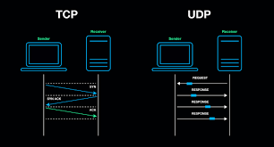
The section will describe the basic theory needed to understand the work of the project, such as TCP, UDP, as well as what a client and server are, the difference between TCP and UDP.

The theory was taken not only from RFC, but also from basic sources such as articles, Wikipedia, and studying materials. I will quote RFC where I see that it is possible, I will leave quotes on the theory from open sources where i thing it needs to be.

## **TCP (Transmission Control Protocol)**

This section will talk about the theory of TDP connections, perhaps even too deeply and knowledge of these things is not necessary, but still desirable for understanding, information for the section was taken from RFC and various open sources. [[1]](https://datatracker.ietf.org/doc/html/rfc9293)

The Transmission Control Protocol (TCP) is one of the main protocols of the Internet protocol suite. It originated in the initial network implementation in which it complemented the Internet Protocol (IP). Therefore, the entire suite is commonly referred to as TCP/IP. TCP provides reliable, ordered, and error-checked delivery of a stream of octets (bytes) between applications running on hosts communicating via an IP network. Major internet applications such as the World Wide Web, email, remote administration, and file transfer rely on TCP, which is part of the transport layer of the TCP/IP suite. SSL/TLS often runs on top of TCP.

TCP is connection-oriented, meaning that sender and receiver firstly need to establish a connection based on agreed parameters, they do this through three-way handshake procedure. The server must be listening (passive open) for connection requests from clients before a connection is established. Three-way handshake (active open), retransmission, and error detection adds to reliability but lengthens latency.
Source: [[13]](https://www.fortinet.com/resources/cyberglossary/tcp-ip#:~:text=Transmission%20Control%20Protocol%20(TCP)%20is,data%20and%20messages%20over%20networks.)

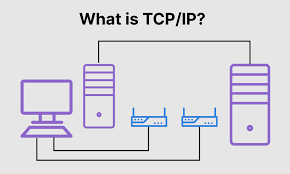

### **Three-Way Handshake**

The algorithm used by TCP to establish and terminate a connection is called a three-way handshake. We first describe the basic algorithm and then show how it is used by TCP. The three-way handshake involves the exchange of three messages between the client and the server. [[1]](https://datatracker.ietf.org/doc/html/rfc9293).

The idea is that two parties want to agree on a set of parameters, which, in the case of opening a TCP connection, are the starting sequence numbers the two sides plan to use for their respective byte streams. In general, the parameters might be any facts that each side wants the other to know about. First, the client (the active participant) sends a segment to the server (the passive participant) stating the initial sequence number it plans to use (Flags = SYN, SequenceNum = x). The server then responds with a single segment that both acknowledges the client's sequence number (Flags = ACK, Ack = x + 1) and states its own beginning sequence number (Flags = SYN, SequenceNum = y). That is, both the SYN and ACK bits are set in the Flags field of this second message. Finally, the client responds with a third segment that acknowledges the server's sequence number (Flags = ACK, Ack = y + 1). The reason why each side acknowledges a sequence number that is one larger than the one sent is that the Acknowledgment field actually identifies the “next sequence number expected,” thereby implicitly acknowledging all earlier sequence numbers. Although not shown in this timeline, a timer is scheduled for each of the first two segments, and if the expected response is not received, the segment is retransmitted. If you not interested in reading RFC Wiki gives good basic with references to it. [[16]](https://en.wikipedia.org/wiki/Transmission_Control_Protocol)


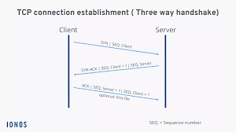


### **Data Transmission**

TCP organizes data so that it can be transmitted between a server and a client. It guarantees the integrity of the data being communicated over a network. Before it transmits data, TCP establishes a connection between a source and its destination, which it ensures remains live until communication begins. [[1]](https://datatracker.ietf.org/doc/html/rfc9293)

### **Congestion Control**

Transmission Control Protocol uses a congestion control algorithm that includes various aspects of an additive increase/multiplicative decrease scheme, along with other schemes including slow start and a congestion window, to achieve congestion avoidance. The TCP congestion-avoidance algorithm is the primary basis for congestion control in the Internet. Per the end-to-end principle, congestion control is largely a function of internet hosts, not the network itself. There are several variations and versions of the algorithm implemented in protocol stacks of operating systems of computers that connect to the Internet. [[24]](https://en.wikipedia.org/wiki/TCP_congestion_control)

To avoid congestive collapse, TCP uses a multi-faceted congestion-control strategy. For each connection, TCP maintains a CWND, limiting the total number of unacknowledged packets that may be in transit end-to-end. This is somewhat analogous to TCP's sliding window used for flow control.  [[1]](https://datatracker.ietf.org/doc/html/rfc9293).

### **Error Detection and Correction**

Error Detection and Correction: TCP uses checksums to detect errors in transmitted data. If an error is detected, the sender will retransmit the affected segment. Congestion Control: TCP uses algorithms to adjust its sending rate based on network congestion. [[1]](https://datatracker.ietf.org/doc/html/rfc9293)


### **Connection Termination**

The connection termination phase uses a four-way handshake, with each side of the connection terminating independently. When an endpoint wishes to stop its half of the connection, it transmits a FIN packet, which the other end acknowledges with an ACK. Therefore, a typical tear-down requires a pair of FIN and ACK segments from each TCP endpoint. After the side that sent the first FIN has responded with the final ACK, it waits for a timeout before finally closing the connection, during which time the local port is unavailable for new connections, this state lets the TCP client resend the final acknowledgment to the server in case the ACK is lost in transit. The time duration is implementation-dependent, but some common values are 30 seconds, 1 minute, and 2 minutes. After the timeout, the client enters the CLOSED state and the local port becomes available for new connections.  [[1]](https://datatracker.ietf.org/doc/html/rfc9293) [[19]](https://www.geeksforgeeks.org/tcp-connection-termination/)

### **Beneffits of TCP** [[1]](https://datatracker.ietf.org/doc/html/rfc9293)

- **Reliability:** TCP ensures that all data sent from the sender is received by the receiver, and if packets are lost or corrupted, they are retransmitted .
- **Ordered Delivery:** Data packets are delivered in the exact order in which they were sent, even if they arrive out of order due to network routing
- **Error Detection:** Data integrity is guaranteed with the use of checksums
- **Flow Control:** TCP ensures that the sender does not overwhelm the receiver by controlling the amount of data in transit
- **Congestion Control:** TCP dynamically adjusts the sending rate to avoid congestion and ensure smooth transmission
- **Connection Establishment and Termination:** TCP uses a reliable three-way handshake to establish, four-way handshake to terminate the connection
- **More** [[15]](https://www.techtarget.com/searchnetworking/definition/TCP)

### **Applications of TCP**
I took information from this website [[15]](https://www.techtarget.com/searchnetworking/definition/TCP), but you can freely use any of open sources for it.
TCP is used by many network applications that require tcp communication. Some of the most common applications:

- **Web Browsing (HTTP/HTTPS):** When you browse websites, HTTP or HTTPS uses TCP for reliable data transfer [[9]](https://datatracker.ietf.org/doc/html/rfc1945).
- **File Transfer Protocol (FTP):** FTP uses TCP to ensure files are correctly transferred between computers [[8]](https://datatracker.ietf.org/doc/html/rfc1350).
- **Email (SMTP, POP3, IMAP):** TCP ensures the reliable delivery of email messages between mail servers and clients [[6]](https://www.ietf.org/rfc/rfc1939.txt) [[7]](https://datatracker.ietf.org/doc/html/rfc5321).
- **Remote Access (SSH, Telnet):** TCP is used for secure and reliable remote connections between devices [[1]](https://datatracker.ietf.org/doc/html/rfc9293).


## **UDP (User Datagram Protocol)**  
This section will describe UDP, this is the second important part in the implementation of the project.

UDP (User Datagram Protocol) is a connectionless transport-layer protocol defined in [[2]](https://datatracker.ietf.org/doc/html/rfc768) [[17]](https://en.wikipedia.org/wiki/User_Datagram_Protocol). It provides a lightweight mechanism for transmitting data with minimal overhead, making it suitable for time-sensitive applications where low latency is prioritized over reliability. 

The User Datagram Protocol, or UDP, is a communication protocol used across the Internet for especially time-sensitive transmissions such as video playback or DNS lookups [[14]](https://www.cloudflare.com/learning/ddos/glossary/user-datagram-protocol-udp/). It speeds up communications by not formally establishing a connection before data is transferred.
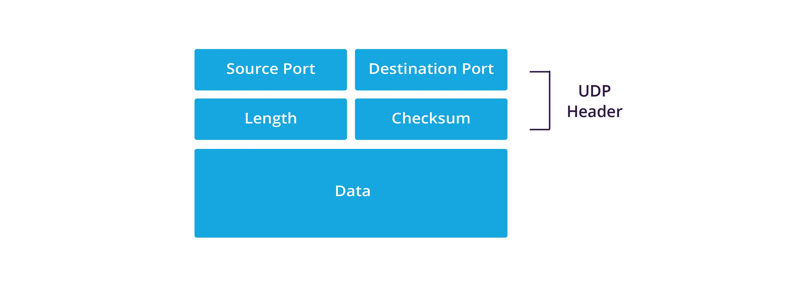


### **No Connection Setup**  
UDP is **stateless** and does not require a handshake, unlike TCP, which uses a three-way handshake [[3]](https://datatracker.ietf.org/doc/html/rfc793). A sender can start transmitting packets without establishing a connection with the receiver. Each packet ak. **datagram** is treated independently, allowing for minimal delay in communication.  

### **Packet Structure (UDP Datagram Format)**  
A UDP datagram consists of a **header** and a **data payload**. The header is 8 bytes long and contains the following fields:  

| Field            | Size (Bytes) | Description |
|-----------------|-------------|-------------|
| **Source Port**  | 2           | Identifies the sending process (optional). |
| **Destination Port** | 2       | Identifies the receiving process. |
| **Length**       | 2           | Specifies the total length of the UDP datagram (header + data). |
| **Checksum**     | 2           | Used for error detection in the header and data. |

The payload contains application-specific data, and the maximum size of a UDP datagram, including the header, is **65,535 bytes** [[2]](https://datatracker.ietf.org/doc/html/rfc768).  

### **No Acknowledgments or Retransmissions**  
UDP does not provide reliability mechanisms such as acknowledgments (ACKs) or retransmissions, unlike TCP [[3]](https://datatracker.ietf.org/doc/html/rfc793). If a packet is lost or arrives out of order, the responsibility for handling such issues lies with the application layer.  

### **Error Detection**  
UDP implements a simple **checksum** algorithm to verify the integrity of the header and data. If a checksum mismatch is detected, the packet is discarded. However, unlike TCP, UDP does not request retransmission for corrupted or lost packets.  

### **Low Latency and High Throughput**  
Due to its minimal overhead, UDP is much faster than TCP, making it ideal for applications requiring **low latency** and **high throughput** where occasional packet loss is acceptable. Some common use cases include:  

- **Real-time streaming (VoIP, video streaming, gaming)**  
- **DNS queries [[4]](https://datatracker.ietf.org/doc/html/rfc1035)**  
- **Network time synchronization [[5]](https://datatracker.ietf.org/doc/html/rfc5905)**  
- **IoT and sensor networks**  


### **Comparison: UDP vs. TCP**  

| Feature          | UDP [[2]](https://datatracker.ietf.org/doc/html/rfc768) | TCP [[3]](https://datatracker.ietf.org/doc/html/rfc793) |
|-----------------|-----------------|-----------------|
| **Connection Type** | Connectionless | Connection-oriented |
| **Reliability** | Unreliable | Reliable |
| **Ordering** | No guaranteed order | Ensures ordered delivery |
| **Error Handling** | Checksum only | Checksum, retransmissions |
| **Speed** | Faster (low overhead) | Slower (due to handshaking & acknowledgments) |
| **Use Cases** | Streaming, gaming, DNS, VoIP | Web browsing, file transfers, emails |

Additional source : [[15]](https://www.techtarget.com/searchnetworking/definition/TCP)
Good website, you can take accually full theory from that to this project.


## **Client**

The following parts of the text will not have citations as they are taken from this website. [[18]](https://en.wikipedia.org/wiki/Client%E2%80%93server_model)

There are many articles on this topic and the explanations in them are correct, so you can take from any resources. I took it from the link above and I recommend it to you.

The client–server model is a distributed application structure that partitions tasks or workloads between the providers of a resource or service, called servers, and service requesters, called clients. Often clients and servers communicate over a computer network on separate hardware, but both client and server may be on the same device. A server host runs one or more server programs, which share their resources with clients. A client usually does not share its computing resources, but it requests content or service from a server and may share its own content as part of the request. Clients, therefore, initiate communication sessions with servers, which await incoming requests. Examples of computer applications that use the client–server model are email, network printing, and the World Wide Web.


A **client** is a device or program that sends requests to a server to access services or resources. It typically initiates communication with the server and waits for a response. Clients can be a variety of devices or software applications, such as web browsers, email clients, or mobile apps. The client relies on the server to provide the required data, services, or functionality.

### **How Clients Work:**

1. **Sending Requests:**
   - The client sends a request to the server, usually over a network. The request specifies what data or service the client wants (e.g., a web page, a file, or a database query).

2. **Waiting for Responses:**
   - The client waits for the server to process the request and return the appropriate response. This could be the requested data, an acknowledgment, or an error message.

3. **Receiving and Displaying Responses:**
   - Once the server responds, the client processes the response and presents the data or action to the user (e.g., rendering a web page, displaying an email, or presenting a file).

4. **Ending the Communication:**
   - After receiving the response, the client can either send another request or terminate the connection, depending on the communication protocol used.
5. **Error Handling:**
   - If there are issues during the communication, such as network problems or invalid requests, the client may receive an error message from the server. The client then needs to handle these errors appropriately, which may involve displaying an error message to the user or attempting to resend the request.

**...**
### **Types of Clients:**

- **Web Browsers:**
   - These are the most common type of client. A web browser (like Chrome, Firefox, Safari) is used to request and display web pages served by web servers. The browser sends an HTTP request to the server, and the server responds with HTML, CSS, and JavaScript, which the browser renders as a web page.

- **Mobile Apps:**
   - Mobile applications also function as clients, sending requests to servers for data, such as news, social media updates, or weather reports. These apps typically interact with the server through APIs to fetch and display data to users.

- **Email Clients:**
   - Email clients (like Outlook, Thunderbird, or Gmail's mobile app) are used to access and manage emails stored on an email server. They send requests to retrieve messages, send new emails, or synchronize mail folders.

- **FTP Clients:**
   - FTP clients are used to transfer files to and from an FTP server. These clients can upload or download files, browse directories, and perform other file management tasks.


**Client** is an one of two main component in the client-server model, responsible for requesting services and displaying results to users. It depends on the server for resources but also handles many critical aspects of user interaction, processing, and presentation.


## **Server**

A **server** [[18]](https://en.wikipedia.org/wiki/Client%E2%80%93server_model) is a system or program that listens for and responds to requests from clients. It processes client requests, handles them, and sends back appropriate responses. Servers are typically always-on systems that provide various services, such as serving web pages, processing emails, managing databases, or running applications.

"Server-side software" refers to a computer application, such as a web server, that runs on remote server hardware, reachable from a user's local computer, smartphone, or other device. Operations may be performed server-side because they require access to information or functionality that is not available on the client, or because performing such operations on the client side would be slow, unreliable, or insecure.

Client and server programs may be commonly available ones such as free or commercial web servers and web browsers, communicating with each other using standardized protocols. Or, programmers may write their own server, client, and communications protocol which can only be used with one another.

Server-side operations include both those that are carried out in response to client requests, and non-client-oriented operations such as maintenance tasks.


### **How Servers Work:**

I will describe only the basic things that are most likely used in the server for our project, the rest of the points can be found in open sources.

1. **Listening for Requests:**
   - The server listens on a specified port for incoming connections and waits for requests from clients. This can involve listening for specific communication protocols, such as HTTP for web traffic or SMTP for email.

2. **Connection Establishment:**
   - In protocols like TCP, a server establishes a connection with the client to ensure reliable communication, which involves a handshake process (e.g., SYN-ACK).

3. **Processing Requests:**
   - Once a connection is established, the server processes the client's request, which may involve retrieving data, executing commands, or interacting with other services (such as a database).

4. **Sending Responses:**
   - After processing the request, the server sends back the appropriate response, such as a web page, confirmation, or error message, depending on the client’s request.

5. **Connection Termination:**
   - In TCP, once the request has been processed and the response is sent, the server terminates the connection using a **FIN** packet to signal the end of the communication.

6. **Handling Multiple Clients:**
   - Servers are often designed to handle multiple requests from multiple clients simultaneously. This is accomplished using various techniques, such as multi-threading, multiprocessing, or asynchronous I/O. This allows the server to efficiently manage a large number of concurrent client requests without becoming overwhelmed.

Another Funcionality: 

7. **Error Handling and Logging**

8. **Load Balancing**

9. **Security Measures**

10. **Caching**

11. **Scalability**

12. **State Management**

13. **Database Interactions**


### **Types of Servers:**

- **Application Server:**
   - Important type of server for us. The reason that we send Tcp and Udp packets so the server that gets thme is just an application that runs on VUT servers right now. An application server runs software applications and provides services to client applications. It may host business logic, process client requests, and interact with databases to deliver dynamic content or application functionality.

**Another servers types**

- **Web Server:**
   - A web server is responsible for hosting websites and serving web pages. It handles HTTP requests from clients (typically web browsers) and serves the appropriate HTML content, static files, or dynamic web pages.

- **Database Server:**
   - A database server stores and manages databases. Clients (such as web applications) send queries to the database server, which processes the request and returns the requested data.

- **File Server:**
   - A file server provides access to files over a network. Clients can upload, download, and manage files stored on the file server, often used in enterprise settings or cloud storage services.

- **Mail Server:**
   - A mail server handles the sending, receiving, and storage of emails. It processes incoming email requests from clients and stores messages in users' inboxes or sends new emails to their intended recipients.

- **DNS Server:**
   - A DNS (Domain Name System) server translates human-readable domain names (like "www.example.com") into IP addresses that computers can understand and use for routing network traffic.

- **Proxy Server:**
   - A proxy server acts as an intermediary between clients and other servers. It can improve security, performance (via caching), and anonymity by filtering traffic or masking the client's real IP address.

As a result, the server is a very important part in IT and we can say that the entire Internet works thanks to servers. In our project, this is a very important part since our client communicates with a remote server. In IPK25 project we use standart approach when client is .NET application in my situation or C,C++ that is running on client side and server is application that runs far from client (We dont know in what language, it is not important we comunicate using packets) and they communicate using Sockets. Next esction about sockets and it will be more that enough to understnand background of project.

## Network socket

In computer science, a network socket is an endpoint connected through a computer network. With the rise of the Internet, most communication between computers is done using the TCP/IP protocol family. The actual data transfer is done over IP, so the term "Internet socket" is also used. A user socket is a handle (an abstract reference) that a program can use when calling a network application programming interface (API), such as "send this data to this socket."

For more information use open-sources. Also will be good to read Microsoft **System.Net.Sockets Namespace** [[10]](https://learn.microsoft.com/en-us/dotnet/api/system.net.sockets?view=net-9.0) for better understanding how to use it in .NET applications.

In my project i use abstractions above sockets, so you will not see how i use it. But classes **TcpClient** [[11]](https://learn.microsoft.com/en-us/dotnet/api/system.net.sockets.tcpclient?view=net-9.0) and **UdpClient** [[12]](https://learn.microsoft.com/en-us/dotnet/api/system.net.sockets.udpclient?view=net-9.0) uses it. **They are part of Sockets namespace.**

# Introduction

This project involves the development of a client application that communicates with a remote server using the **IPK25-CHAT** protocol like it was desribed in Theory section. The protocol offers two transport protocol variants **UDP** and **TCP**. The task/project was to implement both variants, focusing on the networking aspects of the communication between the client and the server.

The **IPK25-CHAT** protocol defines several message types such as **AUTH**, **JOIN**, **MSG**, **BYE**, **PING**, **ERR**, **CONFIRM**, **REPLY** each with specific parameters and behaviors. The client must handle these message types appropriately, sending the required data and processing responses from the server based on the protocol/project's specifications.

The primary focus of this implementation was the correct handling of the networking layer, message processing, error handling, correct outputs, correct termination atd. This includes managing connections like UDP or stream-based communication of TCP. The client must perform actions such as authentication, joining chat channels, sending and receiving messages, and gracefully handling errors or connection terminations as described before.

Throughout the development, attention was given to the correct formatting of messages, correct using of transport protocols, FSM machine states. The client implements **IPK25-CHAT** protocol specification, enabling interaction with the server using both UDP and TCP variants. 

Next, the project will be described, its structure, how it should work, its state, what packets look like, error handling, client output, and so on it was taken from documentaion to project. 

***You can skip it to Implementation...**


# Project Overview

The **IPK25-CHAT** protocol uses client-server communication, with the option to use the **UDP** or **TCP** transport protocols. This project focuses on the implementation of both protocol variants, allowing for flexible communication and handling of different message types. The following sections outline the key message types in the protocol, the message header structure, and the content of each message type and so on...

All tables and theory were taken from the task, some parts were removed, some were shortened. Who is not interested in reading the task a second time, please go to the next chapter with my implementation. [Implementation](#implementation)
Source of Project Overview Section: [[21]](https://git.fit.vutbr.cz/NESFIT/IPK-Projects/src/branch/master/Project_2)

#### **Client FSM**:
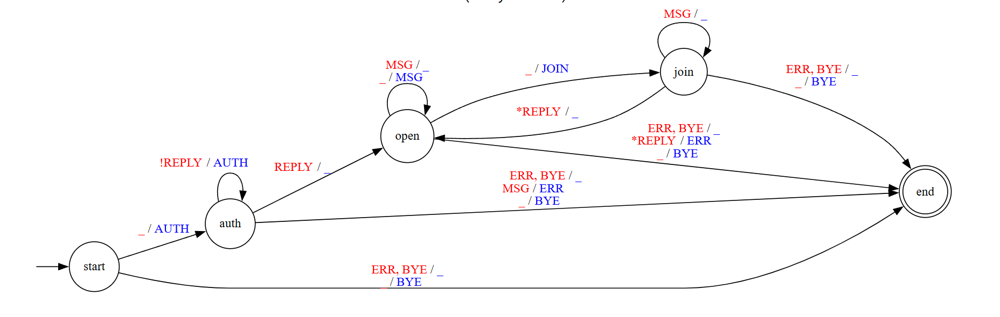

## Message Types

The **IPK25-CHAT** protocol defines several message types, each with specific functionality and structure. The client application must support and properly handle the following message types:

- **CONFIRM**
- **REPLY**
- **AUTH**
- **JOIN**
- **MSG**
- **ERR**
- **BYE**
- **PING**

Each message type has its own unique purpose in the communication flow, such as authentication, sending messages, confirming receipt, or indicating an error. More information about packets in next sections. They are refer to UDP variant, Tcp will be desribed after it from TCP Variant section.

### **CONFIRM**
The **CONFIRM** message is used exclusively in the UDP protocol variant to confirm the successful delivery of a message. This message contains the **Ref_MessageID**, which is the identifier of the message being confirmed.

```
1 byte       2 bytes      
+--------+--------+--------+
|  0x00  |  Ref_MessageID  |
+--------+--------+--------+
Ref_MessageID | uint16  | The MessageID value of the message being confirmed
```

### **REPLY**
The **REPLY** message is used to reply to a previously sent message. It contains the **Result** field (0 for failure, 1 for success), the **Ref_MessageID** (identifier of the message being replied to), and the **MessageContents** (the content of the reply message).

```
1 byte       2 bytes       1 byte       2 bytes      
+--------+--------+--------+--------+--------+--------+--------~~---------+---+
|  0x01  |    MessageID    | Result |  Ref_MessageID  |  MessageContents  | 0 |
+--------+--------+--------+--------+--------+--------+--------~~---------+---+
Result            | uint8    | 0 indicates failure, 1 indicates success
Ref_MessageID     | uint16   | The MessageID value of the message being replied to
MessageContents   | string   | Contains the reply content, always terminated with a zero byte
```

### **AUTH**
The **AUTH** message is used for client authentication. It contains the **Username**, **DisplayName**, and **Secret** fields, all of which are strings terminated by a zero byte.

```
1 byte       2 bytes      
+--------+--------+--------+-----~~-----+---+-------~~------+---+----~~----+---+
|  0x02  |    MessageID    |  Username  | 0 |  DisplayName  | 0 |  Secret  | 0 |
+--------+--------+--------+-----~~-----+---+-------~~------+---+----~~----+---+
Username      | string   | User's username, terminated with a zero byte
DisplayName   | string   | User's display name, terminated with a zero byte
Secret        | string   | User's secret (password), terminated with a zero byte
```

### **JOIN**
The **JOIN** message is used to request the client’s participation in a specific chat channel. It includes the **ChannelID** and the **DisplayName** of the client.

```
1 byte       2 bytes      
+--------+--------+--------+-----~~-----+---+-------~~------+---+
|  0x03  |    MessageID    |  ChannelID | 0 |  DisplayName  | 0 |
+--------+--------+--------+-----~~-----+---+-------~~------+---+
ChannelID     | string   | The channel to join, terminated with a zero byte
DisplayName   | string   | The client's display name, terminated with a zero byte
```

### **MSG**
The **MSG** message is used to send a message to the chat channel. It includes the **DisplayName** of the sender and the **MessageContents** of the message.

```
1 byte       2 bytes      
+--------+--------+--------+-------~~------+---+--------~~---------+---+
|  0x04  |    MessageID    |  DisplayName  | 0 |  MessageContents  | 0 |
+--------+--------+--------+-------~~------+---+--------~~---------+---+
DisplayName     | string   | Sender's display name, terminated with a zero byte
MessageContents | string   | The content of the message, terminated with a zero byte
```

### **ERR**
The **ERR** message is sent when an error occurs during communication. It includes the **DisplayName** of the sender and an error **MessageContents**.

```
1 byte       2 bytes
+--------+--------+--------+-------~~------+---+--------~~---------+---+
|  0xFE  |    MessageID    |  DisplayName  | 0 |  MessageContents  | 0 |
+--------+--------+--------+-------~~------+---+--------~~---------+---+
DisplayName     | string   | Sender's display name, terminated with a zero byte
MessageContents | string   | The error message content, terminated with a zero byte
```

### **BYE**
The **BYE** message indicates the termination of the conversation. It includes the **DisplayName** of the sender.

```
1 byte       2 bytes
+--------+--------+--------+-------~~------+---+
|  0xFF  |    MessageID    |  DisplayName  | 0 |
+--------+--------+--------+-------~~------+---+
DisplayName     | string   | Sender's display name, terminated with a zero byte
```

### **PING**
The **PING** message is used in the UDP variant to check the aliveness of the connection. It only contains the **MessageID** field.

```
1 byte       2 bytes
+--------+--------+--------+
|  0xFD  |    MessageID    |
+--------+--------+--------+
MessageID    | uint16   | A unique message ID for the ping message
```

## Message Header

Each message sent via the **IPK25-CHAT** protocol begins with a uniform 3-byte header, followed by message-specific content. The header consists of two fields: **Type** (1 byte) and **MessageID** (2 bytes). The **Type** field identifies the type of the message, while the **MessageID** provides a unique identifier for each message. The remaining content of the message varies based on the type and can range from no content (in the case of a **PING**) to variable-length data (such as the **MessageContents** in **MSG**).

#### Message Type Mapping

The **Type** field in the message header is mapped to specific protocol message types as follows:

| Message Type | Field Value |
|--------------|-------------|
| **CONFIRM**  | 0x00        |
| **REPLY**    | 0x01        |
| **AUTH**     | 0x02        |
| **JOIN**     | 0x03        |
| **MSG**      | 0x04        |
| **PING**     | 0xFD        |
| **ERR**      | 0xFE        |
| **BYE**      | 0xFF        |

#### MessageID

The **MessageID** field is a 2-byte number that uniquely identifies a message in the communication session. Each message is assigned a unique **MessageID** starting from 0, and each side of the communication (client and server) maintains its own **MessageID** sequence. The **MessageID** ensures that each message can be tracked and correctly processed by both parties.

## TCP Variant

The **TCP variant** of the **IPK25-CHAT** protocol ensures communication between the client and server by utilizing the inherent features of the **Transmission Control Protocol (TCP)** (like connection between server and client). TCP provides connection-oriented communication, ensuring that messages are delivered in the correct order and without loss. (When UDP dont connect and just send packets in any order) Unlike the **UDP variant**, the **CONFIRM** and **PING** message types are not required in the **TCP variant** because TCP guarantees the delivery and reliability of messages. 

### Message Content Parameter Mapping for TCP

In the **TCP variant**, each message type is mapped to specific content templates, which define how the data is formatted when exchanged between the client and server. The following table outlines the mapping of message types to their corresponding content templates:

| Message Type | Message Parameter Template                               |
|--------------|----------------------------------------------------------|
| **ERR**      | `ERR FROM {DisplayName} IS {MessageContent}\r\n`         |
| **REPLY**    | `REPLY {"OK \| "NOK"} IS {MessageContent}\r\n`           |
| **AUTH**     | `AUTH {Username} AS {DisplayName} USING {Secret}\r\n`    |
| **JOIN**     | `JOIN {ChannelID} AS {DisplayName}\r\n`                  |
| **MSG**      | `MSG FROM {DisplayName} IS {MessageContent}\r\n`         |
| **BYE**      | `BYE FROM {DisplayName}\r\n`                             |
| **CONFIRM**  | **Unused in TCP**                                        |
| **PING**     | **Unused in TCP**                                        |

These message parameter templates specify how the data should be structured for each type of message. For example:

- **ERR**: An error message is formatted as `ERR FROM {DisplayName} IS {MessageContent}\r\n`, where `{DisplayName}` is the name of the user sending the error message and `{MessageContent}` contains the description of the error.
  
- **REPLY**: A reply message is formatted as `REPLY {"OK" | "NOK"} IS {MessageContent}\r\n`, where `{"OK" | "NOK"}` indicates the success or failure of the operation, and `{MessageContent}` holds any additional information.

- **AUTH**: For authentication, the message is formatted as `AUTH {Username} AS {DisplayName} USING {Secret}\r\n`, where `{Username}` is the client’s username (in our situatuion, like xlogin00), `{DisplayName}` is the display name, and `{Secret}` is the password or authentication token (we used API-TOKEN when testing application).

- **JOIN**: When a client requests to join a chat channel, the message is structured as `JOIN {ChannelID} AS {DisplayName}\r\n`, where `{ChannelID}` is the unique identifier for the channel and `{DisplayName}` is the name of the client.

- **MSG**: A message from a user is sent as `MSG FROM {DisplayName} IS {MessageContent}\r\n`, where `{DisplayName}` is the user's name and `{MessageContent}` is the content of the message.

- **BYE**: To terminate the connection, the **BYE** message is formatted as `BYE FROM {DisplayName}\r\n`, where `{DisplayName}` indicates the user who is ending the conversation.

In the **TCP variant**, **CONFIRM** and **PING** messages are not used because TCP inherently ensures the reliability and delivery of messages. As a result, there is no need to confirm message delivery or periodically check the status of the connection.

By using TCP, this protocol variant focuses on message reliability, eliminating the need for extra mechanisms like **CONFIRM** and **PING**, which are crucial in the UDP variant where reliability is not inherently guaranteed by the transport layer. This makes the TCP variant simpler and more efficient for scenarios where message delivery assurance is required.

I also want to point out that packets have limitations, such as the length of messages, the characters that can be used in them, there are also many states and options when and how packets are sent, received, errors are processed, all this can be seen with the [FSM](#client-fsm) that I added to the project, and you can also read in more detail in the documentation for the **IPK25-CHAT** protocol.

## CLI Arguments and Client Behavior

This section have the behavior of the **client application** with respect to **command-line arguments (CLI)** and the **standard input (stdin)**. The client will handle the provided arguments to establish a connection with the server and support different client commands and chat messages.

### CLI Arguments

The client application must accept specific **command-line arguments** to configure its connection to the server. These arguments will control how the client communicates over TCP or UDP, how the server is identified, and certain timeout or retransmission settings for UDP. The table below outlines the mandatory and optional arguments:

| Argument | Value | Possible Values | Meaning or Expected Program Behavior |
|----------|-------|-----------------|--------------------------------------|
| `-t`     | User provided | `tcp` or `udp` | Specifies the transport protocol used for the connection (either TCP or UDP). |
| `-s`     | User provided | IP address or hostname | Specifies the server's IP address or hostname. This argument is mandatory for connecting to the server. |
| `-p`     | 4567  | `uint16` | Specifies the server port. Default value is 4567, but it can be adjusted if needed. |
| `-d`     | 250   | `uint16` | Specifies the UDP confirmation timeout in milliseconds. It is used only in the UDP protocol variant. |
| `-r`     | 3     | `uint8` | Specifies the maximum number of UDP retransmissions. This argument is only used with the UDP protocol. |
| `-h`     |       |                 | Prints the program help output and exits. |

**Note**: Arguments marked as "User provided" are mandatory, and the user must always specify these arguments when running the program. Other arguments, such as the timeout or retransmission limit, are optional and have default values. The behavior of the program is undefined if arguments are provided incorrectly or in an unsupported manner.

### Client Input and Commands

The client will read **user input** from the **standard input stream (stdin)**. Each input will either be a **local command** or a **chat message** to send to the server. The following defines the client behavior regarding input handling:

### **Command Format**:
All valid commands must be **prefixed** with a forward slash `/` and followed by a non-zero number of characters (a-z, 0-9, `_`, `-`) to uniquely identify the command. The client supports the following local commands:

| Command  | Parameters                                   | Client Behavior |
|----------|----------------------------------------------|-----------------|
| `/auth`  | `{Username} {Secret} {DisplayName}`          | Sends an AUTH message with the provided data to the server. The server's reply is processed, and the `DisplayName` is set for future use (same as the `/rename` command). |
| `/join`  | `{ChannelID}`                                | Sends a JOIN message with the specified channel name to the server. The server's reply is processed. |
| `/rename`| `{DisplayName}`                              | Locally changes the user's display name. This display name is used in messages and commands. |
| `/help`  |                                              | Displays all supported local commands with their descriptions. |

### **Message Input**:
- If the user input does not match a recognized command (i.e., no forward slash `/`), the input is interpreted as a **chat message**.
- If the chat message is not acceptable based on the current state (e.g., trying to send a message before authentication or joining a channel), the program will output an error message without terminating.
  
**Note**: All chat messages must be terminated with a newline character (`\n`).

The client must handle **user input sequentially**, only one action (command or message) can be processed at a time. Once the action is complete (i.e., the message has been delivered to the server, or the command has been processed), the program is ready to handle the next input.

### Client Error Handling

If the user attempts to perform an invalid operation (e.g., sending a message in an invalid state), the client will print an appropriate error message and will **not terminate**. Below are a few examples of what may trigger error messages:

- **Sending a message in a non-open state**: If the client hasn't authenticated, or if the channel hasn't been joined yet, sending a message should display an error.
- **Malformed command**: If the user provides a command with incorrect syntax, an error message will be printed.
- **Trying to join a channel in a non-open state**: If the client hasn't successfully authenticated or isn't connected to a server, attempting to join a channel will result in an error.
- **...**

### Connection Termination

The client must respond to termination signals (like `Ctrl + C`) by gracefully exiting and closing the connection with the server. The **BYE** message should be sent to the server to signal the termination of the connection.

- For **TCP connections**, ensure that the connection is properly finalized.
- For **UDP connections**, the client must right process packet and if need send CONFIRM several times to be sure.

If the client receives an **ERR** or **BYE** message from the server, the client should process these appropriately and terminate the connection gracefully.

### Client Exception Handling

The client must handle a variety of exceptional situations during execution. These situations will arise if the client receives unexpected or malformed messages or if there is a communication issue. Here's how the client should behave in such scenarios(From IPK25-CHAT protocol Documentation): 

| Situation | Category | Expected Client Behavior |
|-----------|----------|--------------------------|
| Receiving a malformed message from the server | Protocol error | The client should display a **local client error** message, send an **ERR** message to the server (if possible), gracefully terminate the connection, and exit with an error code. |
| Confirmation of a sent UDP message times out | Protocol error | The client should display a **local client error** message, consider the connection as final (stop sending further messages), and exit with an error code. |
| No REPLY message received to a confirmed request message in time | Protocol error | The client should display a **local client error** message, send an **ERR** message to the server (if possible), gracefully terminate the connection, and exit with an error code. |

In these cases, the client must be able to **terminate gracefully**, ensuring proper communication is concluded with the server, and no further messages are sent.

### Client Output Formatting

The client must format its output correctly for different types of messages. Each type of message received from the server should trigger the corresponding output on the **standard output stream (stdout)**:

- **MSG (Chat Message)**: `"{DisplayName}: {MessageContent}\n"`
- **ERR (Error Message)**: `"ERROR FROM {DisplayName}: {MessageContent}\n"`
- **REPLY (Action Response)**: 
  - If successful: `"Action Success: {MessageContent}\n"`
  - If failure: `"Action Failure: {MessageContent}\n"`
- **Internal Client Errors**: `"ERROR: {MessageContent}\n"`
## Implementation

In this chapter, we discuss the implementation of a chat client that can communicate with a server over TCP or UDP. The client can be configured to use either transport protocol via command-line arguments, and the application leverages multithreading to handle network communication and user input concurrently.

### Overview of the Code Structure

The program implements a **client application** that can operate over both **TCP** and **UDP** protocols. It is designed to read command-line arguments, set up server connection settings, and enable chat functionality based on the chosen transport protocol.

### Main Components of Client

The main components in the program are:

1. **Server Settings**: The `ServerSetings` class parses the command-line arguments to configure server settings, including transport protocol, server address, and server port.
   
2. **TCP Client** [[11]](https://learn.microsoft.com/en-us/dotnet/api/system.net.sockets.tcpclient?view=net-9.0): The `TcpUser` class is used to manage the connection and communication with the server over TCP. It establishes a network stream for sending and receiving data.

3. **UDP Client** [[12]](https://learn.microsoft.com/en-us/dotnet/api/system.net.sockets.udpclient?view=net-9.0): The `UdpUser` class handles the UDP communication, including starting the client, sending messages, and receiving responses from the server.

4. **Multithreading**: The program utilizes multithreading to manage the simultaneous execution of client-side operations, such as handling user input and maintaining the connection with the server. Actually can be changed to Async, working with Thread a little harder but gives more controll, this is for old programmers on C# old-school.

I want to note that TcpClient, UdpClient is not the same as TcpUser,UdpUser. The first pair goes to **System.Net.Sockets Namespace** [[10]](https://learn.microsoft.com/en-us/dotnet/api/system.net.sockets?view=net-9.0) it just deals with sockets, connections, packages, essentially an abstraction over sockets. In its turn, a couple with the User endings, these are my classes that are responsible for logic. In truth, they could have been written better using more abstraction and techniques, for example, like **Strategy** [[20]](https://refactoring.guru/design-patterns/strategy) in order to write one logic for two and then simply substitute a solution, this would be more in line with OOP and would be more abstract and polymorphic. But the problem is that the Udp logic is still slightly different and it would be necessary to write additional logic only for it and insert it into the middle of the general solution. So, as the classic said and what all companies use now, it is better to write code quickly and working, than to write it for 10 years and get a very complex architecture where no senior can figure it out.

### Main Program Flow
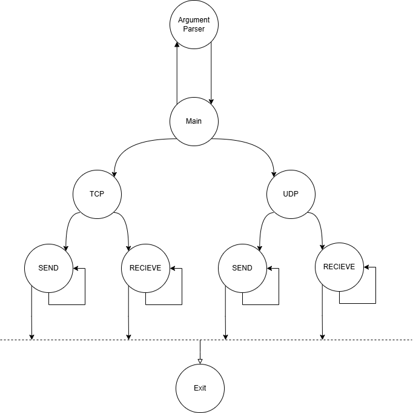
The `Main` method is responsible for initializing the client application. The text can be confusing, **Tcp Client** and **Udp Client** in text do not belong to classes such as **TcpClient and UdpClient**, it only means that these are clients for TCP and UDP applications. That is, these words in my text and code are different things, one is a class, the other is a client that works with this protocols:

1. **Parse Command-Line Arguments**:
   The program begins by parsing the command-line arguments through the `ServerSetings` class. This class processes arguments related to transport protocol (`tcp` or `udp`), server address, and port number. If an error occurs during this process, the program displays an error message and terminates.

   ```csharp
   ServerSetings serverSetings = new ServerSetings(args);
   ```

2. **TCP Client Setup**:
   - If the `tcp` transport protocol is selected, a `TcpClient` object is created, which establishes a connection to the server using the specified IP address and port.
   - A `NetworkStream` is obtained from the `TcpClient` for sending and receiving data.
   - The `TcpUser` object, which handles the communication protocol for TCP, is instantiated and the `EnableChatTcp` method is called to enable chat functionality.

   ```csharp
       using (TcpClient tcpClient = new TcpClient(AddressFamily.InterNetwork))
       {
           tcpClient.Connect(serverSetings.serverAddress, serverSetings.serverPort);
           using (NetworkStream networkStream = tcpClient.GetStream())
           {
               TcpUser tcpUser = new TcpUser(networkStream);
               tcpUser.EnableChatTcp();
           }
           tcpClient.Close();
       }
   ```

   The `TcpClient` object is disposed of automatically after the connection is closed, ensuring that resources are freed properly.

3. **UDP Client Setup**:
   - If the `udp` transport protocol is selected, a `UdpUser` object is created using the `ServerSetings` configuration.
   - The `EnableChatUdp` method of the `UdpUser` class is invoked to begin the communication process. This method is responsible for sending and receiving messages over UDP and is implemented to handle network communication concurrently using **multithreading**, one thread to send,one to recieve.

   ```csharp
       UdpUser udpUser = new UdpUser(serverSetings);
       udpUser.EnableChatUdp();
   ```

4. **Error Handling**:
   - If an exception occurs at any point during the execution of the program, an error message is printed to the console. The program then exits with an error code.

   ```csharp
   catch (Exception e)
   {
       Console.WriteLine($"ERROR: {e.Message}");
       Environment.Exit(1);
   }
   ```
#### Short Description

In short, the application is the main thread, which at the beginning is divided into 2 options, either tcp or udp. After which each of them starts 2 processes, one for processing the console and sending packets to the server, and the other for receiving. This is done so that the application does not hang at the moment of writing a message and stops receiving packets from the server or outputting them to the console, and when receiving packets, it does not allow writing in the chat. This approach allows you to asynchronously process both outgoing and incoming packets without waiting.

### TCP Client Implementation (TcpUser)

The `TcpUser` class is designed to handle communication between a client and a server using the **TCP** protocol. It supports various actions such as authenticating with the server, joining channels, sending and receiving messages, and processing different types of server responses. Additionally, it uses multithreading to manage simultaneous user input and message reception from the server like it was desribed earlier.

If I describe it briefly, it works like this: a connection is established between the client and the server, this connection (reference to the object) is transferred to my object and from there it is managed. There are basically 2 threads working in parallel: one receives input in the console and sends packets, in case of an error it displays it in the console, the second packet receives packets and also displays them in the console or an error. In case of receiving an error or BYE or closing the connection, the client correctly closes the connection and closes the application with or without the error code. Also implemented is the support of several messages in one packet and also one message divided into several packets. I will not describe the work line by line, only its basics, for more detailed things like processing each packet, look in the source code, but it works so that the packets are read, then they are divided by \r\n and these packets are processed separately, for each packet there is a separate HandlePacket method that handles it.
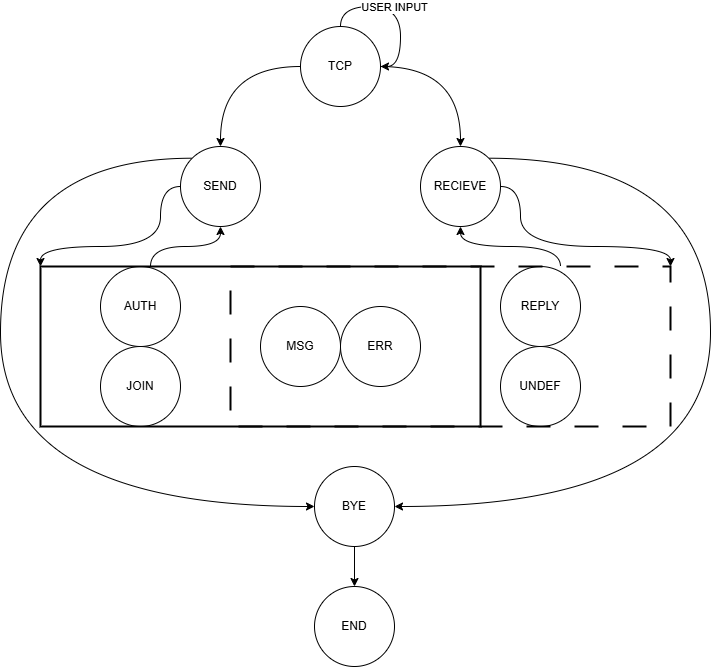

From UML you can see that the program receives and sends packets of different types. [Project Overview Packet Types](#message-content-parameter-mapping-for-tcp)
#### Functions:

1. **Authentication**: The client can authenticate itself by providing a username, secret, and display name. The server will respond with either a success or failure message, allowing the client to proceed with further actions if successful.

2. **Channel Joining**: After authentication, the client can join a specific channel. The server replies with the success or failure of this operation.

3. **Message Sending and Receiving**: The client can send messages to the server, which in turn will send back responses. These messages can include communication from other users, errors, or general replies.

4. **Multithreading**: A dedicated thread is responsible for receiving messages from the server while the main thread handles the client’s user input.

5. **Error Handling**: The client processes various server responses, including success (`REPLY`), error (`ERR`), and message (`MSG`) types. If any unexpected messages are received, the client handles them accordingly.
6. **More in source files** rename...
#### Implementation Details:
**Only main details, it wond describe code line by line!**
1. **Constructor**:
   - The constructor initializes the network stream and sets up a thread to handle incoming messages from the server.
   - It also register **CancelKeyPress** event for interruption signals, such as when the user presses `Ctrl+C`.

2. **Enable Chat**:
   - The `EnableChatTcp` method listens for user input continuously. If the input matches a predefined command (e.g., authentication, channel joining), the client processes it accordingly.
   - If the user is not authenticated, sending messages is prohibited.
   - The method also validates the input to ensure that only valid messages (i.e., containing ASCII printable characters) are sent.

3. **Authentication**:
   - The client sends an authentication request to the server, including the username, display name, and secret. 
   - It then processes the server’s response, handling both success and failure cases.

4. **Join Channel**:
   - The client sends a `JOIN` request to the server to join a specific channel. The channel name is validated for length and character composition (only alphanumeric characters and hyphens are allowed).

5. **Message Reception**:
   - A dedicated thread listens for incoming server messages, processes them, and calls appropriate methods based on the type of message (e.g., message from another user, error, server reply).
   - The method splits incoming data into individual messages and processes them sequentially.

6. **Sending Messages**:
   - Messages are converted into byte arrays and sent over the network stream to the server.

7. **Receiving Messages**:
   - The client reads incoming data from the network stream, processes it, and returns it as a string. If an error occurs during the reading process, it returns an "ERROR" message.

8. **Processing Server Messages**:
   - The client handles different types of server messages, such as `MSG` (regular message), `ERR` (error message), `REPLY` (server reply), and `BYE` (server termination). Each message type is processed by specific methods designed for handling them.

9. **Error Handling**:
   - The client has built-in error handling that processes error messages and gracefully terminates the connection if needed. For example, if an `ERR` message is received, the client displays the error correctly terminates. (Without BYE message)

### UDP Client Implementation (UdpUser)

The `UdpUser` class operates as a UDP-based communication client, enabling the user to send and receive messages to and from a server over the **UDP** protocol. It handles authentication, message sending, receiving server responses, and managing retransmissions when necessary.

The **UML diagram** follows the same structure as in the TCP variant but includes additional logic specific to UDP communication:  
- After sending a message (`SEND`), the client waits for a **CONFIRM** from the server.  
- Upon receiving a message (`RECEIVE`), the client sends back a **CONFIRM** to acknowledge it.  
- Handling Dublicates.
- Resending packets if not getting CONFIRM before timeout. 

To manage UDP-specific behaviors, the client uses the `-d` and `-r` command-line arguments:
- `-d` sets the **UDP confirmation timeout** (in milliseconds), defining how long the client waits for a **CONFIRM** before retrying.  
- `-r` specifies the **maximum number of UDP retransmissions**, ensuring the client does not retry indefinitely if no confirmation is received.  


The main difference from tcp is that a connection is not established, packets are in bit form and not in text, and it is also necessary to confirm incoming packets and resolve undelivered projects and duplicates. Basically the same code as before, just with additional logic and a different format. You can check this [Implementation Details](#implementation-details) UDP implemenation have same functions as TCP, but another packets format and additional logic as desrived before.

This concludes the implementation section. My goal was to describe more how it works and what it uses. For more information on the implementation, I recommend looking at the source code, I added quite large comments to each function and explained in detail what it is for, what it does, and what its result is. The entire code is divided into such small methods and each of them has its own extensive comment. The next section will be testing.

## Testing

The application was tested in different conditions, I tested all types of packets and all possible situations with the reference server, then you will see pictures from discord, wireshark, also in the directory with tests you can find all this in text form, and captured wireshark packets, do not reduce the points for screenshots, this is to confirm the tests. The application was also tested on my server, which I wrote last year, I tested all situations, and also simultaneously connected several clients to my server, both tcp and udp, and from them it is clear that all clients correctly process packets. It was also additionally tested on python tests in isolation, there are more than 40 tests aimed at checking all possible situations.

The tests were made on **VirtualBox with IPK25_Ubuntu24.ova** installed on it, i used and used **NIX development environment** [[22]](https://git.fit.vutbr.cz/NESFIT/dev-envs#starting-development-environment) with root privileges. 

During the tests it was found out that root does not have .NET Runtime so Makefile was changed and now includes Runtime. Now during testing it is considered that Makefile will be launched without privileges and compiled using .NET 9 SDK and .NET 9 Runtime will be placed in the binary file. In turn, root will use Runtime which will already be in the binary file, since it does not have its own.

### Testing with Reference Server

The client was tested using a **Reference Server**, which we get for this year. This allowed us to validate the core functionality and integration with the server-side processes. The tests performed in this environment ensured that the system handles real-time packet transmission and reception correctly, and meets performance and reliability standards.

#### Tested Protocols and Operations:
- **TCP**: AUTH, BYE, JOIN, MSG, RENAME
- **UDP**: AUTH, BYE, JOIN, MSG, RENAME , CONFIRM

The tests were conducted using an **automated Python test** that runs the program and feeds input into the standard input (stdin) with a timeout of **0.5s** to simulate human behavior. This test environment helped verify the system's ability to process packets with realistic timing, closely mimicking user actions. 

Additionally, the **Reference Server** does not support sending multiple TCP packets within a single packet, which was considered when designing the tests.

#### Test Setup and Results:
Each of the following tests includes predefined stdin inputs, along with results captured from the program, Reference Server, and network traffic analysis tools.
You can find all results in directory `tests\IntegrationReferenceServerTests`, additional you can find there all captured packets in files that ends  **.pcapng**. You can open it in Wireshark.

In the tests it was expected that the packets sent by the client would be correctly processed by the server. As a result, all possible cases were tested and the results can be seen below.

It will not describe over and over again what happens in the tests, it is clearly visible from the name of the test, input, output, discord snapshot, wireshark snapshot and all additional files saved in the directory with the tests.

Every test have structure like **Protocol-PacketType, stdin, stdout, image from Reference Discord Server, Wireshark Screenshot(with pcapng file in directory), for TCP I added FLOW in text**. Stdin and Stdout is links to txt files in directory, they are mostly same and was used during auto testing, dont see reasons to copy-paste it 10 times. All results in text/captured packets/images and so on can be finded in directory **tests**.

Based on the comments on the forum about using images, they will be used only in tests with the REFERENCE server to show the correct processing of packets by it. In further tests, all examples and results will be in text.

**If you see an unloaded icon/text/image** atd, it is most likely a markdown viewer error, in these places there is always a link to a file that is in the directory, mainly it has a problem with the input and output since they are stored in text form in the directory with tests, because they were used in automatic testing and I added links to them. In this case, please find them in the project files or use another viewer.

##### **TCP-AUTH**
- **Predefined stdin**: 
- **Program Output**: 
- **Reference Server Output**:  
  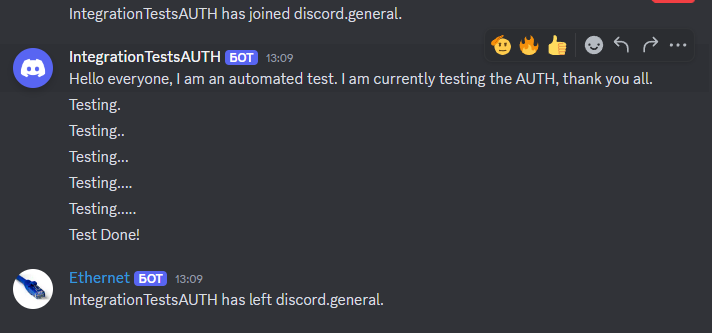
- **Wireshark Screenshot**:  
  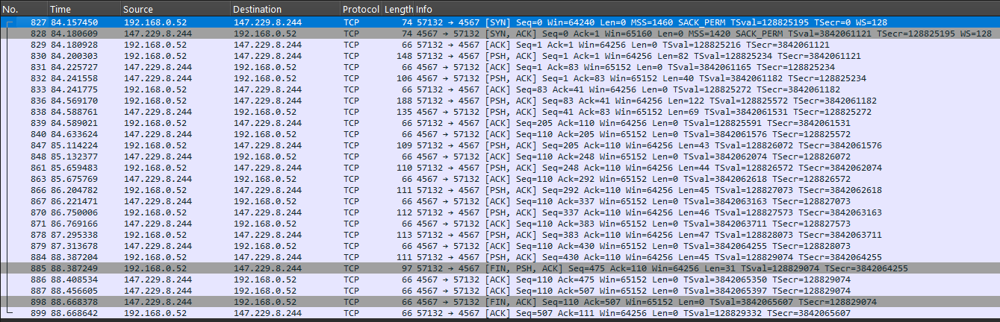
- **Wireshark FLOW**: 
```
AUTH xmalas04 AS IntegrationTestsAUTH USING 5a798b1c-9425-492f-aca1-439513fb7440

REPLY OK IS Authentication successful.

MSG FROM IntegrationTestsAUTH IS Hello everyone, I am an automated test. I am currently testing the AUTH, thank you all.

MSG FROM Server IS IntegrationTestsAUTH has joined discord.general.

MSG FROM IntegrationTestsAUTH IS Testing.
MSG FROM IntegrationTestsAUTH IS Testing..
MSG FROM IntegrationTestsAUTH IS Testing...
MSG FROM IntegrationTestsAUTH IS Testing....
MSG FROM IntegrationTestsAUTH IS Testing.....
MSG FROM IntegrationTestsAUTH IS Test Done!
BYE FROM IntegrationTestsAUTH 	                                                                              
```

##### **TCP-BYE**
- **Predefined stdin**: 
- **Program Output**: 
- **Reference Server Output**: Same as previous.
- **Wireshark Screenshot**: Same as previous.

##### **TCP-JOIN**
- **Predefined stdin**: 
- **Program Output**: 
- **Reference Server Output**:  
   Connected To discord.general.
  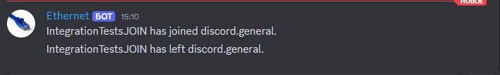

  Connected To discord.jointest.

  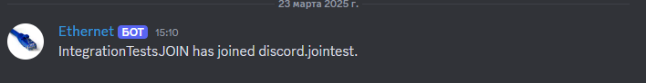

 `Here is strange thing of Reference Server. TCP was tested after UDP. So it Created new channel for TCP (Upper Image), but prints MSG to old one channel with the same name.(That channel was created for UDP)`

  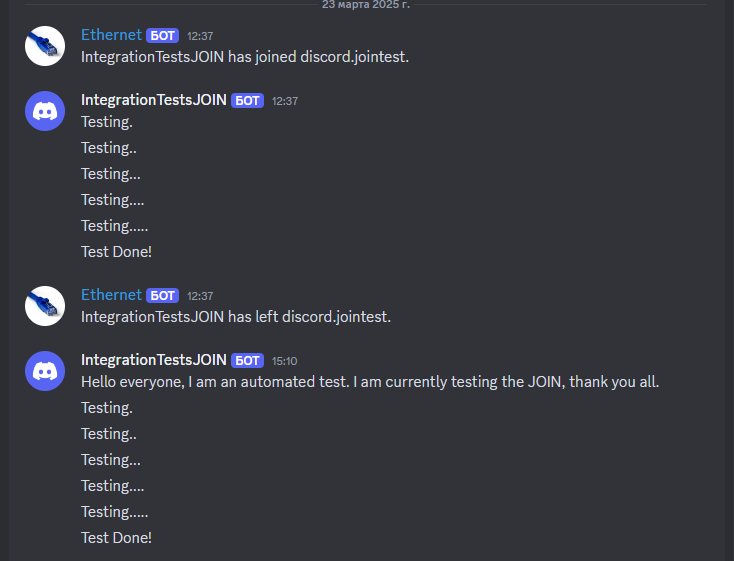
- **Wireshark Screenshot**:  
  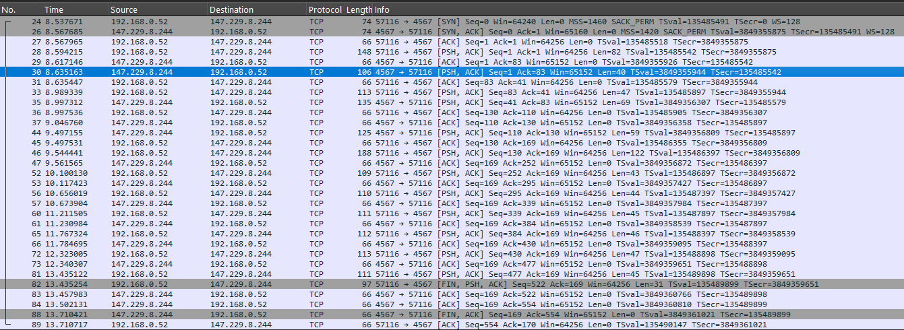
- **Wireshark FLOW**: 
```
AUTH xmalas04 AS IntegrationTestsJOIN USING 5a798b1c-9425-492f-aca1-439513fb7440

REPLY OK IS Authentication successful.

JOIN discord.JoinTest AS IntegrationTestsJOIN

MSG FROM Server IS IntegrationTestsJOIN has joined discord.general.
REPLY OK IS Channel discord.JoinTest successfully joined.

MSG FROM IntegrationTestsJOIN IS Hello everyone, I am an automated test. I am currently testing the JOIN, thank you all.
MSG FROM IntegrationTestsJOIN IS Testing.
MSG FROM IntegrationTestsJOIN IS Testing..
MSG FROM IntegrationTestsJOIN IS Testing...
MSG FROM IntegrationTestsJOIN IS Testing....
MSG FROM IntegrationTestsJOIN IS Testing.....
MSG FROM IntegrationTestsJOIN IS Test Done!
BYE FROM IntegrationTestsJOIN

```


##### **TCP-MSG**
- **Predefined stdin**: 
- **Program Output**: 
- **Reference Server Output**: Was tested in other tests. 
- **Wireshark Screenshot**:  Same as another tests.


##### **TCP-RENAME**
- **Predefined stdin**: 
- **Program Output**: 
- **Reference Server Output**:  
  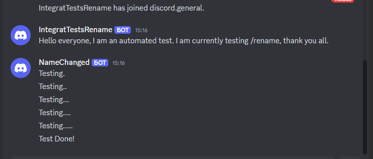
- **Wireshark Screenshot**:  
  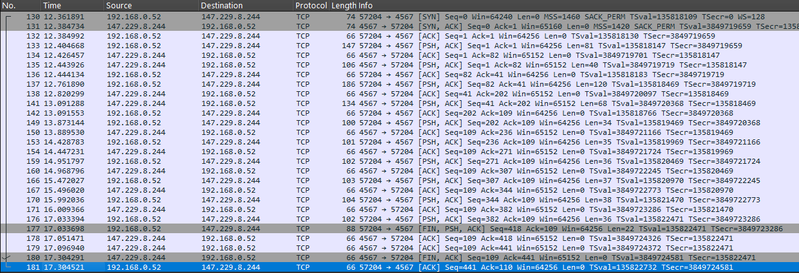

```
AUTH xmalas04 AS IntegratTestsRename USING 5a798b1c-9425-492f-aca1-439513fb7440

REPLY OK IS Authentication successful.

MSG FROM IntegratTestsRename IS Hello everyone, I am an automated test. I am currently testing /rename, thank you all.

MSG FROM Server IS IntegratTestsRename has joined discord.general.

MSG FROM NameChanged IS Testing.
MSG FROM NameChanged IS Testing..
MSG FROM NameChanged IS Testing...
MSG FROM NameChanged IS Testing....
MSG FROM NameChanged IS Testing.....
MSG FROM NameChanged IS Test Done!
BYE FROM NameChanged
```
##### **UDP-AUTH**
- **Predefined stdin**: 
- **Program Output**: 
- **Reference Server Output**:  
  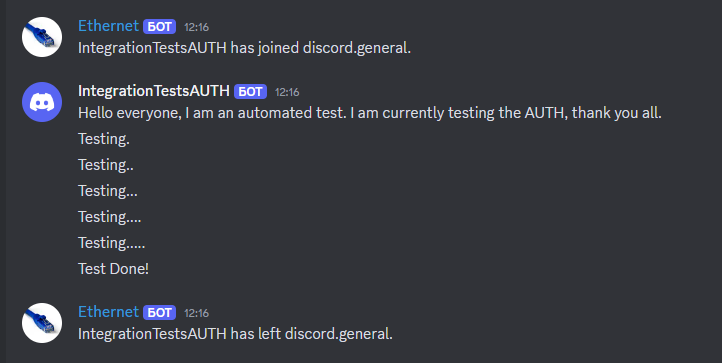
- **Wireshark Screenshot**:  
  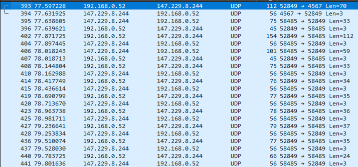


##### **UDP-BYE**
- **Predefined stdin**: 
- **Program Output**: 
- **Reference Server Output**:  
  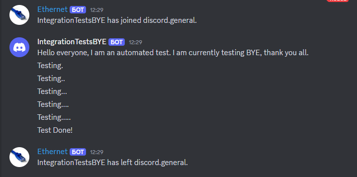
- **Wireshark Screenshot**:  
  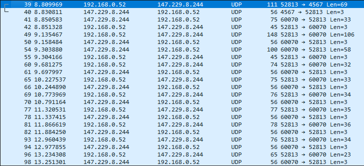


##### **UDP-JOIN**
- **Predefined stdin**: 
- **Program Output**: 
- **Reference Server Output**:  
  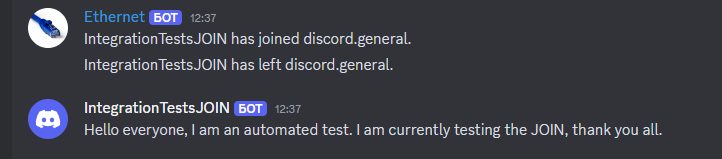
- **Wireshark Screenshot**:  
  


##### **UDP-MSG**
- **Predefined stdin**: 
- **Program Output**: 
- **Reference Server Output**:  
  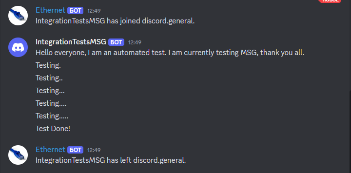
- **Wireshark Screenshot**:  
  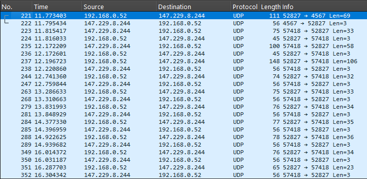


##### **UDP-RENAME**
- **Predefined stdin**: 
- **Program Output**: 
- **Reference Server Output**:  
  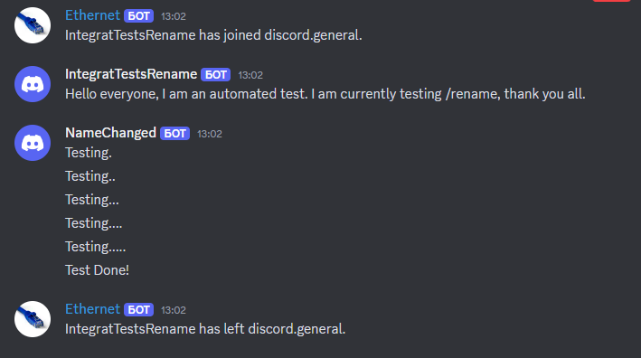
- **Wireshark Screenshot**:  
  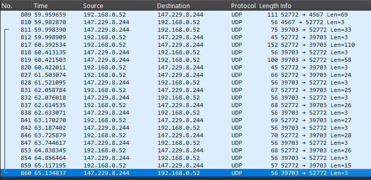


#### Final Test (Approved)

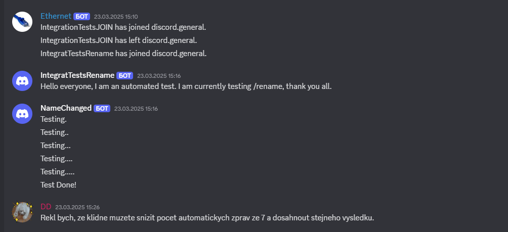
And as you can see, my tests were not left without attention. My tests were confirmed by the creator of this project himself. Which once again confirms the quality of testing and the results achieved. Thank you.


This detailed testing setup ensured thorough validation of the system’s behavior across both TCP and UDP protocols. All the test results were analyzed through the generated outputs, Wireshark screenshots, and pcapng files, ensuring that the system functions as expected in real-world conditions.

As a result, all tests were successful, and in the tests you can see the flow of tcp packets, the output of packets from the server to the discord. So all functions work fine with it.


### Testing with Custom Server  
**FROM THIS TEST CLEARLY SEEN THAT PROGRAM CAN SEND/RECIEVE&PRINT ALL TYPES OF PACKETS!**

Additionally, project was tested with my own server. The **Custom Server** must impements all server side functions. The reason I tested this is because on the reference server it is difficult to catch the moment of communication between several clients through the server. Here I can do it myself.
To further validate reliability, we conducted extensive tests on the following message sequences over both **TCP** and **UDP**:  
- **AUTH** (Authentication)  
- **MSG** (Message exchange)  
- **JOIN** (Joining the server)  
- **REPLY** (Response messages)  
- **CONFIRM** (Acknowledgment mechanism)  
- **BYE** (Session termination)  

These tests confirmed that both **TCP** and **UDP** communication worked perfectly, with expected behavior across all tested scenarios. Basically, tests are needed to test packages like MSG, JOIN so that it is clearly visible that the client is processing messages from the server, it is harder to wait MSG from reference server to test it.

#### Users and Server Logs  
Client-side interactions were captured in the following logs:  
- **TCP Clients:**
   - **IPK_TCP_USER1**
    
  - **IPK_TCP_USER2**
    
- **UDP Clients:**  
   - **IPK_UDP_USER1**
   
   - **IPK_UDP_USER2**  
    

- **Server-side logs detailing all communications are stored in:** 
  

Additionally, packet captures (`.pcapng` files) for further network analysis are available in the `tests/CustomServer/` directory. These captures provide in-depth verification of communication consistency and protocol adherence.  

#### Visuals  


**From the tests you can see that 4 clients connected to the server. 2 of which are tcp and 2 are udp. The first tcp client watched the chat, the other clients wrote to it. In result you can see that TCP1 have IPK25-CHAT. Then you can see that all the users moved to another channel, asked for points for the project and left it.**

### Integration Tests
I will note include source siles of this test due to big size.

My github repo: [[23]](https://github.com/Vlad6422/VUT_IPK_CLIENT_TESTS)

This is python tests that tests all posible states of application. These tests were used by most students and most of them praised them, so you may have seen or will see these tests quoted by other students, these are last year's tests that I changed to a new format, added additional tests, changed the states and how and when packets are processed.

Also during testing, it was found that the Virtual Machine (Virtual Box) does not always hold the load of Python tests.
I tested all the tests both on the virtual machine and without it. And I found out that without a virtual machine, Python tests on average send a packet the first packet at a speed of less than 100 ms, this is the delta between the time the packet was sent from the client to the server and from the server to the client, for example, 100 ms passed after the AUTH packet was sent and CONFIRM was sent in response, and sending subsequent packets reduces this delta to 10 ms or less.

At one time, on a virtual machine and in a NIX environment with .NET 9, Python tests did not always pass everything. Sometimes a couple of UDP did not pass, the reason for this was that the virtual machine does not have time to interpret Python so quickly and gives a response to an incoming packet on average from 150 to 300 ms, such a large spread most likely depends on what processes are currently running in the background in the system. Therefore, I checked it via wireshark and yes, sometimes the CONFIRM packet is sent after 251 ms, this is not a test error, it should be sent immediately after receiving, most likely again the slow speed of interpretation on the virtual machine. But even so, in 90% of cases all tests pass, sometimes 1-2 tests may not pass due to the fact that the program is initially configured so that it resends the packet after 250 ms, naturally, if the test sent it after 251 ms, it will receive a second packet for authorization and say that this is an error. At some point, you can simply restart the same test and then it will pass again. Typically this problem occurs with the acknowledgement of the very first incoming packet, then the rest of the packets are processed faster.

## UDP Tests:
- **udp_help_command**: PASSED
- **udp_hello**: PASSED
- **udp_not_auth**: PASSED
- **udp_invalid_command**: PASSED
- **udp_auth**: PASSED
- **udp_auth_port**: PASSED
- **udp_auth_nok**: PASSED
- **udp_rename_multiple**: PASSED
- **udp_auth_nok_ok**: PASSED
- **udp_auth_port_change**: PASSED
- **udp_auth_ok**: PASSED
- **udp_msg**: PASSED
- **udp_svr_msg**: PASSED
- **udp_ping**: PASSED
- **udp_bye1**: PASSED
- **udp_bye2**: PASSED
- **udp_server_bye**: PASSED
- **udp_send_receive_multiple**: PASSED
- **udp_retransmit_missing_confirm1**: PASSED
- **udp_retransmit_missing_confirm2**: PASSED
- **udp_ignore_duplicate_server_msg**: PASSED
- **udp_server_err1**: PASSED
- **udp_server_err2**: PASSED
- **udp_join_ok**: PASSED
- **udp_join_nok**: PASSED
- **udp_multiple_auth**: PASSED
- **udp_invalid_msg**: PASSED
- **udp_auth_err**: PASSED

## TCP Tests:
- **tcp_sigint**: PASSED
- **tcp_server_bye**: PASSED
- **tcp_rename**: PASSED
- **tcp_rename_multiple**: PASSED
- **tcp_help_command**: PASSED
- **tcp_send_receive_multiple**: PASSED
- **tcp_multiple_messages_single_segment**: PASSED
- **tcp_single_message_multiple_segments**: PASSED
- **tcp_hello**: PASSED
- **tcp_not_auth**: PASSED
- **tcp_invalid_command**: PASSED
- **tcp_auth**: PASSED
- **tcp_auth_ok**: PASSED
- **tcp_auth_nok**: PASSED
- **tcp_auth_port**: PASSED
- **tcp_auth_nok_ok**: PASSED
- **tcp_auth_ok**: PASSED
- **tcp_msg**: PASSED
- **tcp_svr_msg**: PASSED
- **tcp_bye**: PASSED
- **tcp_server_err1**: PASSED
- **tcp_server_err2**: PASSED
- **tcp_join_ok**: PASSED
- **tcp_join_nok**: PASSED
- **tcp_multiple_auth**: PASSED
- **tcp_invalid_msg**: PASSED
- **tcp_auth_err**: PASSED

## Summary:
- **Total Tests Run**: 55
- **Tests Passed**: 55/55


**You can see that all 55 tests were passed, which is not a bad result and confirms for the third time that the project works.**

### Closed Python Tests (Simulated Server)

This is a set of additional Python tests that again test all functions, but with more emphasis on the correct termination of the application in case of errors, etc. Non-standard situations.

Examples of unstandart tests:
   - `test_terminates_on_eof`: Tests if the connection terminates correctly upon reaching the end of the input (EOF).
   - `test_terminates_on_sigint`: Tests if the connection terminates correctly when a SIGINT (interrupt) signal is sent.
   - `test_terminates_on_err`: Tests if the connection terminates correctly upon receiving an error message from the server.
   - `test_terminates_on_bye`: Tests if the connection terminates correctly upon receiving a "BYE" message from the server.
Example of result of test:
```
        ################################################
        #              Test Termination                #
        #             TestTermination                  #
        ################################################

Running: test_terminates_on_err

AUTH username AS Display_Name USING Abc-123-BCa
REPLY OK IS Auth success.
MSG FROM Display_Name IS ERROR
ERR FROM SERVER IS SOME ERROR ON SERVER SIDE
BYE FROM Display_Name

Action Success: Auth success.
ERROR FROM SERVER: SOME ERROR ON SERVER SIDE
.
```
Here we tested the correct termination of the application after receiving a packet with an error.
And you can see that authorization is successful, then we send a message, receive an error, the client outputs it to Stdout, sends BYE and terminates.
More test: `tests\IntegrationTests\tests.py`

## TESTS RESULTS
The program has been thoroughly tested across all types of packets and situations, ensuring that it can handle various network scenarios, including both TCP and UDP communication protocols. Here are the key types of packets tested and results of this:

- **AUTH**: Authorization was tested on different servers in different states, as a result, the application correctly processes input to the console, correctly assembles the packet and sends it to the server. It also correctly returns an error if the user is already authorized and tries to authorize again. It also correctly processes the server's response to authorization.

- **BYE**: The last packet in communication between the server and the client was tested in all states in different conditions, the client correctly sends the packet in such cases as the end of input, interruption in the console, etc. It also correctly terminates work upon receiving this packet from the server.

- **CONFIRM (UDP only)**: It has been tested, it is sent in response to any packet (including PING), in case of duplicates it sends a confirmation packet (CONFIRM) and ignores the incoming packet.

- **ERR**: Both sending this packet and correct display upon receiving it were tested. It was also tested that upon receiving this packet the application correctly terminates its work, during testing it was found that upon receiving this type of packet a BYE packet is sent in response, after analyzing all the states described in the project task it was decided to remove sending BYE. Otherwise it works correctly.

- **JOIN**: It was tested, on the reference server it correctly connects to the channel and also exits from it. In my tests it also correctly sent and processed REPLY after that.

- **MSG**: Correctly sends and receives all messages. Also, the application does not hang when accepting it and does not break at the moment when a message arrives while printing. The maximum size works correctly.

- **PING (UDP only)**: Correctly responds with a packet CONFIRM.

- **REPLY**: Correct outputs result of it.

It was also additionally tested that the application in the case of tcp can correctly process packets in a stream, which means that 1 message can come in several packets, or dozens of messages/message types in one packet, like AUTH, MSG, JOIN, MSG, BYE will all come in one packet, or they will be scattered over 1000 packets, the application correctly processes them.

Also, in udp, the processing of duplicates and resending of packets in case of non-confirmation of their delivery were tested.

Perhaps I forgot something, but it seems like everything was tested.

The program can successfully process and handle these types of packets, managing all situations, including message transmission, connection termination, error handling, and channel joining, for both TCP and UDP protocols.

The application has been extensively tested using different servers and python tests, all functions have been tested and more than once. Both the correct output of messages and the network side such as the correct sequence of packets, their content, confirmation of packets, search for duplicates and so on have been tested.

**Program Correct SEND Pakets and Correct Recieve and PRINT to stdOut!**


# Spoiler

**AI** : Nowadays, AI simplifies routine, so... When writing the documentation in the text section, **AI** was used **only** to **check grammatical mistakes** (It is not LLMs, but services that simply underline errors with a dotted line and show where to add a comma.)(note: I am not native speaker of English) The reason for such an additional check was the huge size of the documentation and it is very easy to miss something with the eyes. I read it more than 10 times and each time I noticed mistakes, so for an additional check I sometimes rechecked small parts of the text, but most likely there are still many mistakes, quickly **create template for tables** i used web-site ([Tables Generator](#https://www.tablesgenerator.com/markdown_tables)),dont know if it uses AI and 1 time (Integration Tests) to get names of tests to write them to this Readme. **Example of a prompt**: Here are tests, write me names.

**AI was not used for writing the code/impementation/anything what is near to code.**
 
**The entire implementation and idea was not generated by AI.**

**AI did not generate text. That means it didnt generate sections/blocks/parts of text.**

**There is not plagiat, project is full written by me.**

**All resources are cited in the text.**

**Text was readed 10+ times very carrefully.**


**Thanks for reading!**

# Bibliography

[1] EDDY Wesley. Transmission Control Protocol (TCP) [online]. August 2022 [accessed 2025-04-17]. Available at: https://datatracker.ietf.org/doc/html/rfc9293. DOI: 10.17487/RFC9293

[2] POSTEL Jon. User Datagram Protocol [online]. August 1980 [accessed 2025-04-17]. Available at: https://datatracker.ietf.org/doc/html/rfc768. DOI: 10.17487/RFC0768

[3] POSTEL Jon. Transmission Control Protocol [online]. September 1981 [accessed 2025-04-17]. Available at: https://datatracker.ietf.org/doc/html/rfc793. DOI: 10.17487/RFC0793

[4] MOCKAPETRIS Paul. Domain Names - Implementation and Specification [online]. November 1987 [accessed 2025-04-17]. Available at: https://datatracker.ietf.org/doc/html/rfc1035. DOI: 10.17487/RFC1035

[5] MILLS David, Judith MARTIN, James BURBANK, and William KASCH. Network Time Protocol Version 4: Protocol and Algorithms Specification [online]. June 2010 [accessed 2025-04-17]. Available at: https://datatracker.ietf.org/doc/html/rfc5905. DOI: 10.17487/RFC5905

[6] MYERS, J. and M. ROSE. Post Office Protocol – Version 3 (POP3) [online]. Network Working Group. May 1996 [accessed 2025-04-17]. Request for Comments: 1939. Available at: https://www.ietf.org/rfc/rfc1939.txt. DOI: 10.17487/RFC1939

[7] KLENSIN, J. Simple Mail Transfer Protocol (SMTP) [online]. Network Working Group. October 2008 [accessed 2025-04-17]. Request for Comments: 5321. Available at: https://datatracker.ietf.org/doc/html/rfc5321. DOI: 10.17487/RFC5321

[8] SOLLINS David. The TFTP Protocol (Revision 2) [online]. July 1992 [accessed 2025-04-17]. Available at: https://datatracker.ietf.org/doc/html/rfc1350. DOI: 10.17487/RFC1350

[9] NIELSEN Henrik, Roy T. FIELDING, and Tim BERNERS-LEE. Hypertext Transfer Protocol -- HTTP/1.0 [online]. May 1996 [accessed 2025-04-17]. Available at: https://datatracker.ietf.org/doc/html/rfc1945

[10] MICROSOFT. System.Net.Sockets Namespace [online]. [accessed 2025-04-17]. Available at: https://learn.microsoft.com/en-us/dotnet/api/system.net.sockets?view=net-9.0

[11] MICROSOFT. TcpClient Class [online]. [accessed 2025-04-17]. Available at: https://learn.microsoft.com/en-us/dotnet/api/system.net.sockets.tcpclient?view=net-9.0

[12] MICROSOFT. UdpClient Class [online]. [accessed 2025-04-17]. Available at: https://learn.microsoft.com/en-us/dotnet/api/system.net.sockets.udpclient?view=net-9.0

[13] FORTINET. What is TCP/IP? [online]. [accessed 2025-04-17]. Available at: https://www.fortinet.com/resources/cyberglossary/tcp-ip

[14] CLOUDFLARE. What is the User Datagram Protocol (UDP)? [online]. [accessed 2025-04-17]. Available at: https://www.cloudflare.com/learning/ddos/glossary/user-datagram-protocol-udp/

[15] TECHTARGET. Transmission Control Protocol (TCP) [online]. [accessed 2025-04-17]. Available at: https://www.techtarget.com/searchnetworking/definition/TCP

[16] WIKIPEDIA. Transmission Control Protocol [online]. [accessed 2025-04-17]. Available at: https://en.wikipedia.org/wiki/Transmission_Control_Protocol

[17] WIKIPEDIA. User Datagram Protocol [online]. [accessed 2025-04-17]. Available at: https://en.wikipedia.org/wiki/User_Datagram_Protocol

[18] WIKIPEDIA. Client–Server Model [online]. [accessed 2025-04-17]. Available at: https://en.wikipedia.org/wiki/Client%E2%80%93server_model

[19] GEEKSFORGEEKS. TCP Connection Termination [online]. [accessed 2025-04-17]. Available at: https://www.geeksforgeeks.org/tcp-connection-termination/

[20] REFACTORING GURU. Strategy Design Pattern [online]. [accessed 2025-04-17]. Available at: https://refactoring.guru/design-patterns/strategy

[21] NESFIT. IPK25-CHAT Protocol Documentation [online]. [accessed 2025-04-17]. Available at: https://git.fit.vutbr.cz/NESFIT/IPK-Projects/src/branch/master/Project_2

[22] NESFIT. NIX Development Environment [online]. [accessed 2025-04-17]. Available at: https://git.fit.vutbr.cz/NESFIT/dev-envs

[23] MALASHCHUK, Vladyslav, Tomáš HOBZA, et al. VUT_IPK_CLIENT_TESTS [online]. GitHub, 2025 [accessed 2025-04-17]. Available at: https://github.com/Vlad6422/VUT_IPK_CLIENT_TESTS

[24] WIKIPEDIA. TCP congestion control [online] [accessed 2025-04-17]. Available at: https://en.wikipedia.org/wiki/TCP_congestion_control