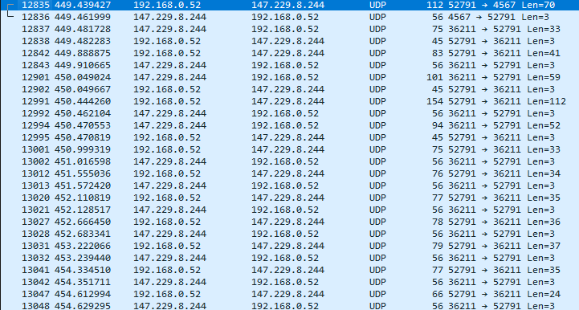

# Project 2 - IPK25-CHAT
### Autor: Malashchuk Vladyslav (xmalas04)

This document provides an overview of the implemented application, detailing its functionality, underlying theory, and key aspects of the source code. Additionally, it includes UML diagrams or a narrative about critical code sections, a thorough testing methodology.

---

## Table of Contents

# Table of Contents

- [IPK25-CHAT Theory](#ipk25-chat-theory)
  - [TCP (Transmission Control Protocol)](#tcp-transmission-control-protocol)
    - [Three-Way Handshake](#three-way-handshake)
    - [Data Transmission](#data-transmission)
    - [Congestion Control](#congestion-control)
    - [Error Detection and Correction](#error-detection-and-correction)
    - [Flow Control (Windowing)](#flow-control-windowing)
    - [Connection Termination](#connection-termination)
    - [Key Features of TCP](#key-features-of-tcp)
    - [Applications of TCP](#applications-of-tcp)
  - [UDP (User Datagram Protocol)](#udp-user-datagram-protocol)
    - [No Connection Setup](#no-connection-setup)
    - [Packet Structure (UDP Datagram Format)](#packet-structure-udp-datagram-format)
    - [No Acknowledgments or Retransmissions](#no-acknowledgments-or-retransmissions)
    - [Error Detection](#error-detection)
    - [Low Latency and High Throughput](#low-latency-and-high-throughput)
    - [Comparison: UDP vs. TCP](#comparison-udp-vs-tcp)
  - [Client](#client)
    - [How Clients Work](#how-clients-work)
    - [Types of Clients](#types-of-clients)
    - [Advantages of Clients](#advantages-of-clients)
    - [Challenges for Clients](#challenges-for-clients)
  - [Server](#server)
    - [How Servers Work](#how-servers-work)
    - [Types of Servers](#types-of-servers)
    - [Advantages of Servers](#advantages-of-servers)
    - [Challenges for Servers](#challenges-for-servers)
- [Introduction](#introduction)
- [Project Overview](#project-overview)
  - [Message Types](#message-types)
    - [CONFIRM](#confirm)
    - [REPLY](#reply)
    - [AUTH](#auth)
    - [JOIN](#join)
    - [MSG](#msg)
    - [ERR](#err)
    - [BYE](#bye)
    - [PING](#ping)
  - [Message Header](#message-header)
  - [TCP Variant](#tcp-variant)
  - [Message Content Parameter Mapping for TCP](#message-content-parameter-mapping-for-tcp)
  - [CLI Arguments and Client Behavior](#cli-arguments-and-client-behavior)
    - [CLI Arguments](#cli-arguments)
    - [Client Input and Commands](#client-input-and-commands)
      - [Command Format](#command-format)
      - [Message Input](#message-input)
  - [Client Error Handling](#client-error-handling)
    - [Client Program and Connection Termination](#client-program-and-connection-termination)
    - [Client Exception Handling](#client-exception-handling)
    - [Client Output Formatting](#client-output-formatting)
- [Implementation](#implementation)
  - [Overview of the Code Structure](#overview-of-the-code-structure)
  - [Key Components and Flow](#key-components-and-flow)
  - [Main Program Flow](#main-program-flow)
  - [Multithreading in UDP Communication](#multithreading-in-udp-communication)
  - [TCP and UDP Client Behavior](#tcp-and-udp-client-behavior)
  - [Code Structure and Organization](#code-structure-and-organization)
  - [Conclusion](#implementation-conclusion)
- [TCP Client Implementation (TcpUser)](#tcp-client-implementation-tcpuser)
  - [Key Features](#tcp-client-key-features)
  - [Implementation Details](#tcp-client-implementation-details)
  - [Conclusion](#tcp-client-conclusion)
- [UDP Client Implementation (UdpUser)](#udp-client-implementation-udpuser)
  - [Key Features](#udp-client-key-features)
  - [Conclusion](#udp-client-conclusion)
- [Testing](#testing)
  - [Testing with Reference Server](#testing-with-reference-server)
    - [Tested Protocols and Operations](#tested-protocols-and-operations)
    - [Test Setup and Results](#test-setup-and-results)
      - [TCP-AUTH](#tcp-auth)
      - [TCP-BYE](#tcp-bye)
      - [TCP-JOIN](#tcp-join)
      - [TCP-MSG](#tcp-msg)
      - [TCP-RENAME](#tcp-rename)
      - [UDP-AUTH](#udp-auth)
      - [UDP-BYE](#udp-bye)
      - [UDP-JOIN](#udp-join)
      - [UDP-MSG](#udp-msg)
      - [UDP-RENAME](#udp-rename)
  - [Testing with Custom Server](#testing-with-custom-server)
  - [Authentication and Message Exchange Testing](#authentication-and-message-exchange-testing)
  - [User and Server Logs](#user-and-server-logs)
  - [Visuals](#visuals)
  - [Closed Python Tests (Simulated Server)](#closed-python-tests-simulated-server)
    - [TESTS RESULTS](#tests-results)
- [Bibliography](#bibliography)

---

# IPK25-CHAT Theory


At the beginning, the theory of TCP, UDP, what is a server and a client, and how everything works will be described.
## **TCP (Transmission Control Protocol)**

TCP (Transmission Control Protocol) is one of the main protocols used in the transport layer of the OSI model. It is known for being a connection-oriented, reliable, and stream-oriented protocol, ensuring that data transmission over networks is stable, ordered, and error-free. It guarantees that packets of data are delivered in the correct order and ensures reliable communication between devices. TCP is used by many applications and protocols, such as HTTP, FTP, SMTP, and more.
TCP operates in various stages, which involve connection establishment, data transmission, and connection termination. Here’s a more detailed breakdown of how it functions.


### **Three-Way Handshake**

The process of establishing a TCP connection is called the **three-way handshake**, which ensures both the client and the server are ready to communicate. Here is a more detailed explanation of the three stages:

- **SYN (Synchronize):** The client, which wants to initiate communication, sends a packet with the SYN flag set to the server. This is a request to begin the TCP connection. The packet will typically contain an initial sequence number that the client wants to start with.
  
- **SYN-ACK (Synchronize-Acknowledgment):** The server receives the client's SYN packet and acknowledges the request by sending a SYN-ACK response. The SYN flag is set to acknowledge the incoming connection request, and the server also provides its own sequence number that the client will need to use for further communication.

- **ACK (Acknowledgment):** Upon receiving the SYN-ACK packet, the client sends an ACK packet back to the server to confirm that the connection setup is complete. At this point, both the client and server are synchronized and can begin transmitting data.

The handshake ensures that both parties agree on parameters such as sequence numbers, and they can begin sending data with confidence that they are properly connected [RFC9293](https://datatracker.ietf.org/doc/html/rfc9293).


### **Data Transmission**

Once the connection is established, data transmission begins. Here’s how it works:

- **Segmentation:** Large messages are divided into smaller units called **segments** (or packets). Each segment contains data and a TCP header. The data is divided so that it can be transmitted more easily over the network. The header includes fields such as the sequence number, acknowledgment number, and flags (such as SYN, ACK, FIN) [RFC9293](https://datatracker.ietf.org/doc/html/rfc9293).

- **Sequence Numbers:** Each packet of data is assigned a sequence number. This allows the receiver to reassemble the segments into the correct order, even if they arrive out of order. The sequence number also helps the receiver determine if any data was lost or duplicated [RFC9293](https://datatracker.ietf.org/doc/html/rfc9293).

- **Acknowledgments (ACKs):** After receiving each data segment, the receiver sends an acknowledgment (ACK) back to the sender. The acknowledgment includes the sequence number of the last successfully received byte. This process ensures that the sender is aware of the status of the data transfer. If the sender does not receive an acknowledgment within a certain timeout, the packet is retransmitted [RFC9293](https://datatracker.ietf.org/doc/html/rfc9293).

- **Retransmissions:** If the sender does not receive an acknowledgment for a given packet within the specified timeout, it retransmits the packet. This guarantees that all data is successfully delivered, even if there are network issues like packet loss [RFC9293](https://datatracker.ietf.org/doc/html/rfc9293).

- **Flow Control:** TCP uses a mechanism called **flow control** to prevent the sender from overwhelming the receiver. This is achieved using a **sliding window** mechanism. The receiver advertises a "window size," which is the maximum amount of data it is willing to accept at once. The sender can only send data up to the size of this window. Once the receiver acknowledges a portion of data, the window slides, allowing the sender to transmit more data [RFC9293](https://datatracker.ietf.org/doc/html/rfc9293).

### **Congestion Control**

One of the key features of TCP is its ability to adapt to network conditions, especially congestion in the network. TCP uses **congestion control algorithms** to dynamically adjust the rate at which data is sent. There are several algorithms for congestion control, such as:

- **Slow Start:** Initially, TCP sends data at a slow rate and then increases the transmission rate exponentially as long as no packet loss is detected [RFC9293](https://datatracker.ietf.org/doc/html/rfc9293).
  
- **Congestion Avoidance:** After reaching a threshold, TCP switches to a linear increase in the sending rate to avoid overloading the network [RFC9293](https://datatracker.ietf.org/doc/html/rfc9293).
  
- **Fast Retransmit and Fast Recovery:** When packet loss is detected (through missing ACKs), TCP triggers a fast retransmit of the lost packet and adjusts the congestion window to prevent further packet loss [RFC9293](https://datatracker.ietf.org/doc/html/rfc9293).

The goal of congestion control is to balance the sender’s transmission rate with the capacity of the network, ensuring that packets are not lost due to congestion [RFC9293](https://datatracker.ietf.org/doc/html/rfc9293).

### **Error Detection and Correction**

TCP uses a **checksum** in its header to detect errors in transmitted data. The checksum is a 16-bit value calculated by applying a mathematical function to the data being sent. The receiver performs the same checksum calculation on the received data and compares it to the checksum sent by the sender.

- **Error Detection:** If there is a mismatch between the sender’s and receiver’s checksums, the receiver knows that some data has been corrupted during transmission. In this case, the receiver will discard the corrupted packet, and the sender will need to retransmit the packet [RFC9293](https://datatracker.ietf.org/doc/html/rfc9293).

- **Retransmission on Error:** TCP guarantees reliability, meaning that if data is lost or corrupted, the sender will retransmit it. This is done based on the acknowledgment mechanism and checksums [RFC9293](https://datatracker.ietf.org/doc/html/rfc9293).

### **Flow Control (Windowing)**

In addition to congestion control, TCP employs **flow control** using a windowing mechanism. The window defines the number of unacknowledged bytes the sender can transmit before it must wait for an acknowledgment. This helps prevent the receiver from becoming overwhelmed by too much data at once.

- **Dynamic Window:** The window size changes based on available buffer space at the receiver. As the receiver processes the data and sends acknowledgments, the window can expand, allowing the sender to transmit more data [RFC9293](https://datatracker.ietf.org/doc/html/rfc9293).

- **Sliding Window:** The sliding window adjusts dynamically, so that once data is acknowledged by the receiver, the sender can send more packets within the allowable window size [RFC9293](https://datatracker.ietf.org/doc/html/rfc9293).

### **Connection Termination**

When the data transmission is complete, TCP initiates a connection termination process using a **four-way handshake**. This ensures that both the client and the server agree to close the connection and that no further data will be transmitted.

- **FIN (Finish):** The client or server that wishes to close the connection sends a packet with the FIN flag set. This indicates that it has finished sending data and requests to close the connection [RFC9293](https://datatracker.ietf.org/doc/html/rfc9293).
  
- **ACK:** The receiver acknowledges the FIN packet by sending an ACK packet [RFC9293](https://datatracker.ietf.org/doc/html/rfc9293).

- **FIN (Finish) from the other side:** The receiver of the original FIN packet sends its own FIN to indicate that it is also done with the connection [RFC9293](https://datatracker.ietf.org/doc/html/rfc9293).

- **ACK:** Finally, the original sender sends an ACK to confirm the termination [RFC9293](https://datatracker.ietf.org/doc/html/rfc9293).

This four-way handshake ensures that both sides agree to close the connection in an orderly manner, ensuring that no data is lost during the termination process [RFC9293](https://datatracker.ietf.org/doc/html/rfc9293).

### **Key Features of TCP**

- **Reliability:** TCP ensures that all data sent from the sender is received by the receiver, and if packets are lost or corrupted, they are retransmitted [RFC9293](https://datatracker.ietf.org/doc/html/rfc9293).
- **Ordered Delivery:** Data packets are delivered in the exact order in which they were sent, even if they arrive out of order due to network routing [RFC9293](https://datatracker.ietf.org/doc/html/rfc9293).
- **Error Detection:** Data integrity is guaranteed with the use of checksums [RFC9293](https://datatracker.ietf.org/doc/html/rfc9293).
- **Flow Control:** TCP ensures that the sender does not overwhelm the receiver by controlling the amount of data in transit [RFC9293](https://datatracker.ietf.org/doc/html/rfc9293).
- **Congestion Control:** TCP dynamically adjusts the sending rate to avoid congestion and ensure smooth transmission [RFC9293](https://datatracker.ietf.org/doc/html/rfc9293).
- **Connection Establishment and Termination:** TCP uses a reliable three-way handshake to establish and a four-way handshake to terminate the connection [RFC9293](https://datatracker.ietf.org/doc/html/rfc9293).

### **Applications of TCP**

TCP is used by many network applications that require reliable communication. Some of the most common applications include:

- **Web Browsing (HTTP/HTTPS):** When you browse websites, HTTP or HTTPS uses TCP for reliable data transfer [RFC1945](https://datatracker.ietf.org/doc/html/rfc1945).
- **File Transfer Protocol (FTP):** FTP uses TCP to ensure files are correctly transferred between computers [RFC1350](https://datatracker.ietf.org/doc/html/rfc1350).
- **Email (SMTP, POP3, IMAP):** TCP ensures the reliable delivery of email messages between mail servers and clients [RFC791](https://datatracker.ietf.org/doc/html/rfc791).
- **Remote Access (SSH, Telnet):** TCP is used for secure and reliable remote connections between devices [RFC9293](https://datatracker.ietf.org/doc/html/rfc9293).

---

## **UDP (User Datagram Protocol)**  

UDP (User Datagram Protocol) is a connectionless transport-layer protocol defined in [RFC768](https://datatracker.ietf.org/doc/html/rfc768). It provides a lightweight mechanism for transmitting data with minimal overhead, making it suitable for time-sensitive applications where low latency is prioritized over reliability.  


### **No Connection Setup**  
UDP is **stateless** and does not require a handshake, unlike TCP, which uses a three-way handshake ([RFC793](https://datatracker.ietf.org/doc/html/rfc793)). A sender can start transmitting packets without establishing a connection with the receiver. Each packet (datagram) is treated independently, allowing for minimal delay in communication.  

### **Packet Structure (UDP Datagram Format)**  
A UDP datagram consists of a **header** and a **data payload**. The header is 8 bytes long and contains the following fields:  

| Field            | Size (Bytes) | Description |
|-----------------|-------------|-------------|
| **Source Port**  | 2           | Identifies the sending process (optional). |
| **Destination Port** | 2       | Identifies the receiving process. |
| **Length**       | 2           | Specifies the total length of the UDP datagram (header + data). |
| **Checksum**     | 2           | Used for error detection in the header and data. |

The payload contains application-specific data, and the maximum size of a UDP datagram, including the header, is **65,535 bytes** ([RFC768](https://datatracker.ietf.org/doc/html/rfc768)).  

### **No Acknowledgments or Retransmissions**  
UDP does not provide reliability mechanisms such as acknowledgments (ACKs) or retransmissions, unlike TCP ([RFC793](https://datatracker.ietf.org/doc/html/rfc793)). If a packet is lost or arrives out of order, the responsibility for handling such issues lies with the application layer.  

### **Error Detection**  
UDP implements a simple **checksum** algorithm to verify the integrity of the header and data. If a checksum mismatch is detected, the packet is discarded. However, unlike TCP, UDP does not request retransmission for corrupted or lost packets.  

### **Low Latency and High Throughput**  
Due to its minimal overhead, UDP is much faster than TCP, making it ideal for applications requiring **low latency** and **high throughput** where occasional packet loss is acceptable. Some common use cases include:  

- **Real-time streaming (VoIP, video streaming, gaming)**  
- **DNS queries ([RFC1035](https://datatracker.ietf.org/doc/html/rfc1035))**  
- **Network time synchronization (NTP, [RFC5905](https://datatracker.ietf.org/doc/html/rfc5905))**  
- **IoT and sensor networks**  

---

### **Comparison: UDP vs. TCP**  

| Feature          | UDP ([RFC768](https://datatracker.ietf.org/doc/html/rfc768)) | TCP ([RFC793](https://datatracker.ietf.org/doc/html/rfc793)) |
|-----------------|-----------------|-----------------|
| **Connection Type** | Connectionless | Connection-oriented |
| **Reliability** | Unreliable | Reliable |
| **Ordering** | No guaranteed order | Ensures ordered delivery |
| **Error Handling** | Checksum only | Checksum, retransmissions |
| **Speed** | Faster (low overhead) | Slower (due to handshaking & acknowledgments) |
| **Use Cases** | Streaming, gaming, DNS, VoIP | Web browsing, file transfers, emails |

---

## **Client**

A **client** is a device or program that sends requests to a server to access services or resources. It typically initiates communication with the server and waits for a response. Clients can be a variety of devices or software applications, such as web browsers, email clients, or mobile apps. The client relies on the server to provide the required data, services, or functionality.

### **How Clients Work:**

1. **Sending Requests:**
   - The client sends a request to the server, usually over a network. The request specifies what data or service the client wants (e.g., a web page, a file, or a database query).

2. **Waiting for Responses:**
   - The client waits for the server to process the request and return the appropriate response. This could be the requested data, an acknowledgment, or an error message.

3. **Receiving and Displaying Responses:**
   - Once the server responds, the client processes the response and presents the data or action to the user (e.g., rendering a web page, displaying an email, or presenting a file).

4. **Ending the Communication:**
   - After receiving the response, the client can either send another request or terminate the connection, depending on the communication protocol used.
5. **Error Handling:**
   - If there are issues during the communication, such as network problems or invalid requests, the client may receive an error message from the server. The client then needs to handle these errors appropriately, which may involve displaying an error message to the user or attempting to resend the request.

### **Types of Clients:**

- **Web Browsers:**
   - These are the most common type of client. A web browser (like Chrome, Firefox, Safari) is used to request and display web pages served by web servers. The browser sends an HTTP request to the server, and the server responds with HTML, CSS, and JavaScript, which the browser renders as a web page.

- **Mobile Apps:**
   - Mobile applications also function as clients, sending requests to servers for data, such as news, social media updates, or weather reports. These apps typically interact with the server through APIs to fetch and display data to users.

- **Email Clients:**
   - Email clients (like Outlook, Thunderbird, or Gmail's mobile app) are used to access and manage emails stored on an email server. They send requests to retrieve messages, send new emails, or synchronize mail folders.

- **FTP Clients:**
   - FTP clients are used to transfer files to and from an FTP server. These clients can upload or download files, browse directories, and perform other file management tasks.

### **Advantages of Clients**

- **User Interface (UI) Interaction:**
   - Clients are typically designed for users to interact with directly. This makes them an essential part of the user experience, whether through a web browser, app, or other interfaces.

- **Efficiency and Personalization:**
   - Clients can store local information, cache resources, and make use of user preferences to offer a more personalized and efficient experience. For example, a web browser can cache previously visited web pages for faster loading times.

- **Local Processing:**
   - Clients may also handle some processing locally, such as rendering a webpage, performing calculations, or executing scripts, without needing to send a request to the server every time.

- **Scalability:**
   - Clients can scale independently of the server. A large number of clients can interact with a server without impacting the performance of the client-side application, as long as the server can handle the load.

### **Challenges for Clients**

- **Network Dependence:**
   - Clients are often dependent on network connectivity to communicate with the server. If the network is slow, unstable, or disconnected, the client may not be able to function as intended.

- **Resource Limitations:**
   - Clients, especially those running on mobile devices, may have limited resources such as processing power, memory, or battery life. These limitations can affect the performance and functionality of the client application.

- **Security Risks:**
   - Clients need to be vigilant against potential security risks, such as malware, data breaches, or unauthorized access. Clients need to implement encryption, secure authentication, and other security measures to protect sensitive information.

In conclusion, a **client** is an essential component in the client-server model, responsible for requesting services and displaying results to users. It depends on the server for resources but also handles many critical aspects of user interaction, processing, and presentation.

---

## **Server**

A **server** is a system or program that listens for and responds to requests from clients. It processes client requests, handles them, and sends back appropriate responses. Servers are typically always-on systems that provide various services, such as serving web pages, processing emails, managing databases, or running applications.

### **How Servers Work:**

1. **Listening for Requests:**
   - The server listens on a specified port for incoming connections and waits for requests from clients. This can involve listening for specific communication protocols, such as HTTP for web traffic or SMTP for email.

2. **Connection Establishment:**
   - In protocols like TCP, a server establishes a connection with the client to ensure reliable communication, which involves a handshake process (e.g., SYN-ACK).

3. **Processing Requests:**
   - Once a connection is established, the server processes the client's request, which may involve retrieving data, executing commands, or interacting with other services (such as a database).

4. **Sending Responses:**
   - After processing the request, the server sends back the appropriate response, such as a web page, confirmation, or error message, depending on the client’s request.

5. **Connection Termination:**
   - In TCP, once the request has been processed and the response is sent, the server terminates the connection using a **FIN** packet to signal the end of the communication.

6. **Handling Multiple Clients:**
   - Servers are often designed to handle multiple requests from multiple clients simultaneously. This is accomplished using various techniques, such as multi-threading, multiprocessing, or asynchronous I/O. This allows the server to efficiently manage a large number of concurrent client requests without becoming overwhelmed.

7. **Error Handling and Logging:**
   - Servers are responsible for identifying and handling errors that occur during the processing of client requests. If there is an issue, such as a bad request or server malfunction, the server sends an error message (e.g., 404 Not Found or 500 Internal Server Error) back to the client. Additionally, servers log errors and important activities to help diagnose and debug issues. Server logs are vital for administrators to monitor server health and identify potential problems.

8. **Load Balancing:**
   - For high-traffic applications, servers may be part of a load-balanced system. In such cases, a load balancer distributes incoming requests across multiple servers to ensure no single server is overloaded, improving the overall performance and availability of the service.

9. **Security Measures:**
   - Servers implement various security measures to protect both the data they store and the clients they interact with. This includes authentication (e.g., password validation or token-based authentication), encryption (e.g., using SSL/TLS for secure communication), and firewalls to prevent unauthorized access. Servers must also be kept up to date with security patches to defend against vulnerabilities.

10. **Caching:**
   - Servers often use caching mechanisms to store frequently requested data or responses temporarily. This can significantly reduce the time required to respond to client requests. When a server receives a request for cached data, it can send the cached data instead of processing the request again, improving response time and reducing server load.

11. **Scalability:**
   - Servers are designed to scale based on demand. This can involve vertical scaling (adding more resources like CPU or memory to the existing server) or horizontal scaling (adding more servers to handle increased traffic). Cloud services often offer scalable server environments where resources can be adjusted dynamically.

12. **State Management:**
   - Many servers, especially those running web applications, must manage the state between multiple requests from clients. This is necessary for things like user authentication, session management, or tracking shopping carts in e-commerce websites. Servers use techniques like session IDs, cookies, or tokens to maintain state across multiple interactions with the same client.

13. **Database Interactions:**
   - Servers frequently interact with databases to retrieve or store data requested by clients. For example, a web server might request data from a database to display information to the user. These interactions often involve complex queries and data processing, and servers are responsible for ensuring that these requests are completed efficiently and accurately.

14. **Serving Different Types of Content:**
   - Servers can serve a wide variety of content, including static files (like HTML pages, images, or videos) and dynamic content (like web pages generated by a back-end application). A web server, for instance, might serve both static assets (e.g., CSS, JavaScript files) and dynamic content (e.g., data retrieved from a database or a personalized user page).

### **Types of Servers:**

- **Web Server:**
   - A web server is responsible for hosting websites and serving web pages. It handles HTTP requests from clients (typically web browsers) and serves the appropriate HTML content, static files, or dynamic web pages.

- **Database Server:**
   - A database server stores and manages databases. Clients (such as web applications) send queries to the database server, which processes the request and returns the requested data.

- **File Server:**
   - A file server provides access to files over a network. Clients can upload, download, and manage files stored on the file server, often used in enterprise settings or cloud storage services.

- **Mail Server:**
   - A mail server handles the sending, receiving, and storage of emails. It processes incoming email requests from clients and stores messages in users' inboxes or sends new emails to their intended recipients.

- **Application Server:**
   - An application server runs software applications and provides services to client applications. It may host business logic, process client requests, and interact with databases to deliver dynamic content or application functionality.

- **DNS Server:**
   - A DNS (Domain Name System) server translates human-readable domain names (like www.example.com) into IP addresses that computers can understand and use for routing network traffic.

- **Proxy Server:**
   - A proxy server acts as an intermediary between clients and other servers. It can improve security, performance (via caching), and anonymity by filtering traffic or masking the client's real IP address.

### **Advantages of Servers**

- **Centralized Management:**
   - Servers enable centralized control over services and data. By consolidating services like databases, applications, and file storage on dedicated servers, administrators can manage and secure resources more effectively.

- **Reliability and Availability:**
   - Servers are typically designed to operate continuously, offering high availability and reliability for services. In many cases, servers have redundancies and failover mechanisms to ensure that they remain operational even if some components fail.

- **Efficient Resource Utilization:**
   - Servers can be optimized for specific tasks, such as data processing, serving web content, or handling email traffic. This allows for more efficient use of resources, as compared to using general-purpose devices for these tasks.

- **Remote Access:**
   - Servers allow clients to access data and services from remote locations. For example, cloud servers enable businesses to access applications, files, and databases from anywhere with an internet connection.

### **Challenges for Servers**

- **Performance Bottlenecks:**
   - Servers can experience performance issues when handling a large number of simultaneous requests or processing resource-intensive tasks. This can be mitigated by optimizing server code, adding more resources, or using load balancing techniques.

- **Security Threats:**
   - Servers are prime targets for cyberattacks, including DDoS (Distributed Denial of Service) attacks, data breaches, or ransomware. Regular security updates, encryption, and access control mechanisms are necessary to protect servers from these threats.

- **Maintenance and Downtime:**
   - Servers require regular maintenance to ensure they continue to operate smoothly. This includes software updates, hardware replacements, and security audits. Scheduled downtime may be necessary for maintenance, but it must be minimized to avoid disrupting services.

In conclusion, a **server** plays a critical role in providing services, resources, and data to clients. It processes client requests, manages resources, ensures security, and maintains high availability for the smooth operation of applications and services. Servers are essential components of modern computing and the backbone of the internet.

# Introduction

This project involves the development of a client application that communicates with a remote server using the **IPK25-CHAT** protocol. The protocol offers two transport protocol variants: **UDP** and **TCP**, each presenting unique challenges and characteristics. The task was to implement both variants, focusing on the networking aspects of the communication between the client and the server.

The **IPK25-CHAT** protocol defines several message types such as **AUTH**, **JOIN**, **MSG**, **BYE**, and others, each with specific parameters and behaviors. The client must handle these message types appropriately, sending the required data and processing responses from the server based on the protocol's specifications.

The primary focus of this implementation was the correct handling of the networking layer. This includes managing connections, whether using the connectionless nature of UDP or the reliable, stream-based communication of TCP. The client must perform actions such as authentication, joining chat channels, sending and receiving messages, and gracefully handling errors or connection terminations.

Throughout the development, particular attention was given to the correct formatting of messages, transport layer considerations (such as UDP's lack of guaranteed delivery and TCP's connection management), and ensuring that communication remains reliable across both transport protocols. The client adheres to the **IPK25-CHAT** protocol specification, enabling seamless interaction with the server using both UDP and TCP variants. 

This document outlines the design and implementation of the client application, detailing the steps taken to meet the project requirements, the challenges faced, and the solutions applied to ensure full protocol compliance.


# Project Overview

The **IPK25-CHAT** protocol enables communication between a client and a server, with the option to use either the **UDP** or **TCP** transport protocols. This project focuses on the implementation of both protocol variants, allowing for flexible communication and handling of different message types. The following sections outline the key message types in the protocol, the message header structure, and the content of each message type.
#### **Client FSM**:


## Message Types

The **IPK25-CHAT** protocol defines several message types, each with specific functionality and structure. The client application must support and properly handle the following message types:

- **CONFIRM**
- **REPLY**
- **AUTH**
- **JOIN**
- **MSG**
- **ERR**
- **BYE**
- **PING**

Each message type has its own unique purpose in the communication flow, such as authentication, sending messages, confirming receipt, or indicating an error.

### **CONFIRM**
The **CONFIRM** message is used exclusively in the UDP protocol variant to confirm the successful delivery of a message. This message contains the **Ref_MessageID**, which is the identifier of the message being confirmed.

```
1 byte       2 bytes      
+--------+--------+--------+
|  0x00  |  Ref_MessageID  |
+--------+--------+--------+
Field name    | Value   | Notes
Ref_MessageID | uint16  | The MessageID value of the message being confirmed
```

### **REPLY**
The **REPLY** message is used to reply to a previously sent message. It contains the **Result** field (0 for failure, 1 for success), the **Ref_MessageID** (identifier of the message being replied to), and the **MessageContents** (the content of the reply message).

```
1 byte       2 bytes       1 byte       2 bytes      
+--------+--------+--------+--------+--------+--------+--------~~---------+---+
|  0x01  |    MessageID    | Result |  Ref_MessageID  |  MessageContents  | 0 |
+--------+--------+--------+--------+--------+--------+--------~~---------+---+
Field name        | Value    | Notes
Result            | uint8    | 0 indicates failure, 1 indicates success
Ref_MessageID     | uint16   | The MessageID value of the message being replied to
MessageContents   | string   | Contains the reply content, always terminated with a zero byte
```

### **AUTH**
The **AUTH** message is used for client authentication. It contains the **Username**, **DisplayName**, and **Secret** fields, all of which are strings terminated by a zero byte.

```
1 byte       2 bytes      
+--------+--------+--------+-----~~-----+---+-------~~------+---+----~~----+---+
|  0x02  |    MessageID    |  Username  | 0 |  DisplayName  | 0 |  Secret  | 0 |
+--------+--------+--------+-----~~-----+---+-------~~------+---+----~~----+---+
Field name    | Value    | Notes
Username      | string   | User's username, terminated with a zero byte
DisplayName   | string   | User's display name, terminated with a zero byte
Secret        | string   | User's secret (password), terminated with a zero byte
```

### **JOIN**
The **JOIN** message is used to request the client’s participation in a specific chat channel. It includes the **ChannelID** and the **DisplayName** of the client.

```
1 byte       2 bytes      
+--------+--------+--------+-----~~-----+---+-------~~------+---+
|  0x03  |    MessageID    |  ChannelID | 0 |  DisplayName  | 0 |
+--------+--------+--------+-----~~-----+---+-------~~------+---+
Field name    | Value    | Notes
ChannelID     | string   | The channel to join, terminated with a zero byte
DisplayName   | string   | The client's display name, terminated with a zero byte
```

### **MSG**
The **MSG** message is used to send a message to the chat channel. It includes the **DisplayName** of the sender and the **MessageContents** of the message.

```
1 byte       2 bytes      
+--------+--------+--------+-------~~------+---+--------~~---------+---+
|  0x04  |    MessageID    |  DisplayName  | 0 |  MessageContents  | 0 |
+--------+--------+--------+-------~~------+---+--------~~---------+---+
Field name      | Value    | Notes
DisplayName     | string   | Sender's display name, terminated with a zero byte
MessageContents | string   | The content of the message, terminated with a zero byte
```

### **ERR**
The **ERR** message is sent when an error occurs during communication. It includes the **DisplayName** of the sender and an error **MessageContents**.

```
1 byte       2 bytes
+--------+--------+--------+-------~~------+---+--------~~---------+---+
|  0xFE  |    MessageID    |  DisplayName  | 0 |  MessageContents  | 0 |
+--------+--------+--------+-------~~------+---+--------~~---------+---+
Field name      | Value    | Notes
DisplayName     | string   | Sender's display name, terminated with a zero byte
MessageContents | string   | The error message content, terminated with a zero byte
```

### **BYE**
The **BYE** message indicates the termination of the conversation. It includes the **DisplayName** of the sender.

```
1 byte       2 bytes
+--------+--------+--------+-------~~------+---+
|  0xFF  |    MessageID    |  DisplayName  | 0 |
+--------+--------+--------+-------~~------+---+
Field name      | Value    | Notes
DisplayName     | string   | Sender's display name, terminated with a zero byte
```

### **PING**
The **PING** message is used in the UDP variant to check the aliveness of the connection. It only contains the **MessageID** field.

```
1 byte       2 bytes
+--------+--------+--------+
|  0xFD  |    MessageID    |
+--------+--------+--------+
Field name   | Value    | Notes
MessageID    | uint16   | A unique message ID for the ping message
```

---

## Message Header

Each message sent via the **IPK25-CHAT** protocol begins with a uniform 3-byte header, followed by message-specific content. The header consists of two fields: **Type** (1 byte) and **MessageID** (2 bytes). The **Type** field identifies the type of the message, while the **MessageID** provides a unique identifier for each message. The remaining content of the message varies based on the type and can range from no content (in the case of a **PING**) to variable-length data (such as the **MessageContents** in **MSG**).

#### Message Type Mapping

The **Type** field in the message header is mapped to specific protocol message types as follows:

| Message Type | Field Value |
|--------------|-------------|
| **CONFIRM**  | 0x00        |
| **REPLY**    | 0x01        |
| **AUTH**     | 0x02        |
| **JOIN**     | 0x03        |
| **MSG**      | 0x04        |
| **PING**     | 0xFD        |
| **ERR**      | 0xFE        |
| **BYE**      | 0xFF        |

#### MessageID

The **MessageID** field is a 2-byte number that uniquely identifies a message in the communication session. Each message is assigned a unique **MessageID** starting from 0, and each side of the communication (client and server) maintains its own **MessageID** sequence. The **MessageID** ensures that each message can be tracked and correctly processed by both parties.

## TCP Variant

The **TCP variant** of the **IPK25-CHAT** protocol ensures reliable communication between the client and server by utilizing the inherent features of the **Transmission Control Protocol (TCP)**. TCP provides connection-oriented communication, ensuring that messages are delivered in the correct order and without loss. Unlike the **UDP variant**, the **CONFIRM** and **PING** message types are not required in the **TCP variant** because TCP guarantees the delivery and reliability of messages. 

### Message Content Parameter Mapping for TCP

In the **TCP variant**, each message type is mapped to specific content templates, which define how the data is formatted when exchanged between the client and server. The following table outlines the mapping of message types to their corresponding content templates:

| Message Type | Message Parameter Template                               |
|--------------|----------------------------------------------------------|
| **ERR**      | `ERR FROM {DisplayName} IS {MessageContent}\r\n`         |
| **REPLY**    | `REPLY {"OK \| "NOK"} IS {MessageContent}\r\n`           |
| **AUTH**     | `AUTH {Username} AS {DisplayName} USING {Secret}\r\n`    |
| **JOIN**     | `JOIN {ChannelID} AS {DisplayName}\r\n`                  |
| **MSG**      | `MSG FROM {DisplayName} IS {MessageContent}\r\n`         |
| **BYE**      | `BYE FROM {DisplayName}\r\n`                             |
| **CONFIRM**  | **Unused in TCP**                                        |
| **PING**     | **Unused in TCP**                                        |

These message parameter templates specify how the data should be structured for each type of message. For example:

- **ERR**: An error message is formatted as `ERR FROM {DisplayName} IS {MessageContent}\r\n`, where `{DisplayName}` is the name of the user sending the error message and `{MessageContent}` contains the description of the error.
  
- **REPLY**: A reply message is formatted as `REPLY {"OK" | "NOK"} IS {MessageContent}\r\n`, where `{"OK" | "NOK"}` indicates the success or failure of the operation, and `{MessageContent}` holds any additional information.

- **AUTH**: For authentication, the message is formatted as `AUTH {Username} AS {DisplayName} USING {Secret}\r\n`, where `{Username}` is the client’s username, `{DisplayName}` is the display name, and `{Secret}` is the password or authentication token.

- **JOIN**: When a client requests to join a chat channel, the message is structured as `JOIN {ChannelID} AS {DisplayName}\r\n`, where `{ChannelID}` is the unique identifier for the channel and `{DisplayName}` is the name of the client.

- **MSG**: A message from a user is sent as `MSG FROM {DisplayName} IS {MessageContent}\r\n`, where `{DisplayName}` is the user's name and `{MessageContent}` is the content of the message.

- **BYE**: To terminate the connection, the **BYE** message is formatted as `BYE FROM {DisplayName}\r\n`, where `{DisplayName}` indicates the user who is ending the conversation.

In the **TCP variant**, **CONFIRM** and **PING** messages are not used because TCP inherently ensures the reliability and delivery of messages. As a result, there is no need to confirm message delivery or periodically check the status of the connection.

By using TCP, this protocol variant focuses on message reliability, eliminating the need for extra mechanisms like **CONFIRM** and **PING**, which are crucial in the UDP variant where reliability is not inherently guaranteed by the transport layer. This makes the TCP variant simpler and more efficient for scenarios where message delivery assurance is required.
## CLI Arguments and Client Behavior

This section outlines the behavior of the **client application** with respect to **command-line arguments (CLI)** and the **standard input (stdin)**. The client will handle the provided arguments to establish a connection with the server and support different client commands and chat messages.

### CLI Arguments

The client application must accept specific **command-line arguments** to configure its connection to the server. These arguments will control how the client communicates over TCP or UDP, how the server is identified, and certain timeout or retransmission settings for UDP. The table below outlines the mandatory and optional arguments:

| Argument | Value | Possible Values | Meaning or Expected Program Behavior |
|----------|-------|-----------------|--------------------------------------|
| `-t`     | User provided | `tcp` or `udp` | Specifies the transport protocol used for the connection (either TCP or UDP). |
| `-s`     | User provided | IP address or hostname | Specifies the server's IP address or hostname. This argument is mandatory for connecting to the server. |
| `-p`     | 4567  | `uint16` | Specifies the server port. Default value is 4567, but it can be adjusted if needed. |
| `-d`     | 250   | `uint16` | Specifies the UDP confirmation timeout in milliseconds. It is used only in the UDP protocol variant. |
| `-r`     | 3     | `uint8` | Specifies the maximum number of UDP retransmissions. This argument is only used with the UDP protocol. |
| `-h`     |       |                 | Prints the program help output and exits. |

**Note**: Arguments marked as "User provided" are mandatory, and the user must always specify these arguments when running the program. Other arguments, such as the timeout or retransmission limit, are optional and have default values. The behavior of the program is undefined if arguments are provided incorrectly or in an unsupported manner.

### Client Input and Commands

The client will read **user input** from the **standard input stream (stdin)**. Each input will either be a **local command** or a **chat message** to send to the server. The following defines the client behavior regarding input handling:

### **Command Format**:
All valid commands must be **prefixed** with a forward slash `/` and followed by a non-zero number of characters (a-z, 0-9, `_`, `-`) to uniquely identify the command. The client supports the following local commands:

| Command  | Parameters                                   | Client Behavior |
|----------|----------------------------------------------|-----------------|
| `/auth`  | `{Username} {Secret} {DisplayName}`          | Sends an AUTH message with the provided data to the server. The server's reply is processed, and the `DisplayName` is set for future use (same as the `/rename` command). |
| `/join`  | `{ChannelID}`                                | Sends a JOIN message with the specified channel name to the server. The server's reply is processed. |
| `/rename`| `{DisplayName}`                              | Locally changes the user's display name. This display name is used in messages and commands. |
| `/help`  |                                              | Displays all supported local commands with their descriptions. |

### **Message Input**:
- If the user input does not match a recognized command (i.e., no forward slash `/`), the input is interpreted as a **chat message**.
- If the chat message is not acceptable based on the current state (e.g., trying to send a message before authentication or joining a channel), the program will output an error message without terminating.
  
**Note**: All chat messages must be terminated with a newline character (`\n`).

The client must handle **user input sequentially**; only one action (command or message) can be processed at a time. Once the action is complete (i.e., the message has been delivered to the server, or the command has been processed), the program is ready to handle the next input.

### Client Error Handling

If the user attempts to perform an invalid operation (e.g., sending a message in an invalid state), the client will print an appropriate error message and will **not terminate**. Below are a few examples of what may trigger error messages:

- **Sending a message in a non-open state**: If the client hasn't authenticated, or if the channel hasn't been joined yet, sending a message should display an error.
- **Malformed command**: If the user provides a command with incorrect syntax, an error message will be printed.
- **Trying to join a channel in a non-open state**: If the client hasn't successfully authenticated or isn't connected to a server, attempting to join a channel will result in an error.

### Client Program and Connection Termination

The client must respond to termination signals (like `Ctrl + C`) by gracefully exiting and closing the connection with the server. The **BYE** message should be sent to the server to signal the termination of the connection.

- For **TCP connections**, ensure that the connection is properly finalized, and the connection closure does not contain the **RST flag** (which indicates an abrupt termination).
- For **UDP connections**, the client must wait for the **BYE** or **ERR** message from the server before shutting down. If the **CONFIRM** message is lost in transit, the client should retry and handle retransmissions.

If the client receives an **ERR** or **BYE** message from the server, the client should process these appropriately and terminate the connection gracefully.

### Client Exception Handling

The client must handle a variety of exceptional situations during execution. These situations will arise if the client receives unexpected or malformed messages or if there is a communication issue. Here's how the client should behave in such scenarios:

| Situation | Category | Expected Client Behavior |
|-----------|----------|--------------------------|
| Receiving a malformed message from the server | Protocol error | The client should display a **local client error** message, send an **ERR** message to the server (if possible), gracefully terminate the connection, and exit with an error code. |
| Confirmation of a sent UDP message times out | Protocol error | The client should display a **local client error** message, consider the connection as final (stop sending further messages), and exit with an error code. |
| No REPLY message received to a confirmed request message in time | Protocol error | The client should display a **local client error** message, send an **ERR** message to the server (if possible), gracefully terminate the connection, and exit with an error code. |

In these cases, the client must be able to **terminate gracefully**, ensuring proper communication is concluded with the server, and no further messages are sent.

### Client Output Formatting

The client must format its output correctly for different types of messages. Each type of message received from the server should trigger the corresponding output on the **standard output stream (stdout)**:

- **MSG (Chat Message)**: `"{DisplayName}: {MessageContent}\n"`
- **ERR (Error Message)**: `"ERROR FROM {DisplayName}: {MessageContent}\n"`
- **REPLY (Action Response)**: 
  - If successful: `"Action Success: {MessageContent}\n"`
  - If failure: `"Action Failure: {MessageContent}\n"`
- **Internal Client Errors**: `"ERROR: {MessageContent}\n"`

For **local client errors**, ensure the message is printed in a clear, descriptive manner, showing the nature of the error encountered during execution.

By following the above behaviors, the client ensures that its interaction with the server is correct and reliable while providing a seamless experience for users interacting through the command-line interface and handling chat messages.

## Implementation

In this chapter, we discuss the implementation of a chat client that can communicate with a server over TCP or UDP. The client can be configured to use either transport protocol via command-line arguments, and the application leverages multithreading to handle network communication and user input concurrently.

### Overview of the Code Structure

The program implements a **client application** that can operate over both **TCP** and **UDP** protocols. It is designed to read command-line arguments, set up server connection settings, and enable chat functionality based on the chosen transport protocol.

### Key Components and Flow

The main components in the program are:

1. **Server Settings**: The `ServerSetings` class parses the command-line arguments to configure server settings, including transport protocol, server address, and server port.
   
2. **TCP Client**: The `TcpClient` class is used to manage the connection and communication with the server over TCP. It establishes a network stream for sending and receiving data.

3. **UDP Client**: The `UdpUser` class handles the UDP communication, including starting the client, sending messages, and receiving responses from the server.

4. **Multithreading**: The program utilizes multithreading to manage the simultaneous execution of client-side operations, such as handling user input and maintaining the connection with the server.

### Main Program Flow

The `Main` method is responsible for initializing the client application. Here’s a detailed breakdown of its operation:

1. **Parse Command-Line Arguments**:
   The program begins by parsing the command-line arguments through the `ServerSetings` class. This class processes arguments related to transport protocol (`tcp` or `udp`), server address, and port number. If an error occurs during this process, the program displays an error message and terminates.

   ```csharp
   ServerSetings serverSetings = new ServerSetings(args);
   ```

2. **TCP Client Setup**:
   - If the `tcp` transport protocol is selected, a `TcpClient` object is created, which establishes a connection to the server using the specified IP address and port.
   - A `NetworkStream` is obtained from the `TcpClient` for sending and receiving data.
   - The `TcpUser` object, which handles the communication protocol for TCP, is instantiated and the `EnableChatTcp` method is called to enable chat functionality.

   ```csharp
   case "tcp":
       using (TcpClient tcpClient = new TcpClient(AddressFamily.InterNetwork))
       {
           tcpClient.Connect(serverSetings.serverAddress, serverSetings.serverPort);
           using (NetworkStream networkStream = tcpClient.GetStream())
           {
               TcpUser tcpUser = new TcpUser(networkStream);
               tcpUser.EnableChatTcp();
           }
           tcpClient.Close();
       }
       break;
   ```

   The `TcpClient` object is disposed of automatically after the connection is closed, ensuring that resources are freed properly.

3. **UDP Client Setup**:
   - If the `udp` transport protocol is selected, a `UdpUser` object is created using the `ServerSetings` configuration.
   - The `Start` method of the `UdpUser` class is invoked to begin the communication process. This method is responsible for sending and receiving messages over UDP and is implemented to handle network communication concurrently using **multithreading**.

   ```csharp
   case "udp":
       UdpUser udpUser = new UdpUser(serverSetings);
       udpUser.Start();
       break;
   ```

4. **Error Handling**:
   - If an exception occurs at any point during the execution of the program, an error message is printed to the console. The program then exits with an error code.

   ```csharp
   catch (Exception e)
   {
       Console.WriteLine($"ERROR: {e.Message}");
       Environment.Exit(1);
   }
   ```

### Multithreading in UDP Communication

For the UDP client, the `UdpUser` class is responsible for managing the network communication. Unlike TCP, where the connection is persistent and message delivery is guaranteed, UDP requires additional mechanisms for message acknowledgment and retransmission. 

To handle this, multithreading is used:

1. **User Input Thread**: A separate thread listens for user input and sends chat messages to the server. This ensures that the main program can continue processing messages while the user interacts with the chat.

2. **Server Response Thread**: Another thread is used to listen for incoming messages from the server. This allows the client to receive messages concurrently while the user continues typing.

   The implementation of the `UdpUser.Start()` method uses `Thread` or `Task` to manage these operations concurrently. This design ensures that the client remains responsive to both user input and server communication.

### TCP and UDP Client Behavior

- **TCP Client**: The `TcpClient` class handles all communication with the server. When the connection is established, the client sends a request (such as authentication or a chat message) and waits for a reply from the server. Once the communication is completed, the connection is closed.

- **UDP Client**: The `UdpUser` class sends a message to the server and expects to receive a confirmation or response. Since UDP does not guarantee delivery, the client may retransmit messages if no response is received. This is managed using a timeout and retry mechanism.

#### Code Structure and Organization

- **ServerSetings**: Parses the command-line arguments and provides configuration to the client for server address, port, and transport protocol.
- **TcpClient**: Manages the connection to the server using TCP.
- **UdpUser**: Handles the connection to the server using UDP, including message sending and receiving with multithreading.
- **TcpUser**: Encapsulates the logic for handling chat functionality and server communication over TCP.
  
#### Conclusion

The program is designed to provide a robust chat client that can communicate with a server using either TCP or UDP protocols. By leveraging multithreading, the client ensures that user input and server communication can occur concurrently, making the chat experience seamless. The modular design allows for easy expansion and handling of different network conditions, including message retransmission in UDP and connection management in TCP. This implementation provides a solid foundation for building real-time communication applications.

### TCP Client Implementation (TcpUser)

The `TcpUser` class is designed to handle communication between a client and a server using the **TCP** protocol. It supports various actions such as authenticating with the server, joining channels, sending and receiving messages, and processing different types of server responses. Additionally, it uses multithreading to manage simultaneous user input and message reception from the server.

#### Key Features:

1. **Authentication**: The client can authenticate itself by providing a username, secret, and display name. The server will respond with either a success or failure message, allowing the client to proceed with further actions if successful.

2. **Channel Joining**: After authentication, the client can join a specific channel. The server replies with the success or failure of this operation.

3. **Message Sending and Receiving**: The client can send messages to the server, which in turn will send back responses. These messages can include communication from other users, errors, or general replies.

4. **Multithreading**: A dedicated thread is responsible for receiving messages from the server while the main thread handles the client’s user input.

5. **Error Handling**: The client processes various server responses, including success (`REPLY`), error (`ERR`), and message (`MSG`) types. If any unexpected messages are received, the client handles them accordingly.

#### Implementation Details:

1. **Constructor**:
   - The constructor initializes the network stream and sets up a thread to handle incoming messages from the server.
   - It also listens for interruption signals, such as when the user presses `Ctrl+C`.

2. **Enable Chat**:
   - The `EnableChatTcp` method listens for user input continuously. If the input matches a predefined command (e.g., authentication, channel joining), the client processes it accordingly.
   - If the user is not authenticated, sending messages is prohibited.
   - The method also validates the input to ensure that only valid messages (i.e., containing ASCII printable characters) are sent.

3. **Authentication**:
   - The client sends an authentication request to the server, including the username, display name, and secret. 
   - It then processes the server’s response, handling both success and failure cases.

4. **Join Channel**:
   - The client sends a `JOIN` request to the server to join a specific channel. The channel name is validated for length and character composition (only alphanumeric characters and hyphens are allowed).

5. **Message Reception**:
   - A dedicated thread listens for incoming server messages, processes them, and calls appropriate methods based on the type of message (e.g., message from another user, error, server reply).
   - The method splits incoming data into individual messages and processes them sequentially.

6. **Sending Messages**:
   - Messages are converted into byte arrays and sent over the network stream to the server.

7. **Receiving Messages**:
   - The client reads incoming data from the network stream, processes it, and returns it as a string. If an error occurs during the reading process, it returns an "ERROR" message.

8. **Processing Server Messages**:
   - The client handles different types of server messages, such as `MSG` (regular message), `ERR` (error message), `REPLY` (server reply), and `BYE` (server termination). Each message type is processed by specific methods designed for handling them.

9. **Error Handling**:
   - The client has built-in error handling that processes error messages and gracefully terminates the connection if needed. For example, if an `ERR` message is received, the client displays the error and sends a `BYE` message before exiting.

### UDP Client Implementation (UdpUser)

The `UdpUser` class operates as a UDP-based communication client, enabling the user to send and receive messages to and from a server over the **UDP** protocol. It handles authentication, message sending, receiving server responses, and managing retransmissions when necessary.

The **UML diagram** follows the same structure as in the TCP variant but includes additional logic specific to UDP communication:  
- After sending a message (`SEND`), the client waits for a **CONFIRM** from the server.  
- Upon receiving a message (`RECEIVE`), the client sends back a **CONFIRM** to acknowledge it.  

To manage UDP-specific behaviors, the client uses the `-d` and `-r` command-line arguments:
- `-d` sets the **UDP confirmation timeout** (in milliseconds), defining how long the client waits for a **CONFIRM** before retrying.  
- `-r` specifies the **maximum number of UDP retransmissions**, ensuring the client does not retry indefinitely if no confirmation is received.  

These parameters allow users to fine-tune UDP reliability while maintaining the protocol's lightweight nature.
#### Key Features:

1. **UDP Client and Server Setup**:
   - The client creates a `UdpClient` instance to send and receive data. The server is specified using an `IPEndPoint`, which includes the server's address and port number.

2. **Constructor**:
   - The constructor initializes the client and server endpoint. It also starts a separate thread that listens for incoming UDP packets from the server.

3. **Message Sending**:
   - The client sends messages to the server (such as authentication requests, join requests, or chat messages). Each message is sent as a UDP packet.
   - If the client does not receive a confirmation response within a specified timeout, it retransmits the message.

4. **Receive UDP Packets**:
   - The client listens for incoming UDP packets. Each packet is processed based on its type (e.g., authentication, error, or regular message). 
   - The client acknowledges the receipt of messages by confirming the received packet with the server.

5. **Authentication**:
   - The client sends an authentication request containing the necessary credentials (username, display name, secret) and waits for a confirmation response from the server.
   - If no confirmation is received within a certain time, the client retries sending the authentication request.

6. **Exit Handling**:
   - When the user exits the application (e.g., pressing `Ctrl+C`), the client sends a "bye" message to the server and waits for confirmation before gracefully closing the connection.


## Testing

This system has undergone extensive testing to ensure reliability and robustness in various environments. The following testing scenarios were utilized:
### Testing with Reference Server

The system was tested using a **Reference Server**, which mimics the behavior of the production environment. This allowed us to validate the core functionality and integration with the server-side processes. The tests performed in this environment ensured that the system handles real-time packet transmission and reception correctly, and meets performance and reliability standards.

#### Tested Protocols and Operations:
- **TCP**: AUTH, BYE, JOIN, MSG, RENAME
- **UDP**: AUTH, BYE, JOIN, MSG, RENAME

The tests were conducted using an **automated Python test** that runs the program and feeds input into the standard input (stdin) with a timeout of **0.5s** to simulate human behavior. This test environment helped verify the system's ability to process packets with realistic timing, closely mimicking user actions. 

Additionally, the **Reference Server** does not support sending multiple TCP packets within a single packet, which was considered when designing the tests.

#### Test Setup and Results:
Each of the following tests includes predefined stdin inputs, along with results captured from the program, Reference Server, and network traffic analysis tools.
You can find all results in directory `tests\IntegrationReferenceServerTests`, additional you can find there all captured packets in files that ends  **.pcapng**. You can open it in Wireshark.
##### **TCP-AUTH**
- **Predefined stdin**: Simulates an authentication request via TCP.
- **Program Output**: The output generated by the system during the test.
- **Reference Server Output**:  
  
- **Wireshark Screenshot**:  
  
- **Wireshark pcapng**: Captured network traffic during the test.
- **Wireshark FLOW**: 
```
AUTH xmalas04 AS IntegrationTestsAUTH USING 5a798b1c-9425-492f-aca1-439513fb7440

REPLY OK IS Authentication successful.

MSG FROM IntegrationTestsAUTH IS Hello everyone, I am an automated test. I am currently testing the AUTH, thank you all.

MSG FROM Server IS IntegrationTestsAUTH has joined discord.general.

MSG FROM IntegrationTestsAUTH IS Testing.
MSG FROM IntegrationTestsAUTH IS Testing..
MSG FROM IntegrationTestsAUTH IS Testing...
MSG FROM IntegrationTestsAUTH IS Testing....
MSG FROM IntegrationTestsAUTH IS Testing.....
MSG FROM IntegrationTestsAUTH IS Test Done!
BYE FROM IntegrationTestsAUTH 	                                                                              
```

##### **TCP-BYE**
- **Predefined stdin**: Simulates a BYE command to disconnect via TCP.
- **Program Output**: The output generated by the system during the test.
- **Reference Server Output**: Same as previous.
- **Wireshark Screenshot**: Same as previous.
- **Wireshark pcapng**: Captured network traffic during the test.

##### **TCP-JOIN**
- **Predefined stdin**: Simulates a JOIN command to join a session via TCP.
- **Program Output**: The output generated by the system during the test.
- **Reference Server Output**:  
   Connected To discord.general.
  

  Connected To discord.jointest.

  

 `Here is strange thing of Reference Server. TCP was tested after UDP. So it Created new channel for TCP (Upper Image), but prints MSG to old one channel with the same name.(That channel was created for UDP)`

  
- **Wireshark Screenshot**:  
  
- **Wireshark FLOW**: 
```
AUTH xmalas04 AS IntegrationTestsJOIN USING 5a798b1c-9425-492f-aca1-439513fb7440

REPLY OK IS Authentication successful.

JOIN discord.JoinTest AS IntegrationTestsJOIN

MSG FROM Server IS IntegrationTestsJOIN has joined discord.general.
REPLY OK IS Channel discord.JoinTest successfully joined.

MSG FROM IntegrationTestsJOIN IS Hello everyone, I am an automated test. I am currently testing the JOIN, thank you all.
MSG FROM IntegrationTestsJOIN IS Testing.
MSG FROM IntegrationTestsJOIN IS Testing..
MSG FROM IntegrationTestsJOIN IS Testing...
MSG FROM IntegrationTestsJOIN IS Testing....
MSG FROM IntegrationTestsJOIN IS Testing.....
MSG FROM IntegrationTestsJOIN IS Test Done!
BYE FROM IntegrationTestsJOIN

```
- **Wireshark pcapng**: Captured network traffic during the test.

##### **TCP-MSG**
- **Predefined stdin**: Simulates sending a message via TCP.
- **Program Output**: The output generated by the system during the test.
- **Reference Server Output**: Was tested in other tests. 
- **Wireshark Screenshot**:  Same as another tests.
- **Wireshark pcapng**: Captured network traffic during the test.

##### **TCP-RENAME**
- **Predefined stdin**: Simulates a RENAME command to change a name via TCP.
- **Program Output**: The output generated by the system during the test.
- **Reference Server Output**:  
  
- **Wireshark Screenshot**:  
  
- **Wireshark pcapng**: Captured network traffic during the test.
```
AUTH xmalas04 AS IntegratTestsRename USING 5a798b1c-9425-492f-aca1-439513fb7440

REPLY OK IS Authentication successful.

MSG FROM IntegratTestsRename IS Hello everyone, I am an automated test. I am currently testing /rename, thank you all.

MSG FROM Server IS IntegratTestsRename has joined discord.general.

MSG FROM NameChanged IS Testing.
MSG FROM NameChanged IS Testing..
MSG FROM NameChanged IS Testing...
MSG FROM NameChanged IS Testing....
MSG FROM NameChanged IS Testing.....
MSG FROM NameChanged IS Test Done!
BYE FROM NameChanged
```
##### **UDP-AUTH**
- **Predefined stdin**: Simulates an authentication request via UDP.
- **Program Output**: The output generated by the system during the test.
- **Reference Server Output**:  
  
- **Wireshark Screenshot**:  
  
- **Wireshark pcapng**: Captured network traffic during the test.

##### **UDP-BYE**
- **Predefined stdin**: Simulates a BYE command to disconnect via UDP.
- **Program Output**: The output generated by the system during the test.
- **Reference Server Output**:  
  
- **Wireshark Screenshot**:  
  
- **Wireshark pcapng**: Captured network traffic during the test.

##### **UDP-JOIN**
- **Predefined stdin**: Simulates a JOIN command to join a session via UDP.
- **Program Output**: The output generated by the system during the test.
- **Reference Server Output**:  
  
- **Wireshark Screenshot**:  
  
- **Wireshark pcapng**: Captured network traffic during the test.

##### **UDP-MSG**
- **Predefined stdin**: Simulates sending a message via UDP.
- **Program Output**: The output generated by the system during the test.
- **Reference Server Output**:  
  
- **Wireshark Screenshot**:  
  
- **Wireshark pcapng**: Captured network traffic during the test.

##### **UDP-RENAME**
- **Predefined stdin**: Simulates a RENAME command to change a name via UDP.
- **Program Output**: The output generated by the system during the test.
- **Reference Server Output**:  
  
- **Wireshark Screenshot**:  
  
- **Wireshark pcapng**: Captured network traffic during the test.

This detailed testing setup ensured thorough validation of the system’s behavior across both TCP and UDP protocols. All the test results were analyzed through the generated outputs, Wireshark screenshots, and pcapng files, ensuring that the system functions as expected in real-world conditions.

---

### Testing with Custom Server  
Additionally, custom server configurations were tested to ensure flexibility and adaptability. The **Custom Server** setup included modifications to suit different network environments and protocols. By testing in this controlled environment, we verified that the system could adapt to various server configurations and maintain consistent performance, even under non-standard server conditions.  

#### Authentication and Message Exchange Testing  
To further validate reliability, we conducted extensive tests on the following message sequences over both **TCP** and **UDP**:  
- **AUTH** (Authentication)  
- **MSG** (Message exchange)  
- **JOIN** (Joining the server)  
- **REPLY** (Response messages)  
- **CONFIRM** (Acknowledgment mechanism)  
- **BYE** (Session termination)  

These tests confirmed that both **TCP** and **UDP** communication worked perfectly, with expected behavior across all tested scenarios.  

#### User and Server Logs  
Client-side interactions were captured in the following logs:  
- **TCP Clients:**
   - **IPK_TCP_USER1**
    
  - **IPK_TCP_USER2**
    
- **UDP Clients:**  
   - **IPK_UDP_USER1**
   
   - **IPK_UDP_USER2**  
    

- **Server-side logs detailing all communications are stored in:** 
  

Additionally, packet captures (`.pcapng` files) for further network analysis are available in the `tests/CustomServer/` directory. These captures provide in-depth verification of communication consistency and protocol adherence.  

#### Visuals  


---

### Closed Python Tests (Simulated Server)

A set of **closed Python tests** was conducted where the server was simulated within Python scripts. These tests were designed to simulate server interactions by sending predefined packets and expecting predefined responses. This setup allowed for isolated testing of system components without the dependency on external servers, ensuring that the core logic of packet handling, response time, and error handling functions correctly.

The test scenario involves a **closed situation**, where the server waits for a specific prepared packet and responds with a prepared reply. This approach is useful for testing all types of packets—**AUTH**, **JOIN**, **MSG**, **BYE**, and **ERROR**—individually, providing an environment to evaluate their handling in isolation.

In addition to normal packet exchanges, error handling was thoroughly tested. Specifically, the **ERROR** packet was used to simulate server-side issues. This is crucial since real servers, such as the Reference Server and Custom Server, might not easily provoke errors or simulate failure conditions in normal operations. By triggering and handling **ERR** packets, we ensured that both the client and server sides respond correctly to errors and unexpected situations.

This controlled testing environment ensures that:
- The system properly handles the expected success scenarios (e.g., authentication, message sending, joining a channel).
- The system handles failure conditions (e.g., invalid authentication) and responds appropriately to error packets like **ERR** and session termination scenarios like **BYE**.

Through these tests, we ensured that the system performs consistently and reliably, even under edge cases where errors and unexpected conditions arise.

Examples of unstandart tests:
   - `test_terminates_on_eof`: Tests if the connection terminates correctly upon reaching the end of the input (EOF).
   - `test_terminates_on_sigint`: Tests if the connection terminates correctly when a SIGINT (interrupt) signal is sent.
   - `test_terminates_on_err`: Tests if the connection terminates correctly upon receiving an error message from the server.
   - `test_terminates_on_bye`: Tests if the connection terminates correctly upon receiving a "BYE" message from the server.
Example of result of test:
```
        ################################################
        #              Test Termination                #
        #             TestTermination                  #
        ################################################

Running: test_terminates_on_err

AUTH username AS Display_Name USING Abc-123-BCa
REPLY OK IS Auth success.
MSG FROM Display_Name IS ERROR
ERR FROM SERVER IS SOME ERROR ON SERVER SIDE
BYE FROM Display_Name

Action Success: Auth success.
ERROR FROM SERVER: SOME ERROR ON SERVER SIDE
.
```
Here we tested the correct termination of the application after receiving a packet with an error.
And you can see that authorization is successful, then we send a message, receive an error, the client outputs it to Stdout, sends BYE and terminates.
More test: `tests\IntegrationTests\tests.py`

## TESTS RESULTS
The program has been thoroughly tested across all types of packets and situations, ensuring that it can handle various network scenarios, including both TCP and UDP communication protocols. Here are the key types of packets tested:

- **AUTH**: Used for client authentication (signing in) with user-provided credentials (username, display name, and password).
- **BYE**: Either party can send this message to indicate that the conversation or connection is to be terminated.
- **CONFIRM (UDP only)**: Used in specific UDP protocol variants to explicitly confirm the successful delivery of a message on the application level.
- **ERR**: Indicates that an error occurred while processing the last message, leading to a graceful termination of the communication.
- **JOIN**: A request message representing the client’s intent to join a chat channel by its identifier.
- **MSG**: Contains the user’s display name and a message meant for the channel they’re joined in.
- **PING (UDP only)**: Periodically sent by a server to clients using the UDP variant as an aliveness check mechanism.
- **REPLY**: Sent in response to requests, confirming positive or negative outcomes.

The program can successfully process and handle these types of packets, managing all situations, including message transmission, connection termination, error handling, and channel joining, for both TCP and UDP protocols.

---

# Bibliography
[RFC2119] Bradner, S. Key words for use in RFCs to Indicate Requirement Levels [online]. March 1997. DOI: 10.17487/RFC2119. Available at: https://datatracker.ietf.org/doc/html/rfc2119

[RFC5234] Crocker, D. and Overell, P. Augmented BNF for Syntax Specifications: ABNF [online]. January 2008. DOI: 10.17487/RFC5234. Available at: https://datatracker.ietf.org/doc/html/rfc5234

[RFC9293] Eddy, W. Transmission Control Protocol (TCP) [online]. August 2022. DOI: 10.17487/RFC9293. Available at: https://datatracker.ietf.org/doc/html/rfc9293

[RFC894] Hornig, C. A Standard for the Transmission of IP Datagrams over Ethernet Networks [online]. April 1984. DOI: 10.17487/RFC894. Available at: https://datatracker.ietf.org/doc/html/rfc894

[RFC791] Information Sciences Institute, University of Southern California. Internet Protocol [online]. September 1981. DOI: 10.17487/RFC791. Available at: https://datatracker.ietf.org/doc/html/rfc791

[RFC768] Postel, J. User Datagram Protocol [online]. March 1997. DOI: 10.17487/RFC0768. Available at: https://datatracker.ietf.org/doc/html/rfc768

[RFC1350] Sollins, D. The TFTP Protocol (Revision 2) [online]. July 1992. DOI: 10.17487/RFC1350. Available at: https://datatracker.ietf.org/doc/html/rfc1350

[RFC1945] NIELSEN, Henrik, Roy T FIELDING a Tim BERNERS-LEE, 2022. Hypertext Transfer Protocol -- HTTP/1.0 [online]. May 1996. Available at: https://datatracker.ietf.org/doc/html/rfc1945
[RFC768] Postel, J. User Datagram Protocol [online]. August 1980. DOI: 10.17487/RFC0768. Available at: https://datatracker.ietf.org/doc/html/rfc768  

[RFC793] Postel, J. Transmission Control Protocol [online]. September 1981. DOI: 10.17487/RFC0793. Available at: https://datatracker.ietf.org/doc/html/rfc793  

[RFC1035] Mockapetris, P. Domain Names - Implementation and Specification [online]. November 1987. DOI: 10.17487/RFC1035. Available at: https://datatracker.ietf.org/doc/html/rfc1035  

[RFC5905] Mills, D., Martin, J., Burbank, J., and Kasch, W. Network Time Protocol Version 4: Protocol and Algorithms Specification [online]. June 2010. DOI: 10.17487/RFC5905. Available at: https://datatracker.ietf.org/doc/html/rfc5905  
